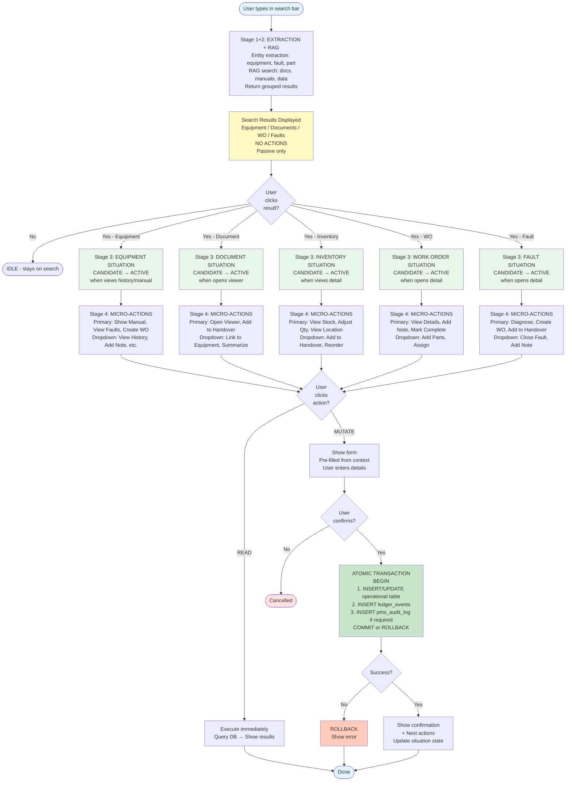

# Global Router Flow - Mermaid Diagram

**Date:** 2026-01-22
**Purpose:** Visual flowchart of CelesteOS control flow (Apple Spotlight model)
**Status:** Layer A - Core Architecture

---

## Flow Diagram



---

## Key Decision Points

### 1. User Click on Search Result (Stage 3)

**5 possible domain situations:**
- Equipment → Equipment Situation
- Document → Document Situation
- Inventory → Inventory Situation
- Work Order → Work Order Situation
- Fault → Fault Situation

**State transition:** IDLE → CANDIDATE (clicked) → ACTIVE (opened detail/manual/history)

---

### 2. Action Type (READ vs MUTATE)

**READ actions:**
- Execute immediately
- No confirmation needed
- Examples: View history, Show manual, Check stock

**MUTATE actions:**
- Show form (pre-filled from context)
- Require user confirmation
- Atomic write to 2-3 tables
- Examples: Create WO, Adjust quantity, Mark complete

---

### 3. MUTATE Commit (Atomic Transaction)

**2-table write (low risk):**
1. INSERT/UPDATE operational table (`pms_work_orders`, `pms_inventory`, etc.)
2. INSERT `ledger_events` (timeline)

**3-table write (high risk - requires signature):**
1. INSERT/UPDATE operational table
2. INSERT `ledger_events`
3. INSERT `pms_audit_log` (compliance)

**Rule:** If any write fails → ROLLBACK entire transaction

---

## Color Legend

| Color | Meaning |
|-------|---------|
| 🔵 Blue | Start/End points |
| 🟢 Green | Commit (success path) |
| 🟡 Yellow | Search results (passive) |
| 🟢 Light Green | Domain situations (active states) |
| 🟠 Orange | Rollback (error) |
| 🔴 Red | Cancelled |

---

## Critical Paths

### Fast Path (READ action)
```
Search → Click Result → Situation Activates → Click READ Action → Execute → Done
```
**Latency target:** < 500ms

### MUTATE Path (requires confirmation)
```
Search → Click Result → Situation Activates → Click MUTATE Action → Form → Confirm → Commit → Done
```
**Latency target:** < 1000ms (excluding user form entry time)

---

## Search Bar Guardrails

**Search results are PASSIVE. No actions allowed.**

✅ Search MAY show:
- Entity previews (one-line)
- Status badges ("Overdue", "Out of Stock")
- Domain grouping

❌ Search MUST NEVER show:
- Action buttons
- Editable fields
- Auto-open entities (even at 100% confidence)

**Why:** Trust depends on this boundary. Search informs, never nudges.

---

## Situation State Machine

```
IDLE (on search surface)
  ↓
  User clicks result
  ↓
CANDIDATE (preview shown, NO actions yet)
  ↓
  User opens detail / views history / opens manual
  ↓
ACTIVE (micro-actions now allowed)
```

**ACTIVE triggers (deterministic evidence):**
- `opened_manual`
- `viewed_history`
- `mutation_committed`
- `repeated_queries_count` (boosts confidence)

---

## Domain Situations

| Situation | Primary Actions | Dropdown Actions |
|-----------|-----------------|------------------|
| **Equipment** | Show Manual, View Faults, Create WO | View History, Add Note, Add to Handover |
| **Document** | Open Viewer, Add to Handover | Link to Equipment, Summarize |
| **Inventory** | View Stock, Adjust Qty, View Location | Add to Handover, Reorder |
| **Work Order** | View Details, Add Note, Mark Complete | Add Parts, Assign |
| **Fault** | Diagnose, Create WO, Add to Handover | Close Fault, Add Note |

**Context filtering:** If user mentioned "overheating" in query → prioritize fault-related actions.

---

## Ledger Dual Purpose

**Ledger is NOT just compliance. It's a working feature.**

1. **User History:** "What did I work on today?" → Query `ledger_events` for navigation
2. **Department Oversight:** HOD sees team activity → Accountability tool
3. **Compliance:** Inspector audit trail → Immutable record

**Ledger = working memory + supervision + compliance.**

---

**Reference:** See `02_GLOBAL_ROUTER_FLOW.md` for detailed stage definitions.
