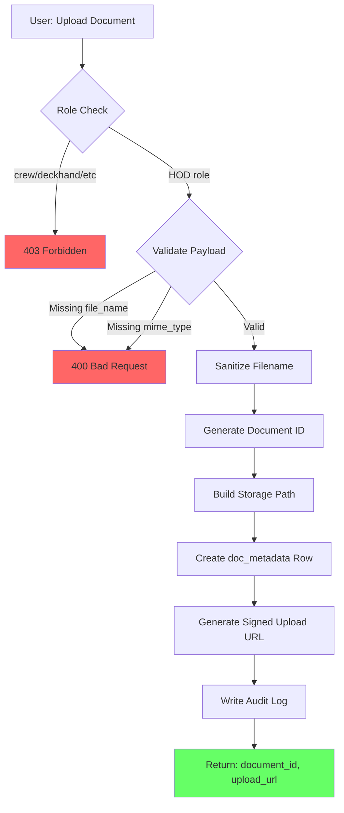
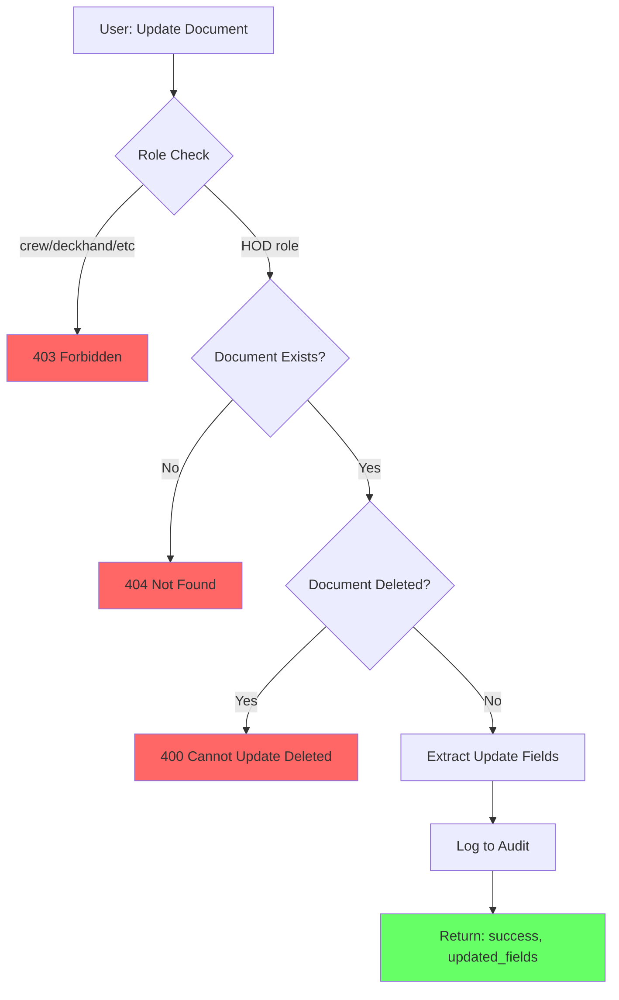
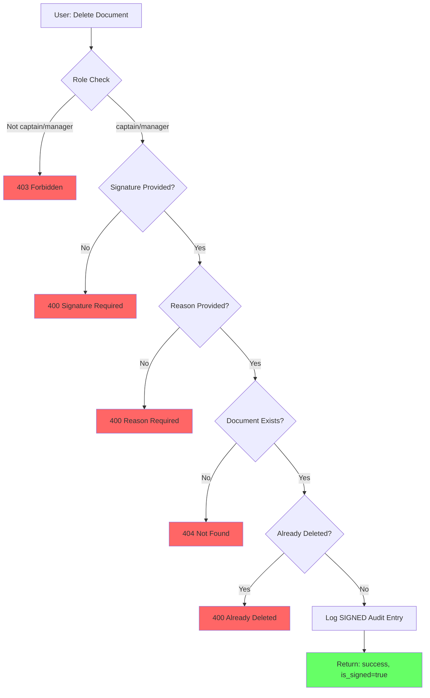
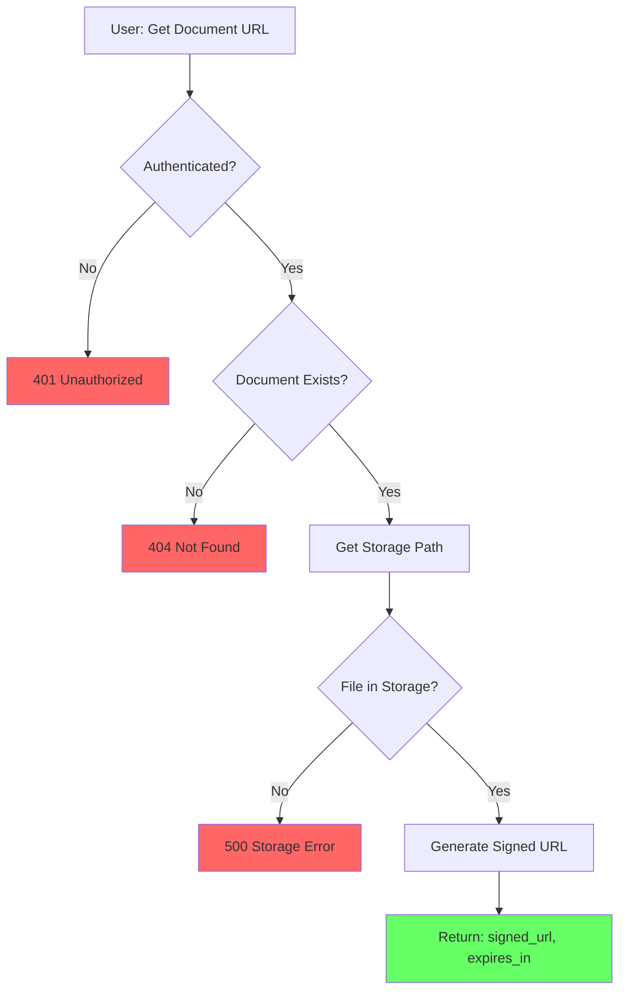
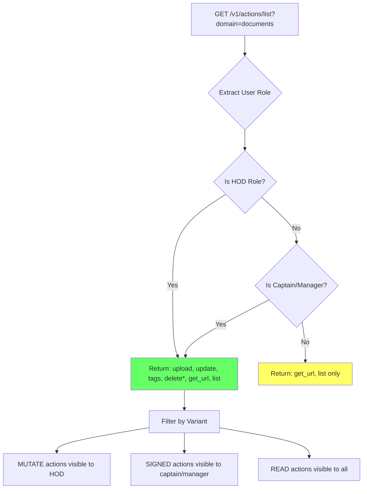
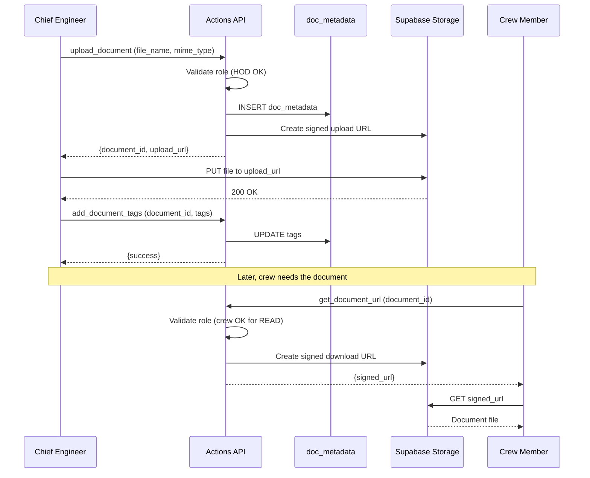
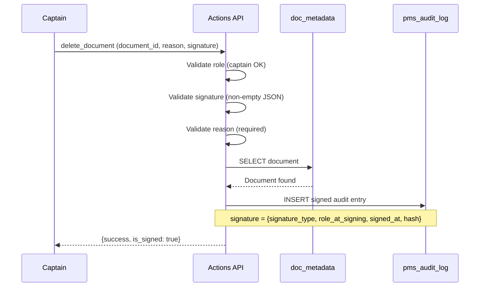
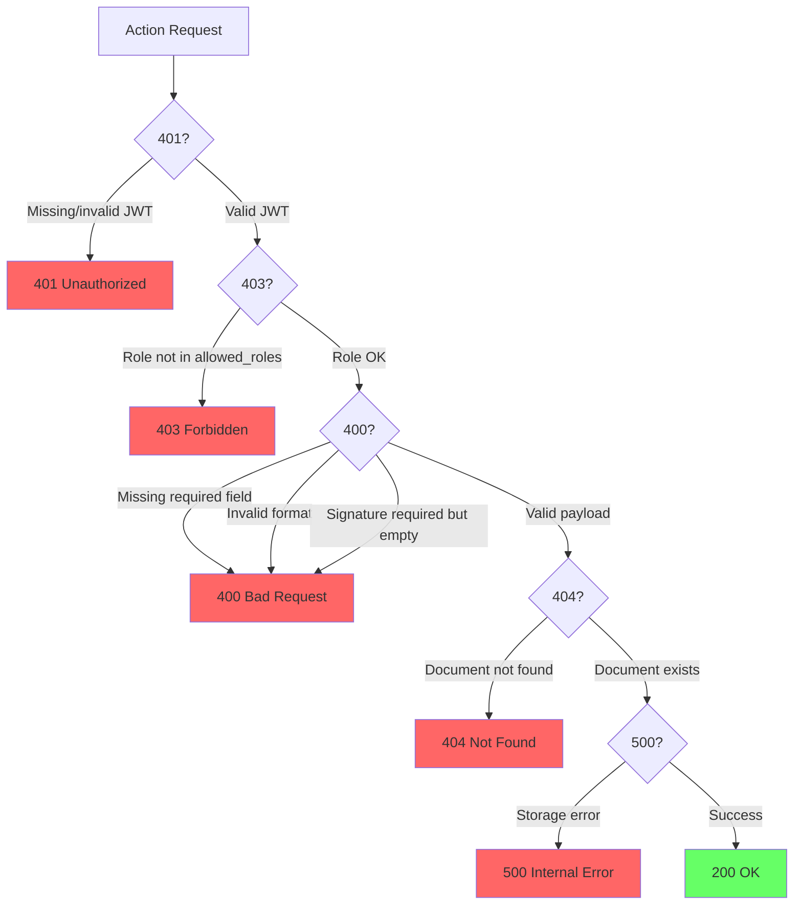
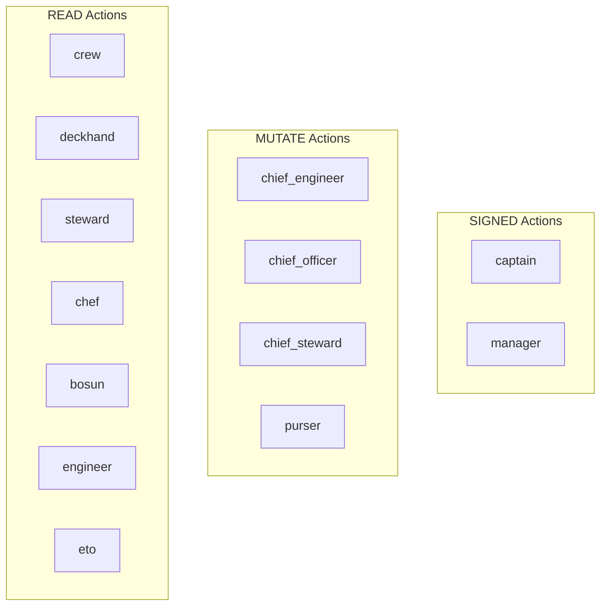
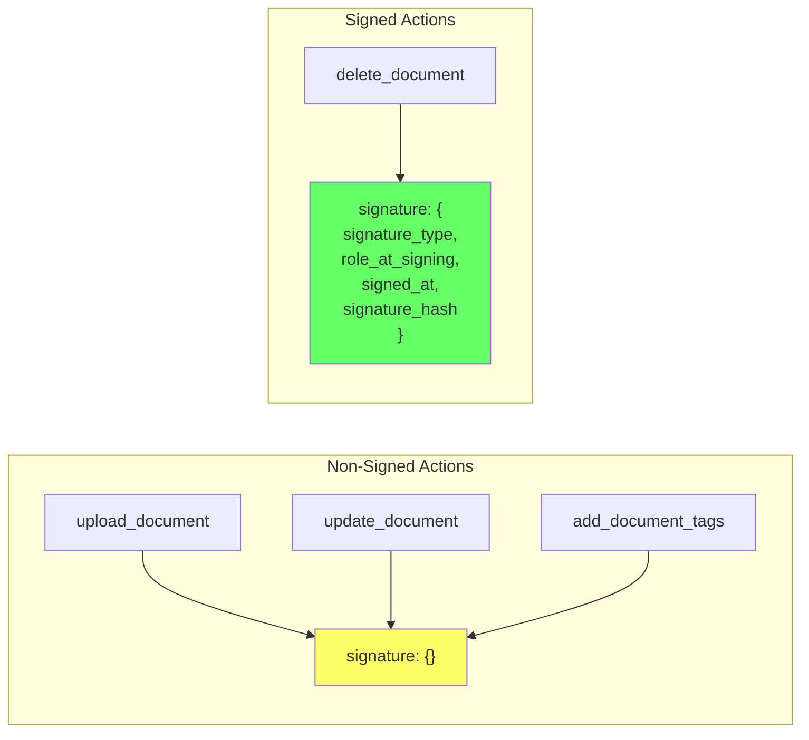

# Document Lens v2 - Flowcharts

## Overview

Visual decision flows for Document Lens v2 actions.

---

## 1. Upload Document Flow

---

## 2. Update Document Flow

---

## 3. Delete Document Flow (SIGNED)

---

## 4. Get Document URL Flow

---

## 5. Action List Role Gating

---

## 6. Complete User Journey: Upload and Share

---

## 7. Complete User Journey: Delete with Signature

---

## 8. Error Decision Tree

---

## Role Hierarchy Visualization

---

## Audit Log Signature Patterns

