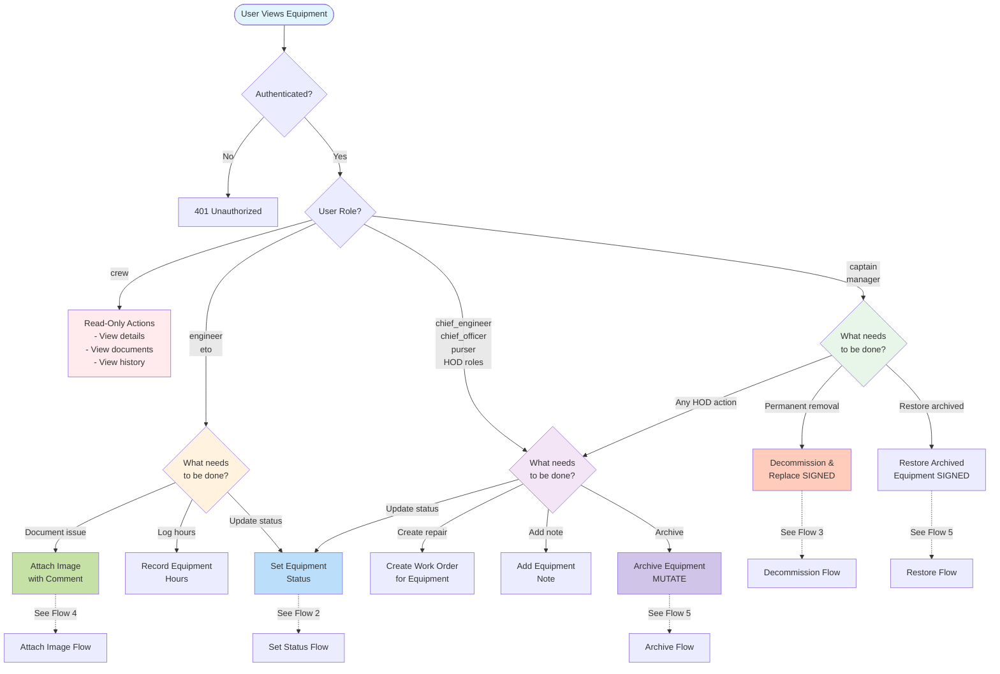
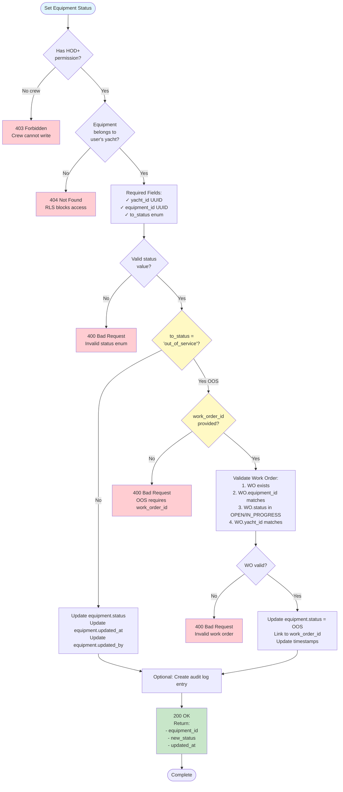
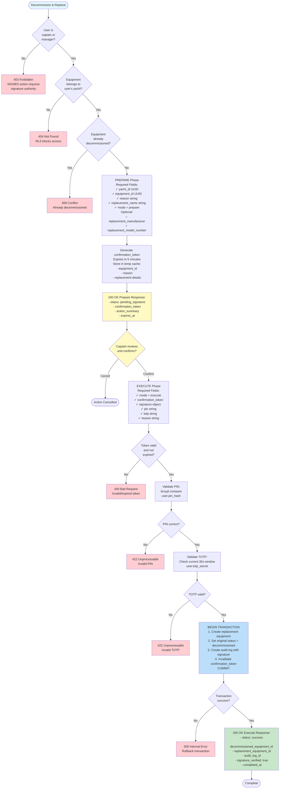
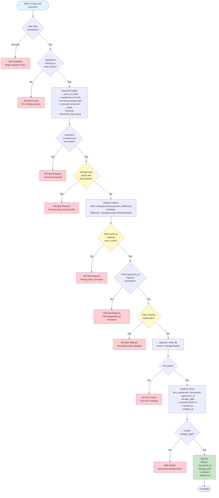
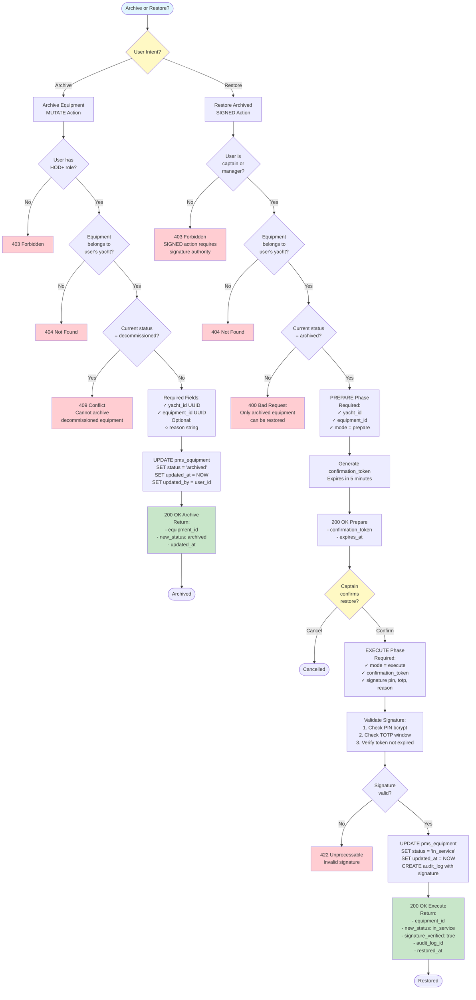
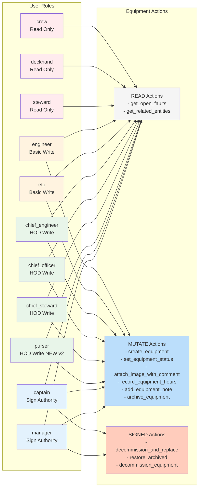
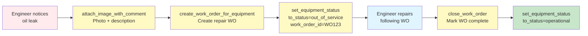
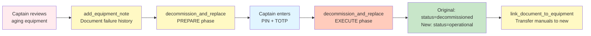

# Equipment Lens v2 - Visual Flowcharts

**Purpose**: Visual decision trees showing role-gated journeys, field requirements, and workflow paths.

---

## Table of Contents

1. [Master Journey Map](#1-master-journey-map)
2. [Set Equipment Status Flow](#2-set-equipment-status-flow)
3. [Decommission & Replace Flow](#3-decommission--replace-flow)
4. [Attach Image with Comment Flow](#4-attach-image-with-comment-flow)
5. [Archive/Restore Flow](#5-archiverestore-flow)
6. [Role Permission Matrix](#6-role-permission-matrix)

---

## 1. Master Journey Map

**Entry Point**: User views equipment with intent to take action



---

## 2. Set Equipment Status Flow

**Action**: `set_equipment_status` (MUTATE)
**Roles**: engineer, eto, chief_engineer, chief_officer, purser, captain, manager



**8 Status Values**:
```
operational → degraded → failed → maintenance
                ↓
        out_of_service (requires WO)
                ↓
           in_service
                ↓
            archived
                ↓
        decommissioned
```

**Field Requirements**:
- **Required Always**: yacht_id, equipment_id, to_status
- **Conditional Required**: work_order_id (if to_status='out_of_service')
- **Optional**: reason (string)

---

## 3. Decommission & Replace Flow

**Action**: `decommission_and_replace_equipment` (SIGNED)
**Roles**: captain, manager only



**Two-Phase Pattern**:
1. **PREPARE**: Generate token, show preview
2. **EXECUTE**: Validate signature, commit changes

**Signature Requirements**:
- **PIN**: 4-6 digit code (bcrypt hashed)
- **TOTP**: Time-based OTP (30-second window)
- **Reason**: Textual justification for audit trail

**Audit Log Invariant**:
- `pms_audit_log.signature` column **NEVER NULL** for SIGNED actions
- Stores: `{pin_valid: true, totp_valid: true, timestamp: "..."}`

---

## 4. Attach Image with Comment Flow

**Action**: `attach_image_with_comment` (MUTATE)
**Roles**: engineer, eto, chief_engineer, chief_officer, chief_steward, purser, captain, manager



**Storage Path Validation Rules**:

```
✓ VALID:
  {yacht_id}/equipment/{equipment_id}/filename.ext
  85fe1119-b04c-41ac-80f1-829d23322598/equipment/abc-123/oil_leak.jpg

✗ INVALID:
  documents/85fe1119.../equipment/abc-123/file.pdf    # No documents/ prefix
  other-yacht-id/equipment/abc-123/file.pdf            # Wrong yacht_id
  85fe1119.../equipment/xyz-999/file.pdf               # Wrong equipment_id
  85fe1119.../equipment/abc-123/nested/dir/file.pdf   # No nesting allowed
```

**Material Drift Fix (v2)**:
- **v1**: Used `description` field (wrong)
- **v2**: Uses `comment` field (correct per spec)
- Migration 018 added `pms_equipment_documents.comment` column

---

## 5. Archive/Restore Flow

**Action**: `archive_equipment` (MUTATE) + `restore_archived_equipment` (SIGNED)



**Status Transitions**:
```
Archive (MUTATE):
  operational/degraded/failed → archived

Restore (SIGNED):
  archived → in_service
```

**Material Drift Fix (v2)**:
- **v1**: Used `deleted_at` soft delete (wrong)
- **v2**: Uses `status='archived'` (correct per spec)
- Migration 019 added status constraint with 8 values

---

## 6. Role Permission Matrix



**Permission Hierarchy**:
```
crew/deckhand/steward (Read Only)
  ↓
engineer/eto (Basic Write)
  ↓
chief_engineer/chief_officer/chief_steward/purser (HOD Write)
  ↓
captain/manager (Sign Authority)
```

**Key Additions in Equipment Lens v2**:
- ✅ **purser** added to HOD roles (Migration 017)
- ✅ **set_equipment_status** replaces update_equipment_status (OOS validation)
- ✅ **attach_image_with_comment** adds comment field (Migration 018)
- ✅ **8-value status enum** (Migration 019)

---

## Complete User Journey Examples

### Journey 1: Equipment Breaks Down



### Journey 2: Equipment End of Life



### Journey 3: Seasonal Equipment Archive

```mermaid
flowchart LR
    A[End of season<br/>jet skis stored] --> B[archive_equipment<br/>MUTATE by HOD]
    B --> C[status=archived<br/>Equipment in storage]
    C --> D[Start of season<br/>6 months later]
    D --> E[restore_archived_equipment<br/>PREPARE by Captain]
    E --> F[Captain enters<br/>PIN + TOTP]
    F --> G[restore_archived_equipment<br/>EXECUTE SIGNED]
    G --> H[status=in_service<br/>Ready for use]

    style A fill:#ffebee
    style B fill:#fff9c4
    style C fill:#e1f5ff
    style D fill:#ffebee
    style E fill:#fff9c4
    style F fill:#e1f5ff
    style G fill:#ffccbc
    style H fill:#c8e6c9
```



---

## Field Requirement Summary

### Required Fields by Action

| Action | Always Required | Conditionally Required | Optional |
|--------|----------------|----------------------|----------|
| **set_equipment_status** | yacht_id, equipment_id, to_status | work_order_id (if OOS) | reason |
| **attach_image_with_comment** | yacht_id, equipment_id, file, comment | - | document_type |
| **decommission_and_replace** (PREPARE) | yacht_id, equipment_id, reason, replacement_name, mode=prepare | - | replacement_manufacturer, replacement_model_number |
| **decommission_and_replace** (EXECUTE) | mode=execute, confirmation_token, signature{pin, totp, reason} | - | - |
| **archive_equipment** | yacht_id, equipment_id | - | reason |
| **restore_archived_equipment** (PREPARE) | yacht_id, equipment_id, mode=prepare | - | - |
| **restore_archived_equipment** (EXECUTE) | mode=execute, confirmation_token, signature{pin, totp, reason} | - | - |

### Signature Object Structure

For all SIGNED actions (EXECUTE phase):
```json
{
  "signature": {
    "pin": "1234",              // Required: 4-6 digit PIN
    "totp": "567890",           // Required: 6-digit TOTP
    "reason": "Justification"   // Required: Audit trail text
  }
}
```

---

## Navigation Guide

**For Specific Scenarios**:
- Equipment broken? → [Flow 2: Set Status](#2-set-equipment-status-flow) → OOS branch
- Document issue? → [Flow 4: Attach Image](#4-attach-image-with-comment-flow)
- End of life? → [Flow 3: Decommission](#3-decommission--replace-flow)
- Temporary storage? → [Flow 5: Archive](#5-archiverestore-flow) → Archive branch
- Bring back equipment? → [Flow 5: Restore](#5-archiverestore-flow) → Restore branch

**For Role Questions**:
- What can I do? → [Flow 1: Master Journey](#1-master-journey-map) → Find your role
- Permission denied? → [Matrix 6: Roles](#6-role-permission-matrix) → Check access level

**For Field Questions**:
- What's required? → [Field Summary](#field-requirement-summary)
- Validation error? → Find action flow → Check validation nodes (yellow diamonds)

---

**Document Version**: 2026-01-27
**Equipment Lens v2**: Complete Visual Reference
