# Shopping List Lens v1 - Visual Flowcharts

**Purpose**: Visual decision trees showing role-gated journeys, field requirements, and workflow paths.

---

## Table of Contents

1. [Master Journey Map](#1-master-journey-map)
2. [Create Shopping List Item Flow](#2-create-shopping-list-item-flow)
3. [Approve Shopping List Item Flow](#3-approve-shopping-list-item-flow)
4. [Reject Shopping List Item Flow](#4-reject-shopping-list-item-flow)
5. [Promote Candidate to Part Flow](#5-promote-candidate-to-part-flow)
6. [Role Permission Matrix](#6-role-permission-matrix)

---

## 1. Master Journey Map

**Entry Point**: User views shopping list with intent to take action

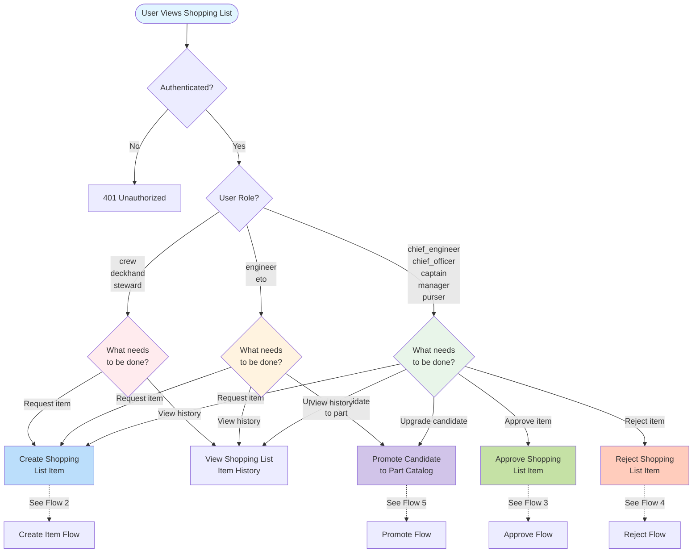

---

## 2. Create Shopping List Item Flow

**Action**: `create_shopping_list_item` (MUTATE)
**Roles**: All authenticated users (crew, deckhand, steward, engineer, eto, chief_engineer, chief_officer, purser, captain, manager)

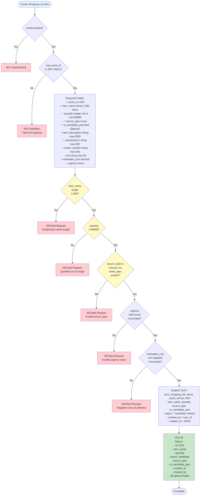

**4 Source Types**:
```
manual       → User manually entered item
wo           → Originated from work order
maint_plan   → Originated from maintenance plan
project      → Originated from project
```

**5 Urgency Levels** (optional):
```
routine → normal_priority → high_priority → urgent → critical
```

**Field Validation Summary**:
- **item_name**: 1-500 characters (required)
- **quantity**: 1-99999 (required)
- **source_type**: enum (required)
- **is_candidate_part**: boolean (required)
- **estimated_cost**: non-negative decimal (optional)
- **urgency**: enum (optional, default: routine)

---

## 3. Approve Shopping List Item Flow

**Action**: `approve_shopping_list_item` (MUTATE)
**Roles**: HOD only (chief_engineer, chief_officer, captain, manager, purser)

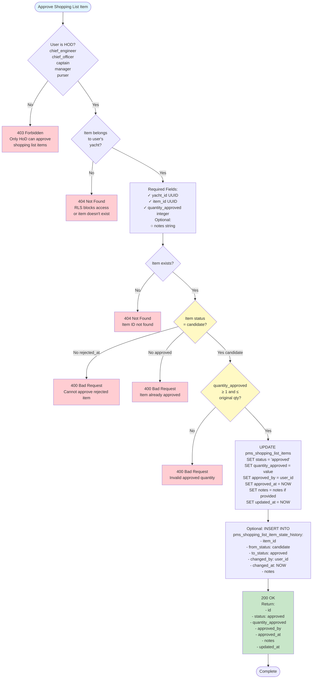

**State Transition**:
```
candidate → approved (terminal)
```

**HOD Roles** (is_hod() returns true):
- chief_engineer
- chief_officer
- captain
- manager
- purser

**Approval Business Rules**:
1. Only HOD can approve
2. Item must be in 'candidate' status
3. Cannot approve rejected items (rejected_at NOT NULL)
4. quantity_approved must be ≥ 1 and ≤ original quantity
5. Sets approved_at timestamp and approved_by user_id

---

## 4. Reject Shopping List Item Flow

**Action**: `reject_shopping_list_item` (MUTATE)
**Roles**: HOD only (chief_engineer, chief_officer, captain, manager, purser)

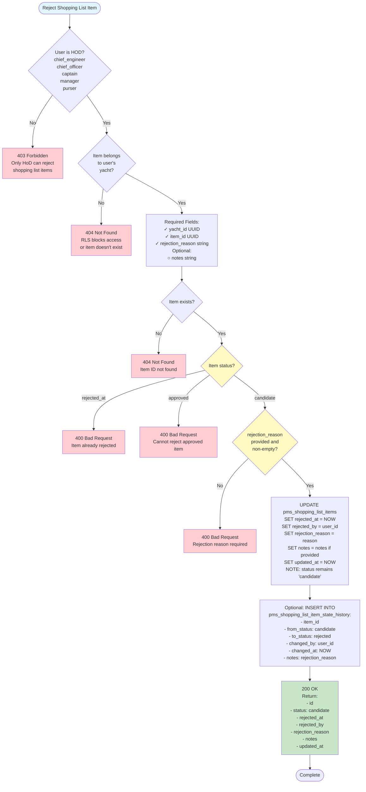

**State Transition**:
```
candidate → candidate (with rejected_at NOT NULL) - terminal
```

**Rejection Business Rules**:
1. Only HOD can reject
2. Item must be in 'candidate' status (rejected_at IS NULL)
3. Cannot reject already rejected items (rejected_at NOT NULL)
4. Cannot reject approved items (status='approved')
5. rejection_reason is required and cannot be empty
6. Sets rejected_at timestamp and rejected_by user_id
7. **Important**: status remains 'candidate', rejection marked by rejected_at field

**Material Drift Note**:
- Rejection does NOT change status field
- Rejected state indicated by rejected_at IS NOT NULL
- This allows queries like: `WHERE status='candidate' AND rejected_at IS NULL` for active candidates

---

## 5. Promote Candidate to Part Flow

**Action**: `promote_candidate_to_part` (MUTATE)
**Roles**: Engineers only (chief_engineer, engineer, manager)

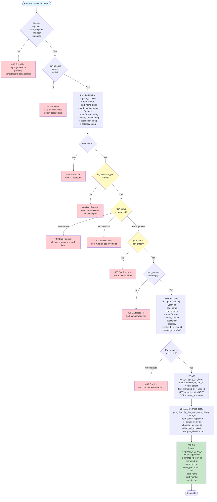

**State Transition**:
```
approved → approved (with promoted_to_part_id NOT NULL)
```

**Engineer Roles** (is_engineer() returns true):
- chief_engineer
- engineer
- manager

**Promotion Business Rules**:
1. Only engineers can promote
2. Item must have is_candidate_part = true
3. Item must be in 'approved' status
4. Cannot promote rejected items
5. Cannot promote non-approved items
6. part_name and part_number are required
7. Creates new record in pms_parts_catalog
8. Links shopping list item to new part via promoted_to_part_id
9. Sets promoted_at timestamp and promoted_by user_id
10. Part number must be unique within yacht

**Integration Note**:
- Promotes item from shopping list to permanent parts catalog
- Shopping list item retains its status='approved'
- Promotion marked by promoted_to_part_id field
- New part inherits manufacturer, model_number from shopping list item

---

## 6. Role Permission Matrix

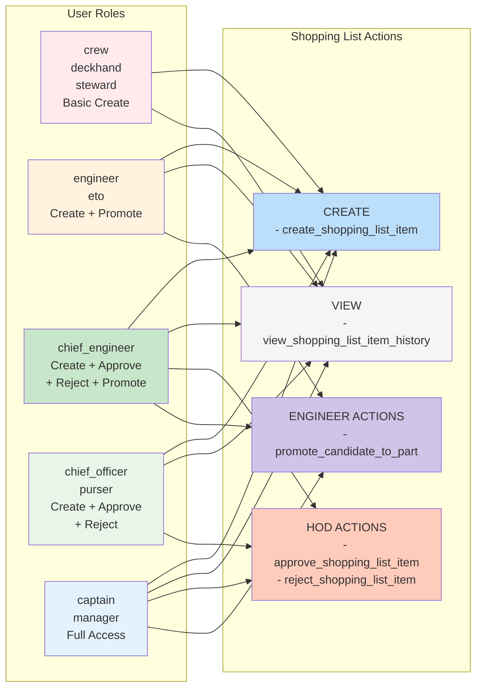

**Permission Hierarchy**:
```
crew/deckhand/steward (Create Only)
  ↓
engineer/eto (Create + Promote)
  ↓
chief_officer/purser (HOD: Create + Approve + Reject)
  ↓
chief_engineer (HOD + Engineer: All Actions)
  ↓
captain/manager (Full Access: All Actions)
```

**Role Permission Table**:

| Role | Create | Approve | Reject | Promote | View History |
|------|--------|---------|--------|---------|--------------|
| crew | ✅ | ❌ | ❌ | ❌ | ✅ |
| deckhand | ✅ | ❌ | ❌ | ❌ | ✅ |
| steward | ✅ | ❌ | ❌ | ❌ | ✅ |
| engineer | ✅ | ❌ | ❌ | ✅ | ✅ |
| eto | ✅ | ❌ | ❌ | ✅ | ✅ |
| chief_engineer | ✅ | ✅ | ✅ | ✅ | ✅ |
| chief_officer | ✅ | ✅ | ✅ | ❌ | ✅ |
| purser | ✅ | ✅ | ✅ | ❌ | ✅ |
| captain | ✅ | ✅ | ✅ | ✅ | ✅ |
| manager | ✅ | ✅ | ✅ | ✅ | ✅ |

**Special Note**:
- **chief_engineer** has BOTH HOD and engineer privileges (can approve AND promote)
- **manager** and **captain** have full access to all actions

---

## Complete User Journey Examples

### Journey 1: Simple Item Request (CREW → HOD)

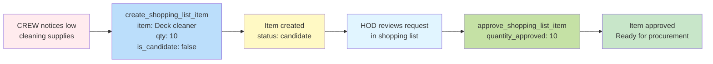

### Journey 2: New Part Discovery (CREW → HOD → ENGINEER)

```mermaid
flowchart LR
    A[CREW identifies<br/>new filter type needed] --> B[create_shopping_list_item<br/>item: Fuel filter XYZ<br/>qty: 5<br/>is_candidate: true<br/>manufacturer: Racor]
    B --> C[Item created<br/>status: candidate<br/>is_candidate_part: true]
    C --> D[HOD reviews<br/>specifications]
    D --> E[approve_shopping_list_item<br/>quantity_approved: 5]
    E --> F[ENGINEER reviews<br/>for catalog addition]
    F --> G[promote_candidate_to_part<br/>part_name: Fuel Filter XYZ<br/>part_number: RAC-FLT-123]
    G --> H[New part in catalog<br/>Item promoted<br/>Ready for procurement]

    style A fill:#ffebee
    style B fill:#bbdefb
    style C fill:#fff9c4
    style D fill:#e1f5ff
    style E fill:#c5e1a5
    style F fill:#e1f5ff
    style G fill:#d1c4e9
    style H fill:#c8e6c9
```

### Journey 3: Item Rejection (CREW → HOD)

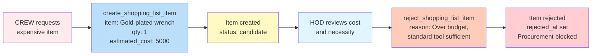

### Journey 4: Work Order Integration (ENGINEER → HOD)

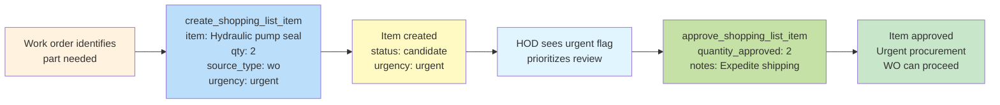

---

## Field Requirement Summary

### Required Fields by Action

| Action | Always Required | Optional |
|--------|----------------|----------|
| **create_shopping_list_item** | yacht_id, item_name (1-500 chars), quantity (1-99999), source_type (enum), is_candidate_part (bool) | item_description, manufacturer, model_number, unit, estimated_cost (≥0), urgency (enum), notes |
| **approve_shopping_list_item** | yacht_id, item_id, quantity_approved (≥1) | notes |
| **reject_shopping_list_item** | yacht_id, item_id, rejection_reason (non-empty) | notes |
| **promote_candidate_to_part** | yacht_id, item_id, part_name (non-empty), part_number (non-empty) | manufacturer, model_number, description, category |
| **view_shopping_list_item_history** | yacht_id, item_id | - |

### Enum Values

**source_type** (required on create):
```
- manual         # User-entered item
- wo             # From work order
- maint_plan     # From maintenance plan
- project        # From project
```

**urgency** (optional on create, default: routine):
```
- routine
- normal_priority
- high_priority
- urgent
- critical
```

### Status Field States

```
candidate    → Initial state (all new items)
approved     → HOD approved (terminal, can be promoted)
```

**Terminal State Indicators**:
- `rejected_at IS NOT NULL` → Rejected (terminal, status remains 'candidate')
- `status = 'approved'` → Approved (terminal, can be promoted)
- `promoted_to_part_id IS NOT NULL` → Promoted (status remains 'approved')

---

## State Machine Diagram

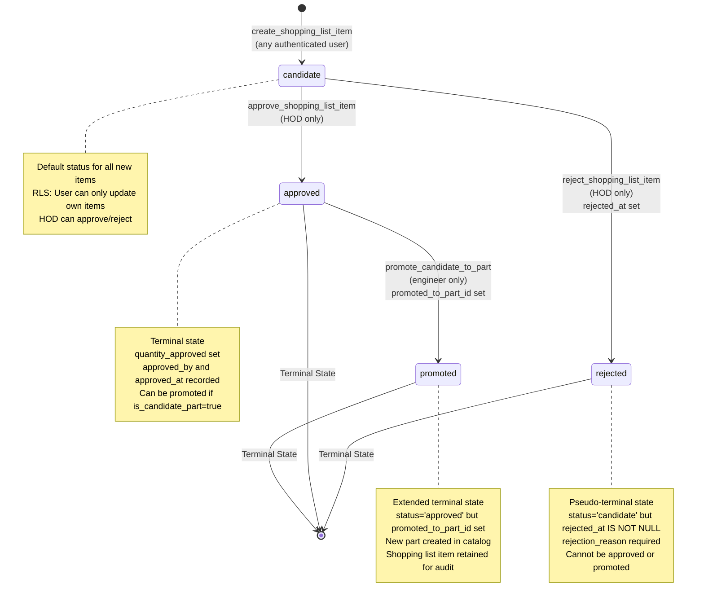

---

## Navigation Guide

**For Specific Scenarios**:
- Request supplies? → [Flow 2: Create Item](#2-create-shopping-list-item-flow)
- Approve request? → [Flow 3: Approve](#3-approve-shopping-list-item-flow) (HOD only)
- Reject request? → [Flow 4: Reject](#4-reject-shopping-list-item-flow) (HOD only)
- Add to catalog? → [Flow 5: Promote](#5-promote-candidate-to-part-flow) (Engineer only)

**For Role Questions**:
- What can I do? → [Flow 1: Master Journey](#1-master-journey-map) → Find your role
- Permission denied? → [Matrix 6: Roles](#6-role-permission-matrix) → Check access level

**For Field Questions**:
- What's required? → [Field Summary](#field-requirement-summary)
- Validation error? → Find action flow → Check validation nodes (yellow diamonds)

**For State Questions**:
- What states exist? → [State Machine](#state-machine-diagram)
- Can I do action X? → Check current state in state machine

---

## Security Notes

**Defense-in-Depth (3 Layers)**:

1. **Router Layer** (apps/api/main.py):
   - Action definitions enforce `allowed_roles`
   - First line of defense
   - Example: `"allowed_roles": ["chief_engineer", "chief_officer", "captain", "manager", "purser"]`

2. **Handler Layer** (apps/api/handlers/shopping_list_handlers.py):
   - Explicit role checks using `is_hod()` and `is_engineer()` RPCs
   - Blocks service key operations
   - Returns 403 with descriptive messages
   - Example: `if not is_hod_result.data: return 403`

3. **Database Layer** (RLS policies):
   - Blocks direct SQL access (PostgREST)
   - Role-specific UPDATE policies
   - Yacht isolation enforcement
   - Example: Policy `hod_approve_shopping_items` checks `is_hod(auth.uid(), get_user_yacht_id())`

**Result**: Users cannot bypass restrictions even with:
- Direct database access (blocked by RLS)
- Compromised UI (blocked by handler checks)
- Direct API calls (blocked by router + handlers)

---

**Document Version**: 2026-01-28
**Shopping List Lens v1**: Complete Visual Reference
