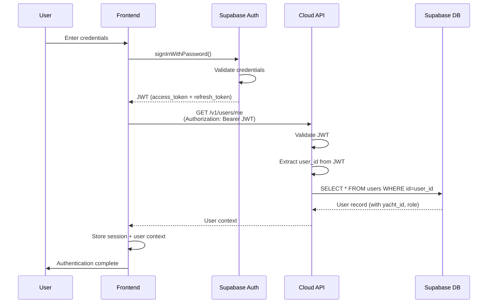
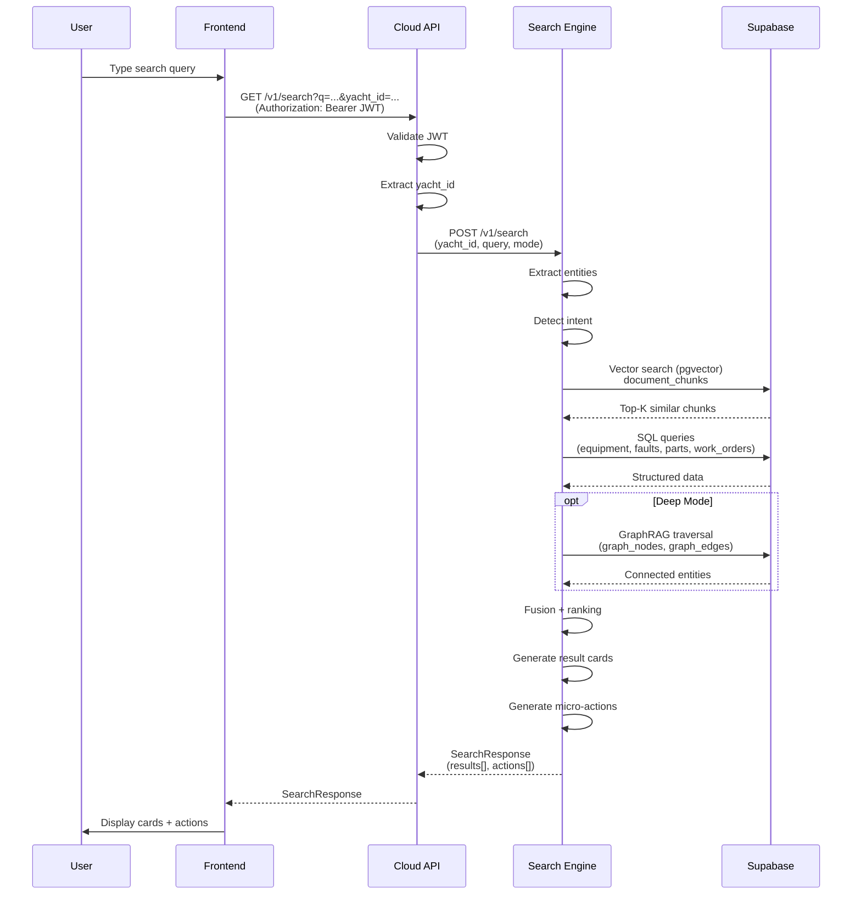
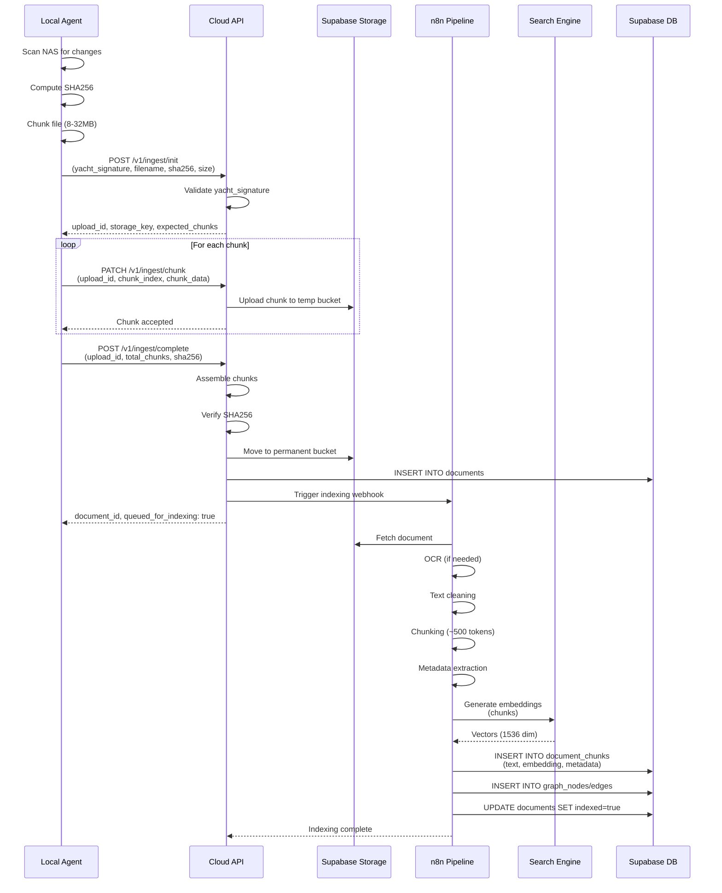
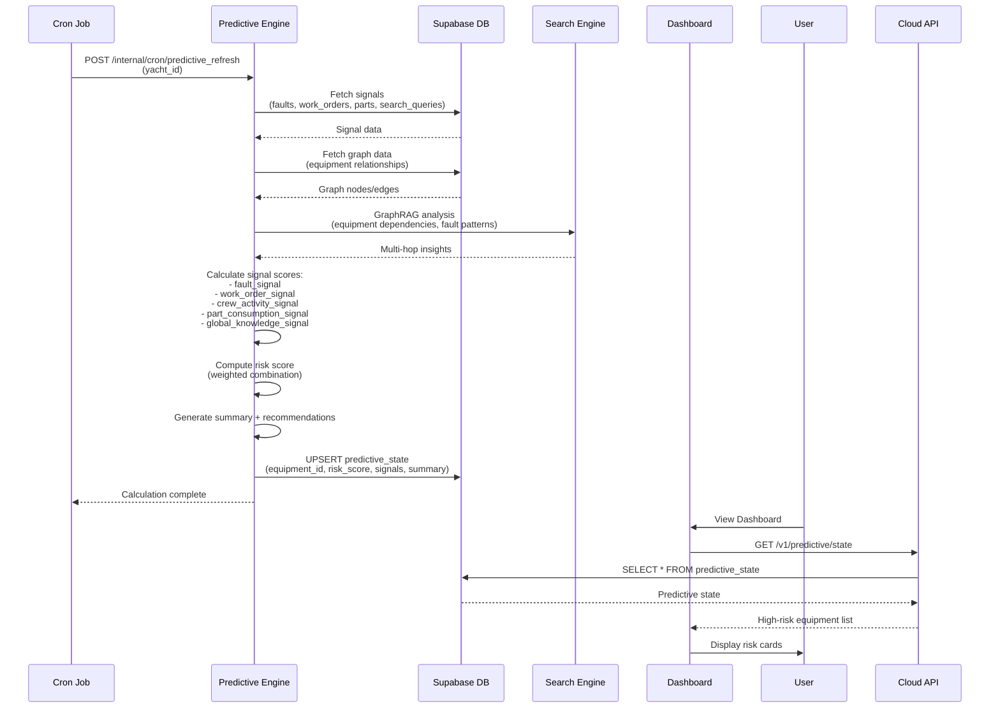
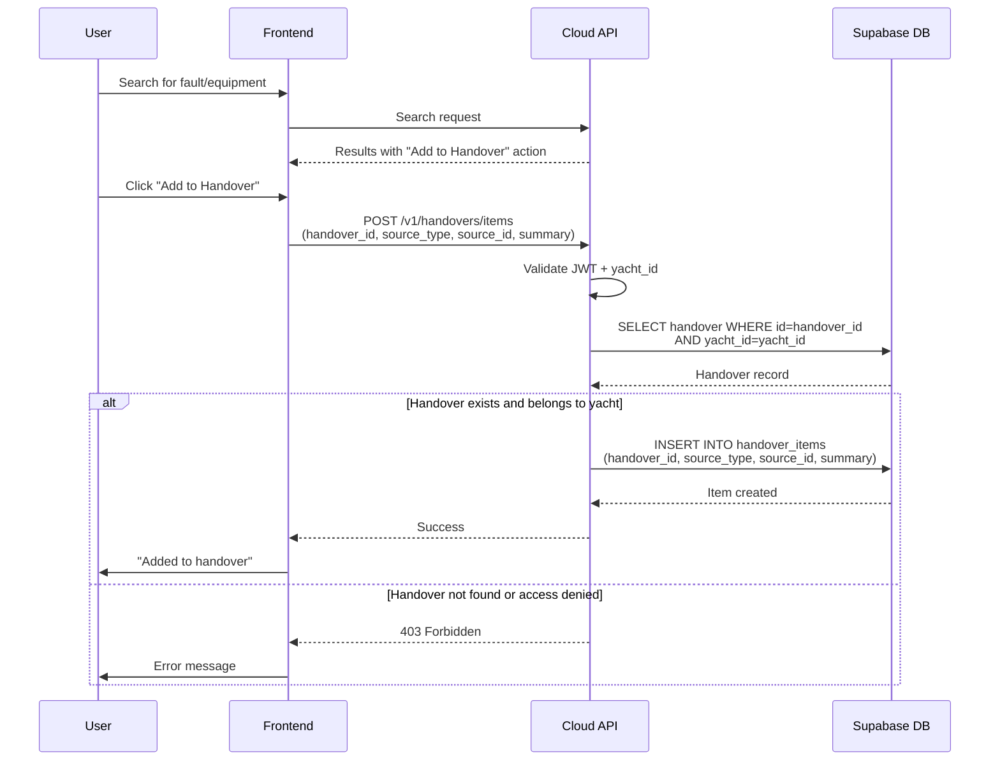
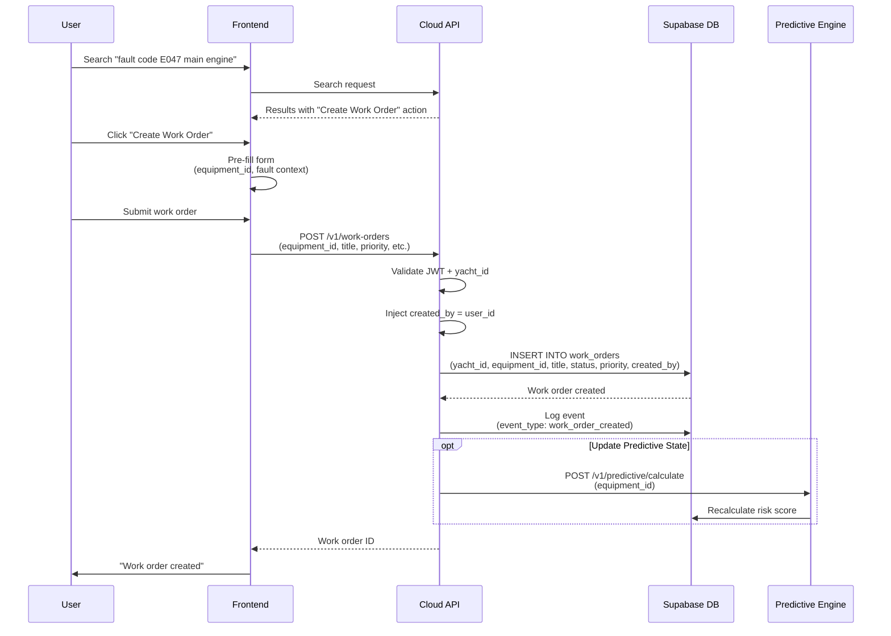
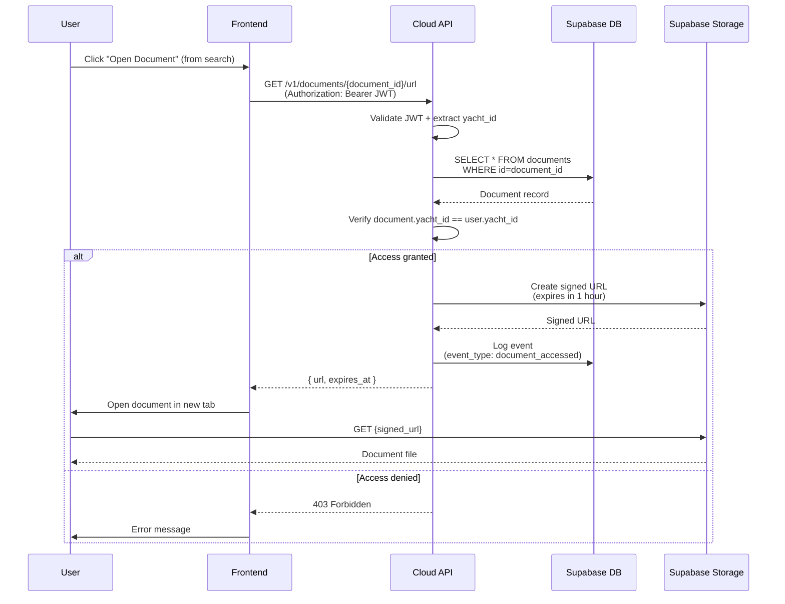
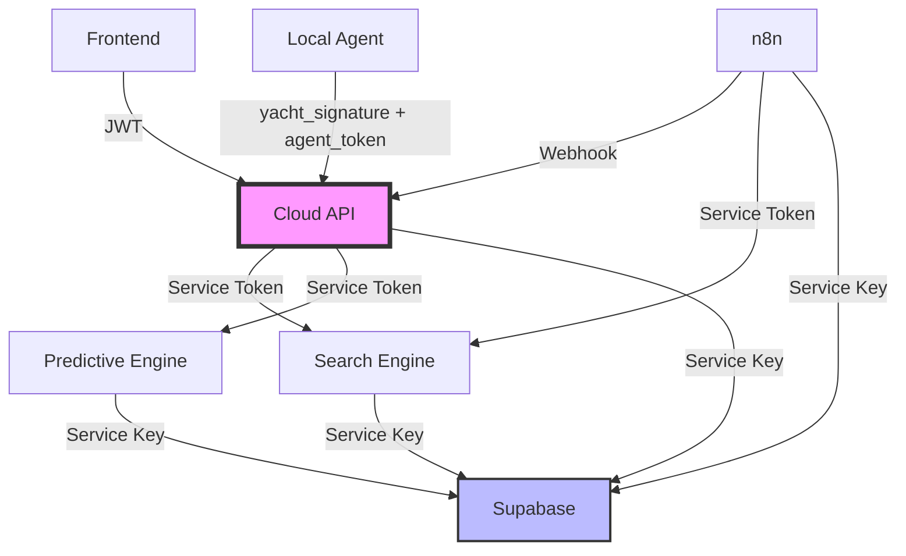

# CelesteOS Integration Flows

This document contains all integration flow diagrams showing how components communicate.

## Table of Contents

1. [Authentication Flow](#1-authentication-flow)
2. [Search Flow](#2-search-flow)
3. [Ingestion Flow](#3-ingestion-flow)
4. [Predictive Flow](#4-predictive-flow)
5. [Handover Flow](#5-handover-flow)
6. [Work Order Creation Flow](#6-work-order-creation-flow)
7. [Document Access Flow](#7-document-access-flow)

---

## 1. Authentication Flow

User authentication and yacht context retrieval.



**Key Points:**
- Frontend NEVER stores passwords
- JWT contains: `user_id`, `yacht_id`, `role`, `exp`
- All API calls include JWT in Authorization header
- Yacht context injected server-side from JWT

---

## 2. Search Flow

Universal search bar query processing.



**Key Points:**
- Cloud API acts as gateway and validates JWT
- Search Engine performs entity extraction + intent detection
- Vector search uses pgvector for semantic similarity
- GraphRAG activated for complex queries
- Results returned as typed cards with micro-actions

---

## 3. Ingestion Flow

Document upload from Local Agent to cloud indexing.



**Key Points:**
- Local Agent uploads in chunks for reliability
- Cloud verifies SHA256 integrity
- n8n orchestrates indexing pipeline
- OCR runs in cloud (consistent across fleet)
- Embeddings generated centrally
- Graph nodes/edges built for GraphRAG

---

## 4. Predictive Flow

Predictive maintenance calculation and insight generation.



**Key Points:**
- Runs on schedule (every 6 hours)
- Analyzes 19 signals across 5 categories
- Uses GraphRAG for multi-hop reasoning
- Risk scores: 0.00 - 1.00
- Results cached in `predictive_state` table
- Dashboard pulls cached results (fast)

---

## 5. Handover Flow

Search-triggered handover item addition.



**Key Points:**
- Triggered from search result micro-actions
- Server validates yacht ownership
- Can add: faults, work orders, notes, documents, predictive insights
- 80% auto-generated during handover export

---

## 6. Work Order Creation Flow

Creating work order from search action.



**Key Points:**
- Context passed from search results
- Equipment, fault, and description pre-filled
- Yacht isolation enforced server-side
- Event logged for analytics
- Triggers predictive recalculation

---

## 7. Document Access Flow

Retrieving documents with signed URLs.



**Key Points:**
- Documents never exposed directly
- Signed URLs expire after 1 hour
- Yacht isolation enforced
- Access logged for audit trail
- Frontend opens in new tab (no download unless requested)

---

## Integration Layer Summary

### Frontend → Cloud API
- **Protocol:** HTTPS/REST
- **Auth:** JWT in Authorization header
- **Format:** JSON
- **Streaming:** SSE for search results

### Cloud API → Search Engine
- **Protocol:** HTTP/REST
- **Auth:** Internal service token
- **Format:** JSON
- **Includes:** yacht_id in every request

### Cloud API → Predictive Engine
- **Protocol:** HTTP/REST
- **Auth:** Internal service token
- **Format:** JSON
- **Caching:** Results cached in Supabase

### Cloud API → Supabase
- **Protocol:** REST API + Supabase SDK
- **Auth:** Service role key (backend)
- **RLS:** Yacht isolation enforced
- **Vector Search:** pgvector extension

### Local Agent → Cloud API
- **Protocol:** HTTPS/REST
- **Auth:** yacht_signature + agent_token
- **Upload:** Chunked (8-32MB)
- **Resume:** Supported via upload_id

### n8n → Services
- **Triggers:** Webhooks
- **Calls:** Supabase API, Search Engine
- **Orchestration:** Document indexing pipeline

---

## Security Boundaries



**Trust Boundaries:**
1. **Public:** Frontend, Local Agent
2. **Gateway:** Cloud API (validates all requests)
3. **Internal:** Search Engine, Predictive Engine, n8n
4. **Data:** Supabase (enforces RLS)

---

## Yacht Isolation Enforcement

Every request path enforces yacht isolation:

1. **JWT contains `yacht_id`** (set at login)
2. **Cloud API extracts `yacht_id`** from JWT
3. **All database queries filter by `yacht_id`**
4. **RLS policies enforce yacht-level access**
5. **Cross-yacht queries are impossible**

Example SQL pattern:
```sql
SELECT * FROM work_orders
WHERE yacht_id = :yacht_id_from_jwt
  AND id = :requested_id;
```

---

## Error Handling

All integration points implement:

- **Retry logic** (exponential backoff)
- **Circuit breakers** (prevent cascade failures)
- **Timeout enforcement** (prevent hanging requests)
- **Graceful degradation** (fallback when services unavailable)
- **Error logging** (centralized observability)

---

## Performance Characteristics

| Endpoint | Expected Latency | Timeout |
|----------|-----------------|---------|
| `/v1/search` | < 500ms | 5s |
| `/v1/predictive/state` | < 200ms (cached) | 2s |
| `/v1/work-orders` | < 300ms | 3s |
| Document upload | Depends on size | 10min |
| Indexing pipeline | 30s - 5min | 15min |

---

## Monitoring Points

Key integration points to monitor:

- [ ] JWT validation success rate
- [ ] Search Engine response time
- [ ] Predictive Engine calculation time
- [ ] Supabase query performance
- [ ] Document upload success rate
- [ ] Indexing pipeline completion rate
- [ ] Signed URL expiration hits
- [ ] Cross-service error rates

