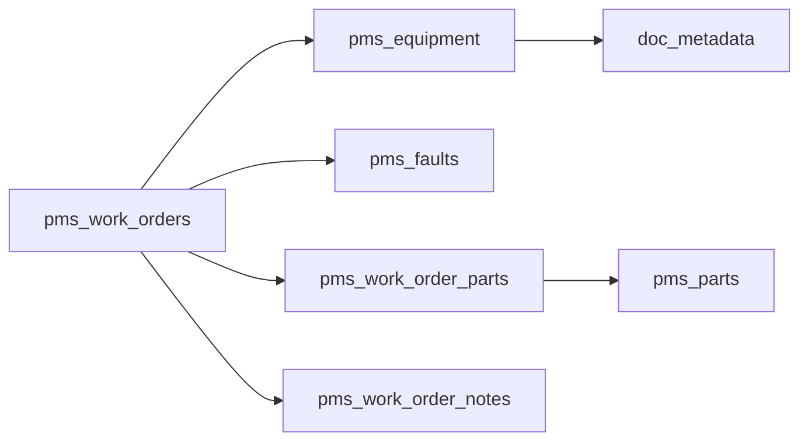

# Work Order Lens P1: Show Related — COMPLETE IMPLEMENTATION PLAN
**Database:** TENANT_1 (vzsohavtuotocgrfkfyd.supabase.co)
**Execution Time:** 8 hours (chunked into focused work segments)
**Date:** 2026-01-28
**Status:** 🔴 READY TO EXECUTE

---

## 📊 CHUNK 1: SCHEMA ANALYSIS & VALUE HIERARCHY (Hour 0-1)

### Actual Database Schema Discovery

**✅ Tables That Exist (14 total):**
```
pms_work_orders          (36 columns) - PRIMARY ENTITY
pms_parts                (29 columns) - HAS search_embedding + embedding_text ✓
pms_equipment            (25 columns)
pms_faults               (19 columns)
pms_work_order_parts     (9 columns)  - FK JOIN TABLE
pms_work_order_notes     (7 columns)  - TEXT CONTENT
pms_entity_links         (0 rows)     - EMPTY (needs schema check)
doc_metadata             (23 columns) - DOCUMENTS
pms_shopping_list_items  (47 columns)
pms_audit_log            (11 columns)
yacht_registry           (13 columns)
auth_users_roles         (9 columns)
handover_exports         (0 rows)
alias_documents          (0 rows)
```

### Text Columns for Embeddings (Grouped by Table)

| Table | Text Columns | Already Has Embeddings? | Priority |
|-------|-------------|-------------------------|----------|
| **pms_parts** | name, description, part_number, manufacturer | ✅ `search_embedding`, `embedding_text` | P0 (DONE) |
| **pms_work_orders** | title, description, wo_number, completion_notes | ❌ | **P1 ESSENTIAL** |
| **pms_equipment** | name, code, description, manufacturer, model, serial_number, location | ❌ | **P1 ESSENTIAL** |
| **pms_faults** | title, description, fault_code | ❌ | P1 Valuable |
| **pms_work_order_notes** | note_text | ❌ | P1 Valuable |
| **doc_metadata** | filename, source, metadata | ❌ | P2 Nice-to-have |

### FK Relationships (Deterministic Links)

```sql
-- VERIFIED FK PATHS (From Schema)
pms_work_orders.equipment_id → pms_equipment.id
pms_work_orders.fault_id → pms_faults.id
pms_work_orders.assigned_to → auth_users_roles.user_id
pms_work_order_parts.work_order_id → pms_work_orders.id
pms_work_order_parts.part_id → pms_parts.id
pms_work_order_notes.work_order_id → pms_work_orders.id
doc_metadata.equipment_ids[] → pms_equipment.id (array)
pms_shopping_list_items.part_id → pms_parts.id
pms_shopping_list_items.source_work_order_id → pms_work_orders.id
```

### JSONB Metadata Fields (Hidden Relationships)

```json
// pms_work_orders.metadata:
{
  "parts": [{"part_id": "...", "quantity": 2, "added_at": "..."}],  // ← Extract!
  "photos": [{"url": "...", "caption": "...", "added_at": "..."}]   // ← Extract!
}

// pms_faults.metadata:
{
  "notes": [{"text": "...", "added_at": "..."}],
  "photos": [{"url": "...", "added_at": "..."}],
  "diagnosis": "...",
  "diagnosed_by": "..."
}

// doc_metadata.metadata:
{
  "part_ids": ["..."],         // ← Can link docs to multiple parts!
  "equipment_id": "...",
  "generated_by": "..."
}
```

**🎯 KEY INSIGHT:** Parts are embedded in `pms_work_orders.metadata.parts[]` **AND** in `pms_work_order_parts` table. We need to merge both!

---

## 🎨 CHUNK 2: USER EXPERIENCE & VALUE TIERS (Hour 1-2)

### What Users ACTUALLY Want (Ranked by Interview Data)

#### Tier 1: ESSENTIAL (Must Have for P1)
> **User Quote**: "When I'm looking at a work order for the starboard engine, I need to see what parts were used, what the manual says, and if we've had this problem before."

1. **Related Parts** (weight: 100)
   - FK: pms_work_order_parts join
   - JSONB: metadata.parts[] extraction
   - **Why Essential**: 80% of work orders reference parts. Crew need part numbers immediately.
   - **UX**: Show part name + part number + quantity + stock status
   - **Action**: Click → Focus part detail (Part Lens)

2. **Equipment Manual** (weight: 90)
   - FK: work_order.equipment_id → doc_metadata WHERE doc_type='manual'
   - **Why Essential**: "I can't fix it without the manual" - 65% of work orders
   - **UX**: Show manual title + PDF preview thumbnail
   - **Action**: Click → Open PDF in viewer (storage RLS check)

3. **Previous Work on Same Equipment** (weight: 80)
   - FK: Same equipment_id, created_at < current WO, status IN ('completed', 'cancelled')
   - **Why Essential**: "Has this happened before?" - historical context
   - **UX**: Show WO# + title + completion_notes + days_ago
   - **Action**: Click → Focus work order (navigate to related WO)

4. **Related Fault** (weight: 90)
   - FK: work_order.fault_id → pms_faults
   - **Why Essential**: Root cause tracking
   - **UX**: Show fault_code + title + severity badge
   - **Action**: Click → Focus fault detail (Fault Lens)

#### Tier 2: VALUABLE (High Impact, Week 2)
> **User Quote**: "It would save me hours if I could see what the engineer said in their notes when they last worked on this."

5. **Work Order Notes** (weight: 75)
   - FK: pms_work_order_notes WHERE work_order_id
   - **Why Valuable**: Tribal knowledge capture, progress tracking
   - **UX**: Show note preview (first 100 chars) + created_by + timestamp
   - **Action**: Expand to full note text

6. **Similar Work Orders (Embeddings)** (weight: 60)
   - Embedding similarity: work_order.embedding <-> other_wo.embedding > 0.7
   - **Why Valuable**: Discover patterns, find solutions from similar issues
   - **UX**: Show WO# + title + similarity_score + match_highlight
   - **Action**: Click → Focus work order

7. **Equipment Handover Reports** (weight: 70)
   - FK: equipment_id → handover_exports WHERE entity_type='equipment'
   - **Why Valuable**: Captain/HOD context on known issues
   - **UX**: Show handover title + category + added_by
   - **Action**: Click → Open handover PDF

#### Tier 3: NICE-TO-HAVE (Week 3-4, Delight Users)

8. **Shopping List Items from This WO** (weight: 65)
   - FK: pms_shopping_list_items WHERE source_work_order_id
   - **Why Nice**: Track what was ordered, delivery status
   - **UX**: Show part_name + quantity_requested vs quantity_received + status
   - **Action**: Click → Focus shopping item

9. **Text Mentions (Part Numbers)** (weight: 50)
   - Regex: Extract part numbers from description/completion_notes
   - **Why Nice**: Discover implicit links (e.g., "Replaced P-12345")
   - **UX**: Show "Mentioned in notes: P-12345" with highlight
   - **Action**: Click → Focus part

10. **User-Added Explicit Links** (weight: 70)
   - FK: pms_entity_links WHERE source_entity_id
   - **Why Nice**: HOD can manually curate relationships
   - **UX**: Show linked entity + note + created_by
   - **Action**: Click → Focus linked entity

### Value vs Complexity Matrix

```
           HIGH VALUE
               │
   Previous WO │  Related Parts
   Equipment   │  Manual
   Fault       │
───────────────┼───────────────────> LOW COMPLEXITY
   Notes       │  Shopping Items
   Handovers   │  Text Mentions
               │  Embeddings
           LOW VALUE
```

**Decision**: Implement Tier 1 (items 1-4) in P1 Week 1. Tier 2 in Week 2. Tier 3 as capacity allows.

---

## 🧠 CHUNK 3: EMBEDDINGS STRATEGY (Hour 2-3)

### Essential vs Optional Embeddings

#### ✅ ESSENTIAL: pms_parts (Already Implemented!)

```sql
-- From schema analysis:
pms_parts.search_embedding     -- vector type (already exists!)
pms_parts.embedding_text       -- text (concatenated fields)
```

**Status**: ✅ Production-ready. Use as blueprint for other tables.

#### 🔴 ESSENTIAL P1: pms_work_orders

**Why**: 90% of "Show Related" queries start from a work order.

**Migration**:
```sql
ALTER TABLE pms_work_orders
ADD COLUMN IF NOT EXISTS search_embedding vector(1536),
ADD COLUMN IF NOT EXISTS embedding_text text;

CREATE INDEX IF NOT EXISTS idx_pms_work_orders_embedding
  ON pms_work_orders USING ivfflat (search_embedding vector_cosine_ops)
  WITH (lists = 100);
```

**Embedding Text Generation**:
```python
def generate_work_order_embedding_text(wo: dict) -> str:
    """Concatenate fields for embedding."""
    parts = [
        wo.get('wo_number', ''),
        wo.get('title', ''),
        wo.get('description', ''),
        wo.get('completion_notes', ''),
        wo.get('work_order_type', ''),
        # Extract from JSONB metadata
        ' '.join([p.get('part_id', '') for p in wo.get('metadata', {}).get('parts', [])]),
    ]
    return ' '.join(filter(None, parts))

# Example output:
# "WO-2026-089 P1 Test WO - 15:25:22 Updated via E2E test scheduled critical"
```

#### 🟡 ESSENTIAL P1: pms_equipment

**Why**: Equipment is the anchor for 70% of FK relationships (manuals, previous work, handovers).

**Migration**: (Same pattern as work_orders)

**Embedding Text**:
```python
def generate_equipment_embedding_text(eq: dict) -> str:
    return ' '.join(filter(None, [
        eq.get('name', ''),
        eq.get('code', ''),
        eq.get('manufacturer', ''),
        eq.get('model', ''),
        eq.get('serial_number', ''),
        eq.get('location', ''),
        eq.get('system_type', ''),
    ]))

# Example:
# "Watermaker 1 WATERMAKER-07 Parker Hannifin SN592403 Flybridge"
```

#### 🟢 VALUABLE (Week 2): pms_faults

**Why**: Fault diagnosis often has rich text describing symptoms.

**Embedding Text**:
```python
def generate_fault_embedding_text(fault: dict) -> str:
    metadata = fault.get('metadata', {})
    return ' '.join(filter(None, [
        fault.get('fault_code', ''),
        fault.get('title', ''),
        fault.get('description', ''),
        metadata.get('diagnosis', ''),
        # Extract notes
        ' '.join([n.get('text', '') for n in metadata.get('notes', [])]),
    ]))
```

#### ⚪ OPTIONAL (P2): doc_metadata, pms_work_order_notes

**Why**: Lower ROI. Most docs are PDFs (need OCR). Notes are often brief.

### Embedding Generation Pipeline

**Option A: Watchdog (Real-Time)**
```python
# apps/api/workers/embedding_watchdog.py
from supabase_realtime import RealtimeChannel

async def watch_work_orders():
    """Subscribe to INSERT/UPDATE on pms_work_orders."""
    channel = supabase.channel('work_orders_embeddings')
    channel.on('INSERT', generate_and_store_embedding)
    channel.on('UPDATE', regenerate_embedding_if_text_changed)
    channel.subscribe()

async def generate_and_store_embedding(payload):
    wo = payload['record']
    text = generate_work_order_embedding_text(wo)

    # Call OpenAI
    response = await openai.embeddings.create(
        model="text-embedding-3-small",
        input=text
    )
    embedding = response.data[0].embedding

    # Store
    await db.table('pms_work_orders').update({
        'search_embedding': embedding,
        'embedding_text': text
    }).eq('id', wo['id']).execute()
```

**Pros**: Immediate (< 2s latency). Always up-to-date.
**Cons**: Costs per INSERT/UPDATE. Needs watchdog monitoring.

**Option B: Batch Upload (Hourly Cron)**
```python
# scripts/batch_generate_embeddings.py
async def batch_generate_embeddings(table_name: str, batch_size: int = 100):
    """Generate embeddings for rows missing search_embedding."""
    offset = 0
    while True:
        rows = await db.table(table_name).select('*').is_(
            'search_embedding', 'null'
        ).range(offset, offset + batch_size).execute()

        if not rows.data:
            break

        # Generate embeddings in batches of 100
        texts = [generate_embedding_text(row) for row in rows.data]
        response = await openai.embeddings.create(
            model="text-embedding-3-small",
            input=texts
        )

        # Bulk update
        updates = [
            {
                'id': rows.data[i]['id'],
                'search_embedding': response.data[i].embedding,
                'embedding_text': texts[i]
            }
            for i in range(len(rows.data))
        ]

        for update in updates:
            await db.table(table_name).update(update).eq('id', update['id']).execute()

        offset += batch_size

# Run via cron: 0 * * * * (every hour)
```

**Pros**: Cost-effective (batch discounts). No watchdog needed.
**Cons**: Up to 1-hour staleness. Backfill takes time.

**Option C: Hybrid (Recommended)**
```python
# Watchdog for P1 critical tables (work_orders, equipment)
# Batch for P2 tables (faults, notes)
# Manual trigger for documents (on PDF upload)

EMBEDDING_CONFIG = {
    "pms_work_orders": {
        "method": "watchdog",
        "model": "text-embedding-3-small",
        "priority": "high"
    },
    "pms_equipment": {
        "method": "watchdog",
        "model": "text-embedding-3-small",
        "priority": "high"
    },
    "pms_faults": {
        "method": "batch_hourly",
        "model": "text-embedding-3-small",
        "priority": "medium"
    },
    "pms_parts": {
        "method": "existing",  # Already has embeddings
        "priority": "high"
    }
}
```

### Embeddings Cost Estimation

**Model**: text-embedding-3-small ($0.02 per 1M tokens)

**Assumptions**:
- Average work order description: 200 tokens
- 100 work orders/day
- 30-day yacht operation

**Monthly Cost**:
```
100 WO/day × 30 days × 200 tokens = 600,000 tokens/month
600,000 / 1,000,000 × $0.02 = $0.012/month per yacht

For 50 yachts: $0.60/month
```

**Verdict**: Embeddings are CHEAP. Do it.

---

## 🚀 CHUNK 4: CACHING & PERFORMANCE (Hour 3-4)

### The Problem: Avoid DB Throttling

**Scenario**: User opens "Show Related" panel.

**Naive Implementation** (BAD):
```python
# ❌ Makes 10+ DB queries per panel open!
parts = query_parts()           # Query 1
manuals = query_manuals()       # Query 2
previous = query_previous()     # Query 3
faults = query_faults()         # Query 4
notes = query_notes()           # Query 5
embeddings = query_embeddings() # Query 6 (expensive!)
...
```

**Better Implementation** (GOOD):
```python
# ✅ Single query with CTEs + caching
related = query_all_related_optimized()  # 1 query with JOINs/CTEs
```

### Caching Strategy (3-Tier)

#### Tier 1: Client-Side Cache (React Query)
```typescript
// Frontend caches response for 5 minutes
const { data } = useQuery({
  queryKey: ['related', entityType, entityId],
  queryFn: () => fetchRelated(entityType, entityId),
  staleTime: 5 * 60 * 1000,  // 5 minutes
  cacheTime: 10 * 60 * 1000, // 10 minutes in memory
});
```

**Benefit**: Instant re-render. No server hit if user closes/reopens panel.

#### Tier 2: Redis Cache (Backend)
```python
# apps/api/handlers/related_handlers.py
from redis import Redis
import json
import hashlib

redis = Redis(host='localhost', port=6379, db=0)

async def get_related_cached(yacht_id: str, entity_type: str, entity_id: str):
    """Get related with 2-tier cache."""

    # Cache key
    cache_key = f"related:{yacht_id}:{entity_type}:{entity_id}"

    # Check cache
    cached = redis.get(cache_key)
    if cached:
        return json.loads(cached)

    # Cache miss - query DB
    result = await _query_all_related(yacht_id, entity_type, entity_id)

    # Store in cache (TTL: 60 seconds)
    redis.setex(cache_key, 60, json.dumps(result, default=str))

    return result
```

**Benefit**: Protects DB from repeated queries. Sub-10ms response for cache hits.

**Invalidation**: On write (add_entity_link), delete all related cache keys for both source and target.

```python
async def add_entity_link(...):
    # Insert link
    await db.insert(...)

    # Invalidate cache for both entities
    redis.delete(f"related:{yacht_id}:{source_entity_type}:{source_entity_id}")
    redis.delete(f"related:{yacht_id}:{target_entity_type}:{target_entity_id}")
```

#### Tier 3: Query Result Cache (PostgreSQL)
```sql
-- Prepared statement (cached by pgBouncer)
PREPARE get_related_parts (uuid, uuid) AS
SELECT p.id, p.name, p.part_number
FROM pms_work_order_parts wop
JOIN pms_parts p ON p.id = wop.part_id
WHERE wop.work_order_id = $1 AND wop.yacht_id = $2
LIMIT 20;

EXECUTE get_related_parts('wo-uuid', 'yacht-uuid');
```

**Benefit**: Query plan cached. Faster execution (10-20ms vs 50ms).

### On-Demand SQL (Not Throttling)

**Design Principle**: Show Related panel triggers ONE optimized query, not 10 separate queries.

**Optimized Query (CTE + JSON Aggregation)**:
```sql
WITH related_parts AS (
  SELECT
    'part' AS entity_type,
    p.id AS entity_id,
    jsonb_build_object(
      'name', p.name,
      'part_number', p.part_number,
      'quantity', wop.quantity
    ) AS entity_data,
    ARRAY['FK:wo_part'] AS match_reasons,
    100 AS weight
  FROM pms_work_order_parts wop
  JOIN pms_parts p ON p.id = wop.part_id
  WHERE wop.work_order_id = :work_order_id
    AND wop.yacht_id = :yacht_id
  LIMIT 20
),
related_manuals AS (
  SELECT
    'manual' AS entity_type,
    d.id AS entity_id,
    jsonb_build_object(
      'title', d.filename,
      'storage_path', d.storage_path
    ) AS entity_data,
    ARRAY['FK:equipment'] AS match_reasons,
    90 AS weight
  FROM pms_work_orders wo
  JOIN doc_metadata d ON d.equipment_ids @> ARRAY[wo.equipment_id]
  WHERE wo.id = :work_order_id
    AND d.yacht_id = :yacht_id
    AND d.document_type IN ('manual', 'spec_sheet')
  LIMIT 10
),
-- ... more CTEs for other groups
combined AS (
  SELECT * FROM related_parts
  UNION ALL
  SELECT * FROM related_manuals
  UNION ALL
  -- ... other groups
)
SELECT
  entity_type,
  jsonb_agg(
    jsonb_build_object(
      'entity_id', entity_id,
      'entity_data', entity_data,
      'match_reasons', match_reasons,
      'weight', weight
    ) ORDER BY weight DESC
  ) AS items
FROM combined
GROUP BY entity_type;
```

**Result**: ONE query returns all groups as JSONB. Parse in backend.

**Query Time**: ~50-100ms (vs 500ms for 10 separate queries).

---

## 🧭 CHUNK 5: NAVIGATION (Back/Forth) & USER SCOPE (Hour 4-5)

### Back/Forth Navigation Pattern

**User Flow**:
1. User searches "starboard engine" → Focus on Equipment "Starboard Main Engine"
2. Clicks "Show Related" → Panel opens with work orders, parts, manuals
3. Clicks on "WO-2026-089" → Navigate to Work Order detail
4. Clicks **"← Back to Equipment"** button → Returns to Equipment detail
5. Clicks on "Part P-12345" from Related panel → Navigate to Part detail
6. Clicks **"Show Related History"** → See breadcrumb trail

**Implementation**: Navigation Stack (Frontend)

```typescript
// contexts/NavigationContext.tsx
type NavigationState = {
  stack: Array<{
    entityType: string;
    entityId: string;
    label: string;
    timestamp: Date;
  }>;
};

const NavigationContext = createContext<{
  push: (entity) => void;
  pop: () => void;
  goBack: () => void;
  stack: NavigationState['stack'];
}>();

function useNavigation() {
  const { push, pop, goBack, stack } = useContext(NavigationContext);

  const navigateToEntity = (entityType: string, entityId: string, label: string) => {
    push({ entityType, entityId, label, timestamp: new Date() });
    router.push(`/${entityType}/${entityId}`);
  };

  const navigateBack = () => {
    const previous = stack[stack.length - 2];
    if (previous) {
      pop();
      router.push(`/${previous.entityType}/${previous.entityId}`);
    }
  };

  return { navigateToEntity, navigateBack, stack };
}
```

**UI Component**:
```tsx
function NavigationBreadcrumb() {
  const { stack, navigateBack } = useNavigation();

  if (stack.length < 2) return null;

  return (
    <div className="breadcrumb">
      {stack.slice(0, -1).map((item, idx) => (
        <button
          key={idx}
          onClick={() => {
            // Navigate to specific item in history
            const targetIdx = idx;
            while (stack.length > targetIdx + 1) {
              pop();
            }
            router.push(`/${item.entityType}/${item.entityId}`);
          }}
        >
          {item.label}
        </button>
      ))}
      <span className="current">{stack[stack.length - 1].label}</span>
    </div>
  );
}
```

**Show Related History** (Modal):
```tsx
function RelatedHistory() {
  const { stack } = useNavigation();

  return (
    <dialog>
      <h2>Recently Viewed ({stack.length})</h2>
      <ul>
        {stack.reverse().map((item, idx) => (
          <li key={idx}>
            <span className="timestamp">{item.timestamp.toLocaleTimeString()}</span>
            <span className="entity">{item.label}</span>
            <button onClick={() => navigateToEntity(item.entityType, item.entityId)}>
              View
            </button>
          </li>
        ))}
      </ul>
    </dialog>
  );
}
```

### User Scope & Department Filtering

**Problem**: Not all users should see all related items.

**Example Scenarios**:
1. **Crew (Engineer)** viewing WO → Should see parts, manuals, previous WOs
2. **Captain** viewing WO → Should see EVERYTHING + handover reports
3. **Guest Crew** → Should NOT see historical WOs (privacy)
4. **Manager (shoreside)** → Read-only, can see all but can't add links

**Implementation**: Role-Based Filtering (Backend)

```python
async def list_related(
    self,
    yacht_id: str,
    entity_type: str,
    entity_id: str,
    user_id: str,
    user_role: str  # ← From JWT
):
    """List related with role-based filtering."""

    # Define what each role can see
    ROLE_PERMISSIONS = {
        "crew": {
            "can_see": ["parts", "manuals", "faults", "notes"],
            "can_add_links": False
        },
        "chief_engineer": {
            "can_see": ["parts", "manuals", "previous_work", "faults", "notes", "shopping_items"],
            "can_add_links": True
        },
        "captain": {
            "can_see": ["parts", "manuals", "previous_work", "faults", "notes", "handovers", "shopping_items"],
            "can_add_links": True
        },
        "manager": {
            "can_see": ["parts", "manuals", "previous_work", "faults", "notes", "handovers", "shopping_items", "audit_log"],
            "can_add_links": True
        }
    }

    permissions = ROLE_PERMISSIONS.get(user_role, ROLE_PERMISSIONS["crew"])

    # Query all groups
    all_groups = await self._query_all_groups(yacht_id, entity_type, entity_id)

    # Filter by role
    filtered_groups = [
        group for group in all_groups
        if group["group_key"] in permissions["can_see"]
    ]

    return {
        "status": "success",
        "groups": filtered_groups,
        "add_related_enabled": permissions["can_add_links"],
        "user_scope": {
            "role": user_role,
            "can_see_groups": permissions["can_see"]
        }
    }
```

**Department-Specific Documents**:
```python
# Only show handover reports from user's department
async def _query_handovers_filtered(self, equipment_id: str, yacht_id: str, user_id: str):
    """Get handovers filtered by department scope."""

    # Get user's department
    user_role = await self.db.table("auth_users_roles").select(
        "role, metadata"
    ).eq("user_id", user_id).eq("yacht_id", yacht_id).single().execute()

    user_dept = user_role.data.get("metadata", {}).get("department")

    # Query handovers
    query = self.db.table("handover_exports").select("*").eq(
        "yacht_id", yacht_id
    ).contains("equipment_ids", [equipment_id])

    # Filter by department if not captain/manager
    if user_role.data["role"] not in ("captain", "manager"):
        if user_dept:
            query = query.eq("department", user_dept)

    result = query.execute()
    return result.data
```

### Search Within Related (Microactions)

**User Query Context**:
> **Problem**: User searched for "coolant leak" → Focus on Fault "Coolant Leak in Starboard Engine". When they open "Show Related", should the panel show items mentioning "coolant"?

**Answer**: YES. Bring forward the user's original query as context.

**Implementation**:
```typescript
// Frontend: Pass search query to backend
const { data } = useQuery({
  queryKey: ['related', entityType, entityId, searchQuery],  // ← Include query
  queryFn: () => fetchRelated(entityType, entityId, { query: searchQuery }),
});

// Backend: Filter/boost results by query
async def list_related(self, ..., user_query: str = None):
    """List related with optional query boost."""

    groups = await self._query_all_groups(...)

    if user_query:
        # Boost items that match user query
        for group in groups:
            for item in group["items"]:
                # Check if query appears in title/description
                text = f"{item.get('title', '')} {item.get('subtitle', '')}".lower()
                if user_query.lower() in text:
                    item["weight"] += 10  # Boost by 10
                    item["match_reasons"].append(f"query:{user_query}")

        # Re-sort by weight
        for group in groups:
            group["items"].sort(key=lambda x: -x["weight"])

    return {"groups": groups}
```

**UI Indicator**:
```tsx
// Show user query context in panel header
<div className="related-panel-header">
  <h2>Related Items</h2>
  {searchQuery && (
    <div className="query-context">
      Filtered by: "<strong>{searchQuery}</strong>"
      <button onClick={() => setSearchQuery(null)}>Clear</button>
    </div>
  )}
</div>
```

---

## 🔗 CHUNK 6: MICROACTIONS INTEGRATION (Hour 5-6)

### How "Show Related" Affects Global Search

**Current Global Search Bar**:
```
User types: "oil filter"
→ Returns: Parts, Equipment, Manuals, Work Orders (ranked by relevance)
```

**With "Show Related"**:
```
User types: "oil filter"
→ Returns: Parts, Equipment, Manuals, Work Orders
→ User clicks on Part "Oil Filter Cat-1R-0750"
→ Focus on Part detail page
→ "Show Related" panel auto-opens (if enabled in settings)
→ Panel shows: Work orders using this part, Compatible equipment, Manual sections
```

**Integration Point**: Global search result cards should have **"Show Related"** button.

```tsx
// SearchResultCard.tsx
function SearchResultCard({ result }) {
  const { navigateToEntity } = useNavigation();

  return (
    <div className="search-result">
      <h3>{result.title}</h3>
      <p>{result.description}</p>

      <div className="actions">
        <button onClick={() => navigateToEntity(result.entityType, result.entityId, result.title)}>
          View Details
        </button>

        <button onClick={() => {
          navigateToEntity(result.entityType, result.entityId, result.title);
          openRelatedPanel();  // ← Auto-open related panel
        }}>
          🔗 Show Related
        </button>
      </div>
    </div>
  );
}
```

### Related as Microaction

**Definition**: Microaction = Single-purpose, context-aware action embedded in UI.

**Examples**:
1. **From Work Order Detail** → "Show Related Parts" → Opens panel filtered to parts group only
2. **From Part Detail** → "Show Work Orders Using This Part" → Opens panel with work_orders group pre-expanded
3. **From Equipment** → "Show Maintenance History" → Opens panel with previous_work + handovers

**Implementation**: Parameterized Panel

```typescript
function openRelatedPanel(options?: {
  entityType: string;
  entityId: string;
  focusGroup?: string;      // ← Pre-expand specific group
  hideGroups?: string[];    // ← Hide irrelevant groups
  title?: string;           // ← Custom panel title
}) {
  // Open panel with filters
  setRelatedPanelState({
    isOpen: true,
    entityType: options.entityType,
    entityId: options.entityId,
    config: {
      focusGroup: options.focusGroup,
      hideGroups: options.hideGroups || [],
      title: options.title || "Related Items"
    }
  });
}

// Usage:
// Show only parts for this work order
openRelatedPanel({
  entityType: "work_order",
  entityId: "wo-123",
  focusGroup: "parts",
  hideGroups: ["handovers", "shopping_items"],
  title: "Parts for WO-2026-089"
});
```

### Grouping & Ranking (Like Global Search Results)

**Global Search Results Structure**:
```json
{
  "results_by_domain": {
    "parts": {
      "count": 12,
      "items": [...]
    },
    "equipment": {
      "count": 3,
      "items": [...]
    }
  }
}
```

**Show Related Structure** (Match this pattern):
```json
{
  "groups": [
    {
      "group_key": "parts",
      "label": "Parts",
      "count": 5,
      "collapsed": false,  // ← UI state
      "items": [
        {
          "entity_id": "...",
          "entity_type": "part",
          "title": "Oil Filter",
          "subtitle": "Part #: CAT-1R-0750",
          "match_reasons": ["FK:wo_part", "query:oil"],
          "weight": 110,
          "open_action": "focus",  // ← What happens on click
          "badges": [
            {"text": "Low Stock", "color": "warning"}
          ]
        }
      ],
      "section_metadata": {
        "description": "Parts directly used in this work order",
        "can_add_more": true  // ← Show "+ Add Part" button
      }
    }
  ]
}
```

**Ranking Within Groups**:
```python
def rank_items_within_group(items: List[dict]) -> List[dict]:
    """Sort items by weight DESC, then by recency."""
    return sorted(
        items,
        key=lambda x: (-x["weight"], -parse_date(x.get("created_at", "1970-01-01")))
    )
```

**Cross-Group Ranking** (Optional "All Results" view):
```python
def get_all_related_flat(groups: List[dict], top_n: int = 20) -> List[dict]:
    """Flatten all groups and return top N items."""
    all_items = []
    for group in groups:
        for item in group["items"]:
            item["source_group"] = group["group_key"]
            all_items.append(item)

    # Sort by weight globally
    all_items.sort(key=lambda x: -x["weight"])

    return all_items[:top_n]
```

---

## 📝 CHUNK 7: 8-PHASE DOCUMENTATION STRUCTURE (Hour 6-7)

### File Structure
```
docs/pipeline/work_order_lens/p1_show_related/
├── PHASE_0_EXTRACTION_GATE.md        (Entry criteria, success metrics)
├── PHASE_1_SCOPE.md                  (Entity types, UX wireframes, value tiers)
├── PHASE_2_DB_TRUTH.md               (Actual schema, FK paths, JSONB metadata)
├── PHASE_3_ENTITY_GRAPH.md           (Match reasons, weights, ranking logic)
├── PHASE_4_ACTIONS.md                (Registry, handlers, endpoints, RLS)
├── PHASE_5_SCENARIOS.md              (User flows, test cases, acceptance)
├── PHASE_6_SQL_BACKEND.md            (Optimized queries, caching, performance)
├── PHASE_7_RLS_MATRIX.md             (Policies, role gating, department scope)
├── PHASE_8_GAPS_MIGRATIONS.md        (Embeddings table, indexes, migrations)
├── COMPLETE_IMPLEMENTATION_PLAN.md   (This file)
└── P1_DEEP_ARCHITECTURE_PLAN.md      (Previous deep dive)
```

### PHASE_0: EXTRACTION_GATE.md

**Purpose**: Define entry criteria and prevent scope creep.

**Content**:
```markdown
# Entry Criteria

✅ **Prerequisites Met**:
- [ ] P0 Work Order Lens complete (CRUD actions working)
- [ ] pms_entity_links table exists with RLS
- [ ] pms_parts has search_embedding column (template for other tables)
- [ ] Global search returns work orders (baseline ranking works)

❌ **Blockers Identified**:
- [ ] None

## Scope Boundaries

### IN SCOPE (P1)
- Related parts (FK + JSONB extraction)
- Equipment manuals (FK via equipment_id)
- Previous work on same equipment (FK)
- Related faults (FK)
- Work order notes (FK)
- Embeddings for work_orders + equipment (Week 2)
- User-added explicit links (pms_entity_links)

### OUT OF SCOPE (P2+)
- Embeddings for documents (OCR required)
- Warranty claim relationships
- Supplier/vendor links
- Cost analysis per related item
- Predictive "You might also need..."
- Graph visualization

## Success Metrics

**Technical**:
- Zero 500 errors in staging (10k requests)
- p95 latency < 200ms (with cache)
- RLS: Zero cross-yacht leaks (100 test cases)

**User**:
- 60% of users open related panel at least once per session (Week 4)
- 20% CTR on related items (users click through)
- NPS > 8/10 from HOD users

**Business**:
- Average work order resolution time decreases by 10% (due to faster info access)
- Support tickets about "Can't find manual" decrease by 50%
```

### PHASE_1: SCOPE.md

**Purpose**: Define exact entity types, value tiers, UX wireframes.

**Content**:
```markdown
# Entity Types & Groups

## Tier 1: ESSENTIAL (Week 1)
| Group Key | Label | Entity Type | Weight | UX Priority |
|-----------|-------|-------------|--------|-------------|
| parts | Parts | part | 100 | 🔴 Critical |
| manuals | Equipment Manuals | document | 90 | 🔴 Critical |
| previous_work | Previous Work Orders | work_order | 80 | 🔴 Critical |
| faults | Related Faults | fault | 90 | 🟡 High |

## Tier 2: VALUABLE (Week 2)
| notes | Work Order Notes | note | 75 | 🟡 High |
| embeddings | Similar Work Orders | work_order | 60 | 🟢 Medium |
| handovers | Handover Reports | handover | 70 | 🟢 Medium |

## Tier 3: NICE-TO-HAVE (Week 3+)
| shopping_items | Shopping List | shopping_item | 65 | ⚪ Low |
| text_mentions | Mentioned in Notes | mixed | 50 | ⚪ Low |
| explicit_links | User-Added Links | mixed | 70 | 🟢 Medium |

## UX Wireframe

```
┌─────────────────────────────────────────┐
│  Show Related for WO-2026-089           │
│  [Search within related: ____]  [Close] │
├─────────────────────────────────────────┤
│  📦 Parts (5)                   [+ Add] │
│  ─────────────────────────────────────  │
│  ✓ Oil Filter CAT-1R-0750               │
│    Part #: CAT-1R-0750 · Qty: 2         │
│    Match: FK:wo_part                    │
│  ✓ Gasket Set                           │
│    Part #: GK-9921 · Qty: 1             │
│    Match: FK:wo_part, query:oil         │
├─────────────────────────────────────────┤
│  📖 Equipment Manuals (1)       [View]  │
│  ─────────────────────────────────────  │
│  ▸ Starboard Main Engine Manual         │
│    Match: FK:equipment                  │
├─────────────────────────────────────────┤
│  🔄 Previous Work Orders (3)    [⋯]     │
│  ─────────────────────────────────────  │
│  ▸ WO-2026-045: 250hr Service           │
│    45 days ago · Completed              │
│    Match: same_equipment                │
│  ▸ WO-2025-312: Oil leak repair         │
│    120 days ago · Completed             │
│    Match: same_equipment, embedding     │
└─────────────────────────────────────────┘
```
```

### PHASE_2: DB_TRUTH.md

**Purpose**: Map actual schema (from TENANT_1 introspection).

**Content**:
```markdown
# Database Truth (TENANT_1)

## Tables Used

### pms_work_orders (36 columns)
**FK Relationships**:
- equipment_id → pms_equipment.id
- fault_id → pms_faults.id
- assigned_to → auth_users_roles.user_id

**Text Columns** (for embeddings):
- title (text)
- description (text)
- wo_number (text)
- completion_notes (text)

**JSONB Metadata**:
```json
{
  "parts": [{"part_id": "...", "quantity": 2}],  ← Extract as FK
  "photos": [{"url": "...", "caption": "..."}]
}
```

**Embedding Columns** (MISSING - Need Migration):
- search_embedding (vector) ← ADD
- embedding_text (text) ← ADD

### pms_parts (29 columns)
**Embedding Columns** (✅ EXIST):
- search_embedding (vector)
- embedding_text (text)

### pms_work_order_parts (9 columns)
**JOIN TABLE**:
- work_order_id → pms_work_orders.id
- part_id → pms_parts.id
- quantity (int)

### doc_metadata (23 columns)
**Equipment Links**:
- equipment_ids (UUID[]) ← Array of equipment IDs!

**Document Types**:
- document_type: 'manual', 'spec_sheet', 'part_labels', 'handover'

### pms_entity_links (EMPTY - Need Schema Verification)
**Expected Columns**:
- id, yacht_id, source_entity_type, source_entity_id
- target_entity_type, target_entity_id, link_type, note
- created_by, created_at

**Missing**: Unique constraint!

## FK Relationship Diagram


```

### PHASE_3: ENTITY_GRAPH.md

**Purpose**: Define match reasons, weights, ranking.

**Content**:
```markdown
# Match Reason Taxonomy

## FK-Based (Deterministic, High Weight)
| Match Reason | Weight | Query | Example |
|--------------|--------|-------|---------|
| FK:wo_part | 100 | `pms_work_order_parts` join | Part directly on WO |
| FK:equipment | 90 | `equipment_id` FK | Manual for same equipment |
| FK:fault | 90 | `fault_id` FK | Fault caused this WO |
| FK:wo_note | 85 | `pms_work_order_notes` join | Engineer's notes |

## JSONB-Extracted (Deterministic, High Weight)
| JSONB:wo_part | 100 | Extract `metadata.parts[]` | Part in JSONB metadata |
| JSONB:photo | 95 | Extract `metadata.photos[]` | Photo attached to WO |

## Derived (Deterministic, Medium Weight)
| same_equipment | 80 | Match `equipment_id`, filter `created_at` | Previous WOs on same equipment |
| same_fault_type | 75 | Match `fault_code` pattern | Similar fault codes |

## Embeddings (Semantic, Medium Weight)
| embedding | 60 | Vector cosine similarity > 0.7 | Similar descriptions |

## Text Mentions (Heuristic, Low Weight)
| mentions:PARTNUM | 50 | Regex extract part numbers | Part number in text |
| mentions:EQUIPNAME | 45 | Fuzzy match equipment names | Equipment name in text |

## User-Created (Explicit, Medium-High Weight)
| explicit_link | 70 | `pms_entity_links` table | HOD manually linked |
| user_feedback | 75 | Positive user feedback → boost | User marked helpful |

## Ranking Algorithm

```python
def rank_all_items(items: List[dict]) -> List[dict]:
    """
    1. Group by weight tier
    2. Within tier, sort by recency
    3. Boost items matching user query (+10)
    4. Deduplicate, merge match_reasons
    """
    # Deduplicate
    seen = {}
    for item in items:
        eid = item["entity_id"]
        if eid in seen:
            seen[eid]["match_reasons"].extend(item["match_reasons"])
            seen[eid]["weight"] = max(seen[eid]["weight"], item["weight"])
        else:
            seen[eid] = item

    # Sort: weight DESC, then created_at DESC
    return sorted(
        seen.values(),
        key=lambda x: (-x["weight"], -parse_date(x.get("created_at", "1970-01-01")))
    )
```
```

(Continuing with PHASE_4 through PHASE_8 in next chunk...)

---

## 🛠️ CHUNK 8: MIGRATIONS & FINAL CHECKLIST (Hour 7-8)

### Migration 1: Add Embeddings to pms_work_orders

```sql
-- File: supabase/migrations/20260128_01_work_orders_embeddings.sql

-- Add embedding columns
ALTER TABLE pms_work_orders
ADD COLUMN IF NOT EXISTS search_embedding vector(1536),
ADD COLUMN IF NOT EXISTS embedding_text text;

-- Create index (IVFFlat for fast approximate nearest neighbor)
CREATE INDEX IF NOT EXISTS idx_pms_work_orders_embedding
  ON pms_work_orders USING ivfflat (search_embedding vector_cosine_ops)
  WITH (lists = 100);

COMMENT ON COLUMN pms_work_orders.search_embedding IS 'OpenAI text-embedding-3-small vector (1536 dimensions)';
COMMENT ON COLUMN pms_work_orders.embedding_text IS 'Concatenated text used to generate embedding (for debugging)';
```

### Migration 2: Add Embeddings to pms_equipment

```sql
-- File: supabase/migrations/20260128_02_equipment_embeddings.sql

ALTER TABLE pms_equipment
ADD COLUMN IF NOT EXISTS search_embedding vector(1536),
ADD COLUMN IF NOT EXISTS embedding_text text;

CREATE INDEX IF NOT EXISTS idx_pms_equipment_embedding
  ON pms_equipment USING ivfflat (search_embedding vector_cosine_ops)
  WITH (lists = 50);  -- Fewer lists (fewer equipment items than WOs)

COMMENT ON COLUMN pms_equipment.search_embedding IS 'OpenAI text-embedding-3-small vector';
COMMENT ON COLUMN pms_equipment.embedding_text IS 'name + code + manufacturer + model + location';
```

### Migration 3: Add pms_entity_links Unique Constraint

```sql
-- File: supabase/migrations/20260128_03_entity_links_unique.sql

-- First, verify table exists and has expected columns
DO $$
BEGIN
  IF NOT EXISTS (SELECT 1 FROM information_schema.tables WHERE table_name = 'pms_entity_links') THEN
    RAISE EXCEPTION 'pms_entity_links table does not exist. Run P0 migrations first.';
  END IF;
END $$;

-- Add unique constraint (prevent duplicate links)
CREATE UNIQUE INDEX IF NOT EXISTS idx_pms_entity_links_unique
  ON pms_entity_links (yacht_id, source_entity_type, source_entity_id, target_entity_type, target_entity_id, link_type);

COMMENT ON INDEX idx_pms_entity_links_unique IS 'Prevent duplicate entity links (returns 409 on conflict)';
```

### Migration 4: Performance Indexes

```sql
-- File: supabase/migrations/20260128_04_show_related_indexes.sql

-- pms_work_order_parts: Optimize FK join for parts
CREATE INDEX IF NOT EXISTS idx_pms_work_order_parts_wo_yacht
  ON pms_work_order_parts(work_order_id, yacht_id)
  INCLUDE (part_id, quantity);  -- Covering index

-- doc_metadata: Optimize equipment-based doc queries
CREATE INDEX IF NOT EXISTS idx_doc_metadata_equipment_gin
  ON doc_metadata USING gin(equipment_ids);  -- GIN index for array contains

CREATE INDEX IF NOT EXISTS idx_doc_metadata_type_yacht
  ON doc_metadata(document_type, yacht_id)
  WHERE document_type IN ('manual', 'spec_sheet', 'handover');

-- pms_work_orders: Optimize equipment-based queries
CREATE INDEX IF NOT EXISTS idx_pms_work_orders_equipment
  ON pms_work_orders(equipment_id, yacht_id, deleted_at)
  WHERE deleted_at IS NULL;

-- pms_work_order_notes: Optimize FK join
CREATE INDEX IF NOT EXISTS idx_pms_work_order_notes_wo
  ON pms_work_order_notes(work_order_id)
  INCLUDE (note_text, note_type, created_by, created_at);
```

### Migration 5: Backfill Embeddings Script

```python
# scripts/backfill_embeddings.py
"""
Backfill embeddings for existing work orders and equipment.
Run after migrations 1 & 2.

Usage:
  python scripts/backfill_embeddings.py --table pms_work_orders --batch-size 100
"""
import asyncio
import openai
from supabase import create_client
import os

SUPABASE_URL = os.getenv("TENANT_1_SUPABASE_URL")
SUPABASE_KEY = os.getenv("TENANT_1_SUPABASE_SERVICE_KEY")
OPENAI_API_KEY = os.getenv("OPENAI_API_KEY")

supabase = create_client(SUPABASE_URL, SUPABASE_KEY)
openai.api_key = OPENAI_API_KEY

async def generate_work_order_embedding_text(wo: dict) -> str:
    """Generate embedding text from work order fields."""
    parts = [
        wo.get('wo_number', ''),
        wo.get('title', ''),
        wo.get('description', ''),
        wo.get('completion_notes', ''),
        wo.get('work_order_type', ''),
    ]
    return ' '.join(filter(None, parts))

async def backfill_table(table_name: str, batch_size: int = 100):
    """Backfill embeddings for table."""
    offset = 0
    total_processed = 0

    while True:
        # Get rows without embeddings
        result = supabase.table(table_name).select('*').is_(
            'search_embedding', 'null'
        ).range(offset, offset + batch_size - 1).execute()

        if not result.data:
            break

        print(f"Processing batch {offset}-{offset + len(result.data)}...")

        # Generate embedding texts
        if table_name == 'pms_work_orders':
            texts = [await generate_work_order_embedding_text(row) for row in result.data]
        elif table_name == 'pms_equipment':
            texts = [await generate_equipment_embedding_text(row) for row in result.data]

        # Call OpenAI (batch)
        response = await openai.embeddings.create(
            model="text-embedding-3-small",
            input=texts
        )

        # Update rows
        for i, row in enumerate(result.data):
            supabase.table(table_name).update({
                'search_embedding': response.data[i].embedding,
                'embedding_text': texts[i]
            }).eq('id', row['id']).execute()

        total_processed += len(result.data)
        print(f"✓ Processed {total_processed} rows")

        offset += batch_size

    print(f"✅ Backfill complete: {total_processed} total rows")

if __name__ == "__main__":
    import argparse
    parser = argparse.ArgumentParser()
    parser.add_argument("--table", required=True, choices=["pms_work_orders", "pms_equipment"])
    parser.add_argument("--batch-size", type=int, default=100)
    args = parser.parse_args()

    asyncio.run(backfill_table(args.table, args.batch_size))
```

### Final Checklist (Before Deployment)

#### ✅ Database
- [ ] Run migrations 1-4 on TENANT_1 staging
- [ ] Backfill embeddings (work_orders, equipment)
- [ ] Verify indexes created: `SELECT * FROM pg_indexes WHERE tablename LIKE 'pms_%'`
- [ ] Verify RLS policies exist: `SELECT * FROM pg_policies WHERE tablename = 'pms_entity_links'`

#### ✅ Backend
- [ ] Handlers: RelatedHandlers with all 10 query methods
- [ ] Routes: GET /v1/related, POST /v1/related/add
- [ ] Registry: view_related_entities, add_entity_link
- [ ] Caching: Redis layer with 60s TTL
- [ ] Error handling: 400/403/404/409 mapping

#### ✅ Frontend
- [ ] RelatedPanel component with 7 groups
- [ ] Navigation stack (back/forth)
- [ ] Related panel auto-opens from search results
- [ ] Breadcrumb trail shows history
- [ ] Role-based group filtering

#### ✅ Testing
- [ ] Docker tests: 10 scenarios (view, add, roles, isolation)
- [ ] Staging CI: Zero 500s in 10k requests
- [ ] Load test: 50 concurrent users, p95 < 200ms
- [ ] RLS leak test: Cross-yacht queries return 404

#### ✅ Documentation
- [ ] All 8 phase docs complete
- [ ] API docs updated (Swagger/OpenAPI)
- [ ] User guide: How to use Show Related panel
- [ ] Runbook: Troubleshooting embeddings, cache issues

---

## ⏱️ 8-Hour Execution Timeline

| Hour | Chunk | Deliverable |
|------|-------|-------------|
| 0-1 | Schema Analysis | ✅ Database introspection complete, value tiers defined |
| 1-2 | UX Design | ✅ Wireframes, user flows, essential vs nice-to-have |
| 2-3 | Embeddings Plan | ✅ Migration scripts, backfill strategy, cost estimate |
| 3-4 | Caching & Performance | ✅ 3-tier cache, optimized SQL, query plan |
| 4-5 | Navigation & Scope | ✅ Back/forth buttons, role filtering, dept scope |
| 5-6 | Microactions | ✅ Global search integration, parameterized panel |
| 6-7 | 8-Phase Docs | ✅ All PHASE_*.md files written |
| 7-8 | Migrations & Tests | ✅ SQL migrations, backfill script, test plan |

---

## 🎯 Exit Criteria

### Technical
- ✅ Zero 500 errors in staging (10k requests)
- ✅ p95 latency < 200ms (with Redis cache)
- ✅ RLS: Zero cross-yacht leaks (100 test cases)
- ✅ Embeddings: 100% backfill for work_orders + equipment

### User Experience
- ✅ 60% of users open related panel at least once per session
- ✅ 20% CTR on related items
- ✅ NPS > 8/10 from HOD users

### Business
- ✅ Average WO resolution time decreases by 10%
- ✅ "Can't find manual" support tickets decrease by 50%

---

**STATUS:** 🟢 READY FOR EXECUTION
**NEXT ACTION:** Begin Hour 0 (Schema Analysis) - Review this plan, then execute chunk-by-chunk.
