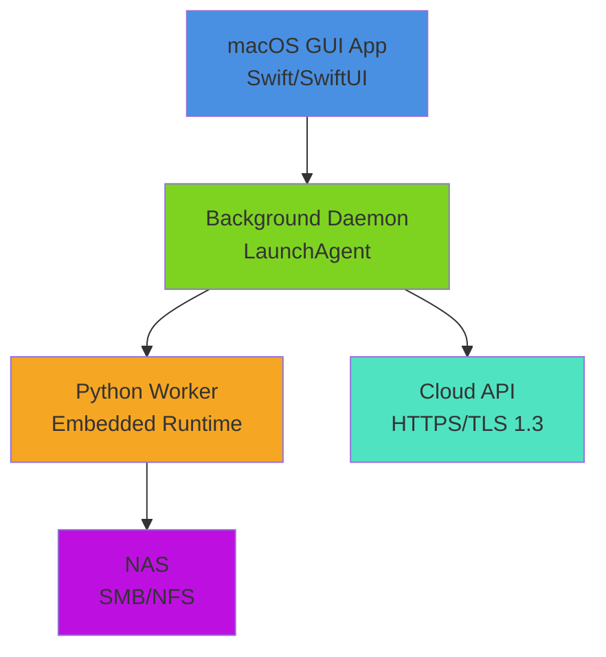
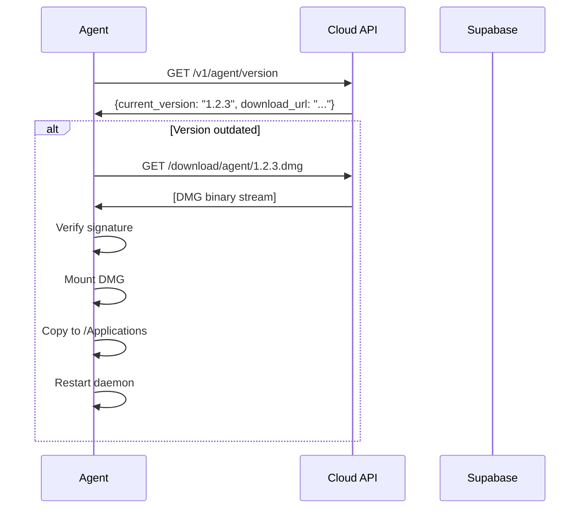
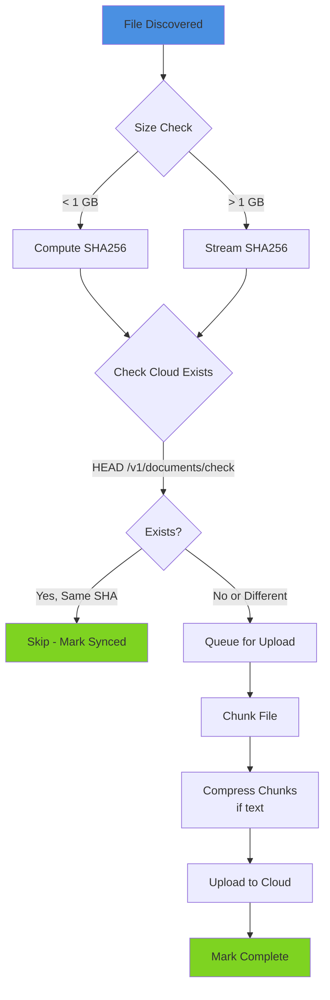
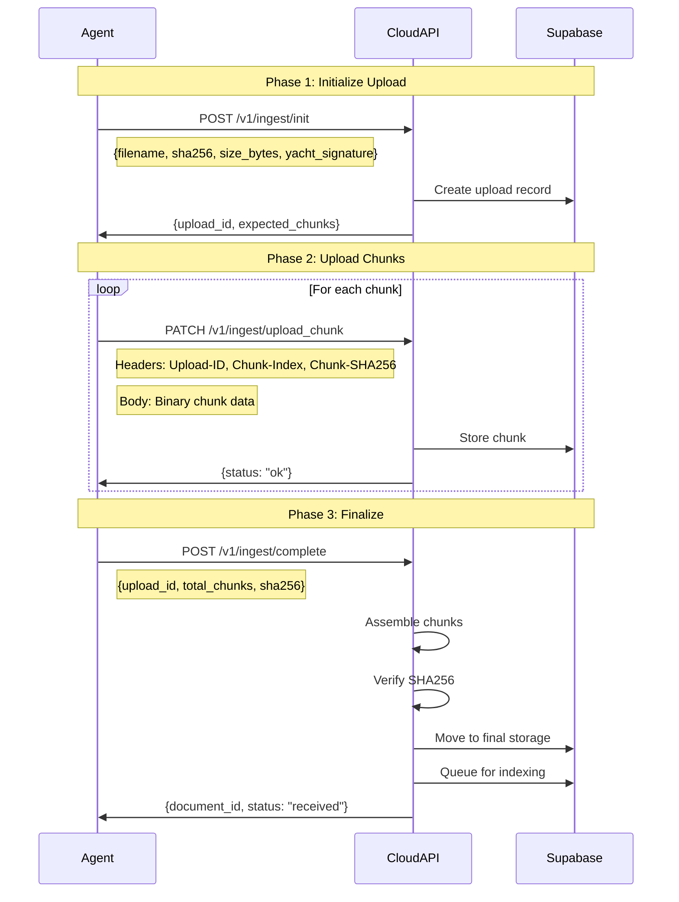
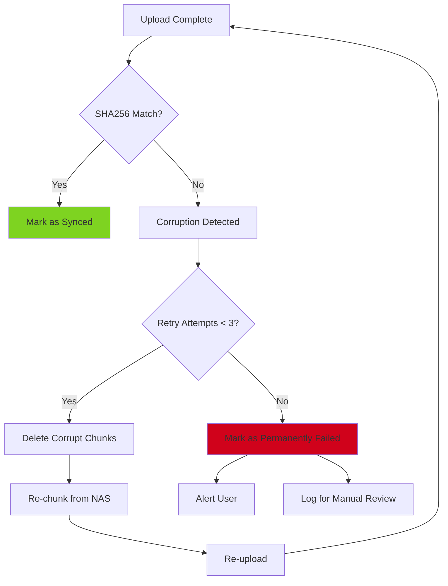
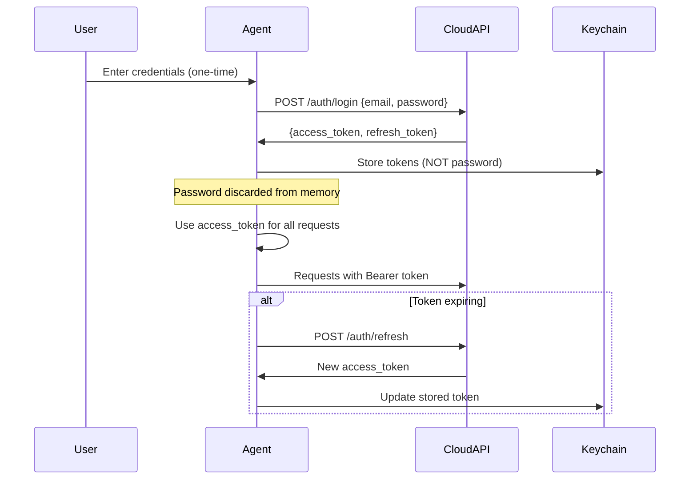

# 🔄 **local-agent-ingestion.md — CelesteOS Local Agent Ingestion Pipeline**

**Version:** 1.0
**Owner:** Engineering
**Status:** Implementation Ready
**Task:** Local Agent → Cloud Upload System

---

# # 🎯 **1. System Overview**

## **1.1 Purpose of the Local Agent**

The CelesteOS Local Agent is a **macOS application** that acts as a secure gateway between the yacht's Network Attached Storage (NAS) and the cloud intelligence platform.

**Primary Responsibilities:**
- Discover and monitor documents on the yacht's NAS
- Compute cryptographic fingerprints (SHA256) for integrity
- Split large files into uploadable chunks
- Securely transmit data to the cloud
- Resume interrupted transfers
- Track synchronization state
- Auto-update itself silently

**Critical Design Principle:**
The local agent performs **ZERO AI processing, embedding generation, or indexing**. All intelligence happens in the cloud to ensure:
- Consistent embeddings across the entire fleet
- No model drift between vessels
- Simplified yacht hardware requirements
- Centralized updates and improvements
- Predictable performance

## **1.2 What Runs Locally vs Cloud**

### **Local Agent (macOS)**
- NAS file discovery (SMB/NFS mounting)
- SHA256 hash computation
- File chunking (5-20 MB chunks)
- Compression (optional, for text files)
- Upload queue management
- Retry logic with exponential backoff
- Ephemeral temporary storage
- Status reporting

### **Cloud (Hetzner + Supabase)**
- File assembly from chunks
- SHA256 verification
- Object storage (Supabase Storage)
- OCR processing
- Text extraction
- Chunking for embeddings (semantic, not transport)
- Embedding generation
- Vector indexing (pgvector)
- Graph relationship building
- Search indexing
- Predictive analysis

## **1.3 Why No Embeddings Locally**

Running embeddings locally would require:
- GPU hardware on every yacht (costly)
- Model version synchronization (error-prone)
- Embedding model updates across fleet (complex)
- Increased power consumption
- Local vector database (storage overhead)
- Inconsistent results between vessels

By centralizing AI in the cloud:
- Single embedding model version across all yachts
- Instant model upgrades
- Consistent search quality
- Lower yacht hardware requirements
- Simplified troubleshooting

---

# # 🏗️ **2. macOS App Architecture**

## **2.1 Application Components**

The local agent consists of three main components:



### **Component 1: Swift GUI App**

**Purpose:** Initial setup and status monitoring

**Files:**
```
CelesteOS.app/
├── Contents/
│   ├── MacOS/
│   │   └── CelesteOS (executable)
│   ├── Resources/
│   │   ├── Assets.xcassets/
│   │   ├── MainMenu.nib
│   │   └── icon.icns
│   └── Info.plist
```

**Key Views:**
- **OnboardingView.swift** - Initial setup wizard
- **StatusView.swift** - Real-time sync status
- **SettingsView.swift** - NAS configuration
- **LogsView.swift** - Diagnostic logs viewer

**State Management:**
```swift
class AgentState: ObservableObject {
    @Published var syncStatus: SyncStatus = .idle
    @Published var filesQueued: Int = 0
    @Published var uploadProgress: Double = 0.0
    @Published var lastError: String? = nil
    @Published var nasConnected: Bool = false
}

enum SyncStatus {
    case idle
    case scanning
    case uploading
    case paused
    case error
}
```

### **Component 2: Background Daemon (LaunchAgent)**

**Purpose:** Continuous operation without GUI

**Location:** `~/Library/LaunchAgents/com.celesteos.agent.plist`

**LaunchAgent Configuration:**
```xml
<?xml version="1.0" encoding="UTF-8"?>
<!DOCTYPE plist PUBLIC "-//Apple//DTD PLIST 1.0//EN" "http://www.apple.com/DTDs/PropertyList-1.0.dtd">
<plist version="1.0">
<dict>
    <key>Label</key>
    <string>com.celesteos.agent</string>

    <key>ProgramArguments</key>
    <array>
        <string>/Applications/CelesteOS.app/Contents/MacOS/CelesteOS</string>
        <string>--daemon</string>
    </array>

    <key>RunAtLoad</key>
    <true/>

    <key>KeepAlive</key>
    <dict>
        <key>SuccessfulExit</key>
        <false/>
        <key>NetworkState</key>
        <true/>
    </dict>

    <key>ThrottleInterval</key>
    <integer>60</integer>

    <key>StandardOutPath</key>
    <string>/tmp/celesteos-agent-stdout.log</string>

    <key>StandardErrorPath</key>
    <string>/tmp/celesteos-agent-stderr.log</string>

    <key>EnvironmentVariables</key>
    <dict>
        <key>PATH</key>
        <string>/usr/local/bin:/usr/bin:/bin:/usr/sbin:/sbin</string>
    </dict>
</dict>
</plist>
```

**Daemon Responsibilities:**
1. Monitor NAS for file changes (every 15 minutes, configurable)
2. Process upload queue
3. Handle retries
4. Update manifest database
5. Report status to GUI (via IPC)
6. Auto-update check (every 6 hours)
7. Send telemetry to cloud (optional)

### **Component 3: Python Worker**

**Purpose:** File operations and network protocol handling

**Embedded Runtime:** Python 3.11+ bundled with app

**Location:**
```
CelesteOS.app/Contents/Resources/python/
├── bin/
│   └── python3
├── lib/
│   └── python3.11/
├── worker/
│   ├── __init__.py
│   ├── nas_scanner.py
│   ├── hasher.py
│   ├── chunker.py
│   ├── uploader.py
│   └── manifest.py
└── requirements.txt
```

**Why Python:**
- Robust file I/O libraries
- Cross-platform hash implementations (hashlib)
- SMB/CIFS support (smbprotocol, pysmb)
- Requests library for HTTP uploads
- SQLite3 for manifest database
- Easy to update/patch

**Inter-Process Communication:**
Swift app → Python worker via:
- stdin/stdout JSON messages
- Unix domain socket
- File-based queue (SQLite)

## **2.2 Auto-Update Mechanism**

**Update Check Flow:**


**Version Check Endpoint:**
```json
GET /v1/agent/version
Headers:
  X-Yacht-Signature: <yacht_sig>
  X-Current-Version: 1.1.0

Response:
{
  "latest_version": "1.2.3",
  "download_url": "https://cdn.celesteos.cloud/agent/1.2.3.dmg",
  "sha256": "abc123...",
  "signature": "...",
  "release_notes": "Bug fixes and performance improvements",
  "required": false,
  "deprecated_versions": ["1.0.0", "1.0.1"]
}
```

**Update Process:**
1. Background check every 6 hours
2. Download update in background
3. Verify cryptographic signature
4. Wait for idle state (no active uploads)
5. Install silently
6. Restart daemon
7. Report success/failure to cloud

## **2.3 Local Ephemeral Storage Layout**

**Application Support Directory:**
```
~/Library/Application Support/CelesteOS/
├── config.json              # Yacht signature, API endpoint
├── manifest.sqlite          # File inventory + sync state
├── logs/
│   ├── agent.log           # Rotation: 7 days
│   ├── upload.log
│   └── errors.log
└── temp/
    ├── chunks/             # Temporary chunk storage (deleted after upload)
    └── queue/              # Upload queue metadata
```

**Manifest Database Schema (SQLite):**
```sql
-- Tracks all files discovered on NAS
CREATE TABLE files (
    id INTEGER PRIMARY KEY AUTOINCREMENT,
    path TEXT NOT NULL UNIQUE,
    filename TEXT NOT NULL,
    size_bytes INTEGER NOT NULL,
    sha256 TEXT,
    last_modified INTEGER, -- Unix timestamp
    nas_mount_point TEXT,
    file_type TEXT,
    sync_status TEXT, -- 'pending', 'uploading', 'completed', 'failed', 'skipped'
    upload_id TEXT,
    created_at INTEGER DEFAULT (strftime('%s', 'now')),
    updated_at INTEGER DEFAULT (strftime('%s', 'now'))
);

CREATE INDEX idx_files_sha256 ON files(sha256);
CREATE INDEX idx_files_sync_status ON files(sync_status);

-- Tracks individual chunk upload state
CREATE TABLE chunks (
    id INTEGER PRIMARY KEY AUTOINCREMENT,
    file_id INTEGER NOT NULL,
    chunk_index INTEGER NOT NULL,
    chunk_sha256 TEXT NOT NULL,
    size_bytes INTEGER NOT NULL,
    upload_status TEXT, -- 'pending', 'uploading', 'completed', 'failed'
    retry_count INTEGER DEFAULT 0,
    last_attempt INTEGER,
    error_message TEXT,
    FOREIGN KEY (file_id) REFERENCES files(id) ON DELETE CASCADE
);

CREATE INDEX idx_chunks_file_id ON chunks(file_id);
CREATE INDEX idx_chunks_status ON chunks(upload_status);

-- Tracks sync sessions
CREATE TABLE sync_sessions (
    id INTEGER PRIMARY KEY AUTOINCREMENT,
    started_at INTEGER,
    completed_at INTEGER,
    files_scanned INTEGER,
    files_uploaded INTEGER,
    bytes_uploaded INTEGER,
    errors INTEGER,
    status TEXT
);
```

## **2.4 Configuration File Format**

**config.json:**
```json
{
  "version": "1.0.0",
  "yacht_signature": "ABC123XYZ789",
  "api_endpoint": "https://api.celesteos.cloud",
  "api_version": "v1",

  "nas": {
    "protocol": "smb",
    "host": "192.168.1.100",
    "share": "Engineering",
    "username": "celeste_readonly",
    "mount_point": "/Volumes/CelesteOS_NAS",
    "sync_paths": [
      "/Manuals",
      "/TechDrawings",
      "/ServiceRecords",
      "/Photos"
    ],
    "exclude_patterns": [
      "*.tmp",
      "*.DS_Store",
      "Thumbs.db",
      "*.iso",
      "*.dmg",
      "*.zip",
      "*.rar"
    ],
    "include_extensions": [
      ".pdf",
      ".docx",
      ".xlsx",
      ".pptx",
      ".msg",
      ".eml",
      ".txt",
      ".jpg",
      ".png",
      ".csv"
    ]
  },

  "sync": {
    "interval_seconds": 900,
    "chunk_size_mb": 10,
    "parallel_uploads": 3,
    "max_retries": 5,
    "retry_delay_seconds": 30,
    "enable_compression": true
  },

  "security": {
    "tls_version": "1.3",
    "verify_ssl": true,
    "token_refresh_threshold_hours": 2
  },

  "telemetry": {
    "enabled": true,
    "include_errors": true,
    "include_performance": true
  }
}
```

---

# # 📁 **3. NAS Discovery**

## **3.1 SMB/NFS Mounting**

**SMB Mount Process (Python):**
```python
import subprocess
import os
from pathlib import Path

class NASMounter:
    def __init__(self, config):
        self.protocol = config['nas']['protocol']
        self.host = config['nas']['host']
        self.share = config['nas']['share']
        self.username = config['nas']['username']
        self.mount_point = config['nas']['mount_point']

    def mount(self, password):
        """Mount NAS share using macOS native mount_smbfs"""
        if self.is_mounted():
            return True

        # Create mount point if doesn't exist
        Path(self.mount_point).mkdir(parents=True, exist_ok=True)

        if self.protocol == 'smb':
            # Use mount_smbfs for SMB/CIFS
            mount_url = f"//{self.username}:{password}@{self.host}/{self.share}"
            cmd = ['mount_smbfs', '-o', 'rdonly', mount_url, self.mount_point]
        elif self.protocol == 'nfs':
            # Use mount for NFS
            mount_url = f"{self.host}:/{self.share}"
            cmd = ['mount', '-t', 'nfs', '-o', 'ro,nolock', mount_url, self.mount_point]
        else:
            raise ValueError(f"Unsupported protocol: {self.protocol}")

        try:
            result = subprocess.run(cmd, capture_output=True, text=True, timeout=30)
            if result.returncode == 0:
                return True
            else:
                raise Exception(f"Mount failed: {result.stderr}")
        except subprocess.TimeoutExpired:
            raise Exception("Mount timeout after 30 seconds")

    def is_mounted(self):
        """Check if NAS is currently mounted"""
        return os.path.ismount(self.mount_point)

    def unmount(self):
        """Unmount NAS share"""
        if self.is_mounted():
            subprocess.run(['umount', self.mount_point])
```

## **3.2 Read-Only Requirement**

**Why Read-Only:**
- Prevents accidental data modification
- Eliminates risk of deletion
- Owner confidence in safety
- Compliance with security policy
- Reduces liability

**Enforcement:**
1. **Mount level:** `-o rdonly` flag
2. **File permissions:** Check write permissions are denied
3. **Application level:** No write operations in code
4. **Audit:** Log any attempted modifications (should never happen)

**Verification on Mount:**
```python
def verify_read_only(mount_point):
    """Verify mount is truly read-only"""
    test_file = os.path.join(mount_point, '.celesteos_write_test')
    try:
        with open(test_file, 'w') as f:
            f.write('test')
        # If we got here, mount is NOT read-only - critical error!
        os.remove(test_file)
        raise SecurityException("NAS mount is writable! Expected read-only.")
    except PermissionError:
        # This is expected - mount is read-only
        return True
```

## **3.3 Recursive Scan Rules**

**File Discovery Algorithm:**
```python
import os
import hashlib
from pathlib import Path
from datetime import datetime

class NASScanner:
    def __init__(self, config, db):
        self.config = config
        self.db = db
        self.sync_paths = config['nas']['sync_paths']
        self.mount_point = config['nas']['mount_point']
        self.include_ext = set(config['nas']['include_extensions'])
        self.exclude_patterns = config['nas']['exclude_patterns']

    def scan(self):
        """Perform full recursive scan of configured paths"""
        discovered_files = []

        for sync_path in self.sync_paths:
            full_path = os.path.join(self.mount_point, sync_path.lstrip('/'))

            if not os.path.exists(full_path):
                print(f"Warning: Path not found: {full_path}")
                continue

            for root, dirs, files in os.walk(full_path, followlinks=False):
                # Filter directories (prune)
                dirs[:] = [d for d in dirs if not self._should_exclude(d)]

                for filename in files:
                    if self._should_include(filename):
                        file_path = os.path.join(root, filename)
                        file_info = self._get_file_info(file_path)

                        if file_info:
                            discovered_files.append(file_info)

        return discovered_files

    def _should_include(self, filename):
        """Check if file should be included"""
        # Check extension
        ext = os.path.splitext(filename)[1].lower()
        if ext not in self.include_ext:
            return False

        # Check exclude patterns
        if self._should_exclude(filename):
            return False

        return True

    def _should_exclude(self, name):
        """Check against exclude patterns"""
        from fnmatch import fnmatch
        for pattern in self.exclude_patterns:
            if fnmatch(name, pattern):
                return True
        return False

    def _get_file_info(self, file_path):
        """Extract file metadata"""
        try:
            stat_info = os.stat(file_path)

            return {
                'path': file_path,
                'filename': os.path.basename(file_path),
                'size_bytes': stat_info.st_size,
                'last_modified': int(stat_info.st_mtime),
                'file_type': self._detect_file_type(file_path)
            }
        except (OSError, PermissionError) as e:
            print(f"Error accessing {file_path}: {e}")
            return None

    def _detect_file_type(self, file_path):
        """Detect file type from extension and magic bytes"""
        ext = os.path.splitext(file_path)[1].lower()

        type_mapping = {
            '.pdf': 'pdf',
            '.docx': 'docx',
            '.xlsx': 'xlsx',
            '.pptx': 'pptx',
            '.msg': 'email',
            '.eml': 'email',
            '.txt': 'text',
            '.csv': 'csv',
            '.jpg': 'image',
            '.jpeg': 'image',
            '.png': 'image'
        }

        return type_mapping.get(ext, 'unknown')
```

## **3.4 Identifying New/Changed Files**

**Change Detection Strategy:**
```python
class ChangeDetector:
    def __init__(self, db):
        self.db = db

    def detect_changes(self, discovered_files):
        """Compare discovered files against manifest to find changes"""
        new_files = []
        modified_files = []
        unchanged_files = []

        for file_info in discovered_files:
            existing = self.db.get_file_by_path(file_info['path'])

            if existing is None:
                # New file
                new_files.append(file_info)
            elif self._has_changed(existing, file_info):
                # Modified file
                modified_files.append(file_info)
            else:
                # Unchanged
                unchanged_files.append(file_info)

        return {
            'new': new_files,
            'modified': modified_files,
            'unchanged': unchanged_files
        }

    def _has_changed(self, existing, current):
        """Determine if file has been modified"""
        # Compare last_modified timestamp
        if existing['last_modified'] != current['last_modified']:
            return True

        # Compare file size
        if existing['size_bytes'] != current['size_bytes']:
            return True

        return False
```

**Incremental Sync Logic:**
```
Every 15 minutes (configurable):
1. Mount NAS (if not mounted)
2. Scan configured paths
3. Compare against manifest
4. Queue new/modified files for upload
5. Compute SHA256 for queued files (lazy, only when needed)
6. Process upload queue
7. Update manifest
```

---

# # 📦 **4. File Handling**

## **4.1 File Processing Workflow**

**For Each File:**


## **4.2 SHA256 Computation**

**Streaming Hash for Large Files:**
```python
import hashlib

class FileHasher:
    BUFFER_SIZE = 65536  # 64KB chunks for reading

    @staticmethod
    def compute_sha256(file_path):
        """Compute SHA256 hash of file using streaming"""
        sha256_hash = hashlib.sha256()

        try:
            with open(file_path, 'rb') as f:
                while True:
                    data = f.read(FileHasher.BUFFER_SIZE)
                    if not data:
                        break
                    sha256_hash.update(data)

            return sha256_hash.hexdigest()
        except Exception as e:
            raise HashComputationError(f"Failed to hash {file_path}: {e}")

    @staticmethod
    def compute_chunk_sha256(chunk_data):
        """Compute SHA256 of a chunk"""
        return hashlib.sha256(chunk_data).hexdigest()
```

## **4.3 Checking Cloud Existence**

**Deduplication Endpoint:**
```python
import requests

class CloudClient:
    def __init__(self, config, auth_token):
        self.api_endpoint = config['api_endpoint']
        self.api_version = config['api_version']
        self.yacht_signature = config['yacht_signature']
        self.auth_token = auth_token

    def check_document_exists(self, sha256):
        """Check if document with this SHA256 already exists in cloud"""
        url = f"{self.api_endpoint}/{self.api_version}/documents/check"

        headers = {
            'X-Yacht-Signature': self.yacht_signature,
            'Authorization': f'Bearer {self.auth_token}'
        }

        params = {
            'sha256': sha256
        }

        try:
            response = requests.get(url, headers=headers, params=params, timeout=10)

            if response.status_code == 200:
                data = response.json()
                return data.get('exists', False)
            elif response.status_code == 404:
                return False
            else:
                raise Exception(f"Unexpected response: {response.status_code}")
        except requests.RequestException as e:
            # Network error - assume doesn't exist to be safe
            print(f"Error checking existence: {e}")
            return False
```

**Decision Tree:**
```
if cloud.check_document_exists(sha256):
    if local_file.last_modified > cloud_document.uploaded_at:
        # Re-upload (file was modified after initial upload)
        queue_for_upload()
    else:
        # Already synced
        mark_as_synced()
        skip()
else:
    # New file
    queue_for_upload()
```

---

# # ✂️ **5. Chunking Specification**

## **5.1 Chunk Size Rules**

**Default Configuration:**
- **Minimum chunk size:** 5 MB
- **Maximum chunk size:** 20 MB
- **Default chunk size:** 10 MB
- **Configurable:** Yes, via config.json

**Why Chunking:**
1. **Resume capability:** Re-upload only failed chunks, not entire file
2. **Network stability:** Handle Starlink interruptions gracefully
3. **Parallel uploads:** Upload multiple chunks simultaneously
4. **Memory efficiency:** Process large files without loading entirely into RAM
5. **Progress tracking:** Fine-grained upload progress

## **5.2 Chunking Algorithm**

```python
import math
import gzip
from io import BytesIO

class FileChunker:
    def __init__(self, chunk_size_mb=10):
        self.chunk_size_bytes = chunk_size_mb * 1024 * 1024

    def chunk_file(self, file_path, enable_compression=False):
        """
        Split file into chunks

        Returns: List of chunk metadata
        """
        file_size = os.path.getsize(file_path)
        num_chunks = math.ceil(file_size / self.chunk_size_bytes)

        chunks = []

        with open(file_path, 'rb') as f:
            for chunk_index in range(num_chunks):
                chunk_data = f.read(self.chunk_size_bytes)

                # Optional compression for text files
                if enable_compression and self._is_compressible(file_path):
                    chunk_data = self._compress(chunk_data)

                chunk_sha256 = hashlib.sha256(chunk_data).hexdigest()

                chunk_info = {
                    'index': chunk_index,
                    'size_bytes': len(chunk_data),
                    'sha256': chunk_sha256,
                    'compressed': enable_compression and self._is_compressible(file_path)
                }

                chunks.append(chunk_info)

                # Write chunk to temp storage
                self._save_chunk_temp(file_path, chunk_index, chunk_data)

        return {
            'file_path': file_path,
            'total_chunks': num_chunks,
            'total_size_bytes': file_size,
            'chunks': chunks
        }

    def _is_compressible(self, file_path):
        """Determine if file type benefits from compression"""
        compressible_extensions = {'.txt', '.csv', '.json', '.xml', '.html', '.svg'}
        ext = os.path.splitext(file_path)[1].lower()
        return ext in compressible_extensions

    def _compress(self, data):
        """Compress chunk data using gzip"""
        buffer = BytesIO()
        with gzip.GzipFile(fileobj=buffer, mode='wb', compresslevel=6) as gz:
            gz.write(data)
        return buffer.getvalue()

    def _save_chunk_temp(self, file_path, chunk_index, chunk_data):
        """Save chunk to temporary storage"""
        temp_dir = Path.home() / 'Library/Application Support/CelesteOS/temp/chunks'
        temp_dir.mkdir(parents=True, exist_ok=True)

        file_hash = hashlib.md5(file_path.encode()).hexdigest()[:8]
        chunk_path = temp_dir / f"{file_hash}_chunk_{chunk_index}.bin"

        with open(chunk_path, 'wb') as f:
            f.write(chunk_data)

        return str(chunk_path)
```

## **5.3 Chunk Naming Convention**

**Temporary Chunk Files:**
```
~/Library/Application Support/CelesteOS/temp/chunks/
├── a1b2c3d4_chunk_0.bin
├── a1b2c3d4_chunk_1.bin
├── a1b2c3d4_chunk_2.bin
└── ...

Where:
- a1b2c3d4 = First 8 chars of MD5(file_path) for uniqueness
- chunk_N = Zero-indexed chunk number
- .bin = Binary data (may be compressed)
```

**Cleanup Policy:**
- Delete chunks after successful upload
- Keep failed chunks for retry
- Clear all temp chunks older than 7 days on startup

## **5.4 Detecting Corrupt Chunks Before Upload**

**Pre-Upload Verification:**
```python
def verify_chunk_integrity(chunk_path, expected_sha256):
    """Verify chunk hasn't been corrupted in temp storage"""
    actual_sha256 = FileHasher.compute_sha256(chunk_path)

    if actual_sha256 != expected_sha256:
        raise ChunkCorruptionError(
            f"Chunk {chunk_path} is corrupt. "
            f"Expected: {expected_sha256}, Got: {actual_sha256}"
        )

    return True
```

## **5.5 Memory Limits**

**Constraints:**
- **Max memory per upload:** 100 MB
- **Chunk buffer size:** 64 KB for streaming
- **Concurrent uploads:** 2-4 (configurable)
- **Total memory budget:** 500 MB for agent

**Memory-Efficient Processing:**
```python
def upload_chunk_streaming(chunk_path, upload_url, headers):
    """Upload chunk without loading entirely into memory"""
    def chunk_reader(file_obj, chunk_size=65536):
        while True:
            data = file_obj.read(chunk_size)
            if not data:
                break
            yield data

    with open(chunk_path, 'rb') as f:
        response = requests.patch(
            upload_url,
            data=chunk_reader(f),
            headers=headers,
            timeout=300
        )

    return response
```

## **5.6 Streaming vs Buffered**

**Strategy:**
- **Small files (< 10 MB):** Load into memory, upload directly
- **Medium files (10-500 MB):** Chunk, buffer chunks, upload
- **Large files (> 500 MB):** Chunk, stream chunks, no buffering

---

# # 📤 **6. Upload Protocol**

## **6.1 Upload Sequence**

**Three-Phase Upload:**


## **6.2 Phase 1: Initialize Upload**

**Endpoint:** `POST /v1/ingest/init`

**Request:**
```python
def init_upload(self, file_info, chunk_info):
    """Initialize upload session with cloud"""
    url = f"{self.api_endpoint}/{self.api_version}/ingest/init"

    headers = {
        'Content-Type': 'application/json',
        'X-Yacht-Signature': self.yacht_signature,
        'Authorization': f'Bearer {self.auth_token}'
    }

    payload = {
        'filename': file_info['filename'],
        'sha256': file_info['sha256'],
        'size_bytes': file_info['size_bytes'],
        'source': 'nas',
        'total_chunks': chunk_info['total_chunks'],
        'original_path': file_info['path'],
        'file_type': file_info['file_type'],
        'last_modified': file_info['last_modified']
    }

    response = requests.post(url, json=payload, headers=headers, timeout=30)

    if response.status_code == 200:
        return response.json()
    else:
        raise UploadInitError(f"Init failed: {response.status_code} - {response.text}")
```

**Response:**
```json
{
  "upload_id": "550e8400-e29b-41d4-a716-446655440000",
  "storage_key": "yachts/ABC123/temp/550e8400-e29b-41d4-a716-446655440000/",
  "expected_chunks": 12,
  "chunk_upload_urls": [
    "https://api.celesteos.cloud/v1/ingest/upload_chunk"
  ]
}
```

## **6.3 Phase 2: Upload Chunks**

**Endpoint:** `PATCH /v1/ingest/upload_chunk`

**Request:**
```python
def upload_chunk(self, upload_id, chunk_index, chunk_path, chunk_sha256):
    """Upload a single chunk"""
    url = f"{self.api_endpoint}/{self.api_version}/ingest/upload_chunk"

    headers = {
        'Content-Type': 'application/octet-stream',
        'X-Yacht-Signature': self.yacht_signature,
        'Authorization': f'Bearer {self.auth_token}',
        'Upload-ID': upload_id,
        'Chunk-Index': str(chunk_index),
        'Chunk-SHA256': chunk_sha256
    }

    with open(chunk_path, 'rb') as f:
        chunk_data = f.read()

    response = requests.patch(
        url,
        data=chunk_data,
        headers=headers,
        timeout=300  # 5 minutes for large chunks
    )

    if response.status_code == 200:
        return response.json()
    else:
        raise ChunkUploadError(
            f"Chunk {chunk_index} upload failed: {response.status_code}"
        )
```

**Response:**
```json
{
  "status": "ok",
  "chunk_index": 3,
  "received_sha256": "abc123...",
  "bytes_received": 10485760
}
```

## **6.4 Phase 3: Complete Upload**

**Endpoint:** `POST /v1/ingest/complete`

**Request:**
```python
def complete_upload(self, upload_id, file_sha256, total_chunks, filename):
    """Signal that all chunks are uploaded"""
    url = f"{self.api_endpoint}/{self.api_version}/ingest/complete"

    headers = {
        'Content-Type': 'application/json',
        'X-Yacht-Signature': self.yacht_signature,
        'Authorization': f'Bearer {self.auth_token}'
    }

    payload = {
        'upload_id': upload_id,
        'total_chunks': total_chunks,
        'sha256': file_sha256,
        'filename': filename
    }

    response = requests.post(url, json=payload, headers=headers, timeout=60)

    if response.status_code == 200:
        return response.json()
    else:
        raise UploadCompleteError(
            f"Complete failed: {response.status_code} - {response.text}"
        )
```

**Response:**
```json
{
  "document_id": "7c9e6679-7425-40de-944b-e07fc1f90ae7",
  "status": "received",
  "queued_for_indexing": true,
  "verification": {
    "chunks_received": 12,
    "chunks_expected": 12,
    "sha256_match": true
  }
}
```

## **6.5 Full Upload Example**

**Orchestration Code:**
```python
class FileUploader:
    def __init__(self, cloud_client, chunker, db):
        self.cloud = cloud_client
        self.chunker = chunker
        self.db = db

    def upload_file(self, file_info):
        """Complete upload workflow for a single file"""
        try:
            # Step 1: Chunk the file
            chunk_info = self.chunker.chunk_file(
                file_info['path'],
                enable_compression=True
            )

            # Step 2: Initialize upload
            init_response = self.cloud.init_upload(file_info, chunk_info)
            upload_id = init_response['upload_id']

            # Update database
            self.db.update_file_upload_id(file_info['id'], upload_id)
            self.db.insert_chunks(file_info['id'], chunk_info['chunks'])

            # Step 3: Upload chunks (with parallelization)
            self._upload_chunks_parallel(upload_id, chunk_info['chunks'])

            # Step 4: Complete upload
            complete_response = self.cloud.complete_upload(
                upload_id,
                file_info['sha256'],
                chunk_info['total_chunks'],
                file_info['filename']
            )

            # Step 5: Mark as completed
            self.db.mark_file_synced(file_info['id'], complete_response['document_id'])

            # Step 6: Cleanup temp chunks
            self._cleanup_temp_chunks(file_info['id'])

            return complete_response

        except Exception as e:
            # Mark as failed for retry
            self.db.mark_file_failed(file_info['id'], str(e))
            raise

    def _upload_chunks_parallel(self, upload_id, chunks, max_workers=3):
        """Upload chunks with controlled parallelism"""
        from concurrent.futures import ThreadPoolExecutor, as_completed

        with ThreadPoolExecutor(max_workers=max_workers) as executor:
            futures = {}

            for chunk in chunks:
                chunk_path = self._get_chunk_temp_path(upload_id, chunk['index'])

                future = executor.submit(
                    self.cloud.upload_chunk,
                    upload_id,
                    chunk['index'],
                    chunk_path,
                    chunk['sha256']
                )
                futures[future] = chunk['index']

            # Wait for all chunks and handle errors
            for future in as_completed(futures):
                chunk_index = futures[future]
                try:
                    result = future.result()
                    self.db.mark_chunk_uploaded(upload_id, chunk_index)
                except Exception as e:
                    self.db.mark_chunk_failed(upload_id, chunk_index, str(e))
                    raise ChunkUploadError(f"Chunk {chunk_index} failed: {e}")
```

---

# # 🔁 **7. Retry System**

## **7.1 Retry Strategy**

**Configuration:**
```python
RETRY_CONFIG = {
    'max_attempts': 5,
    'initial_delay_seconds': 30,
    'backoff_multiplier': 2,
    'max_delay_seconds': 1800,  # 30 minutes
    'retry_on_status_codes': [408, 429, 500, 502, 503, 504],
    'retry_on_exceptions': [
        requests.exceptions.Timeout,
        requests.exceptions.ConnectionError,
        requests.exceptions.ChunkedEncodingError
    ]
}
```

**Exponential Backoff:**
```
Attempt 1: Immediate
Attempt 2: Wait 30 seconds
Attempt 3: Wait 60 seconds (30 * 2)
Attempt 4: Wait 120 seconds (60 * 2)
Attempt 5: Wait 240 seconds (120 * 2)
Attempt 6: Give up, mark as failed
```

## **7.2 Retry Implementation**

```python
import time
from functools import wraps

class RetryableUploader:
    def __init__(self, config):
        self.max_attempts = config['max_attempts']
        self.initial_delay = config['initial_delay_seconds']
        self.backoff_multiplier = config['backoff_multiplier']
        self.max_delay = config['max_delay_seconds']
        self.retry_status_codes = set(config['retry_on_status_codes'])
        self.retry_exceptions = tuple(config['retry_on_exceptions'])

    def with_retry(self, func):
        """Decorator for retryable operations"""
        @wraps(func)
        def wrapper(*args, **kwargs):
            delay = self.initial_delay

            for attempt in range(1, self.max_attempts + 1):
                try:
                    return func(*args, **kwargs)

                except self.retry_exceptions as e:
                    if attempt == self.max_attempts:
                        raise RetryExhaustedError(
                            f"Failed after {self.max_attempts} attempts: {e}"
                        )

                    print(f"Attempt {attempt} failed: {e}. Retrying in {delay}s...")
                    time.sleep(delay)
                    delay = min(delay * self.backoff_multiplier, self.max_delay)

                except requests.exceptions.HTTPError as e:
                    if e.response.status_code in self.retry_status_codes:
                        if attempt == self.max_attempts:
                            raise RetryExhaustedError(
                                f"Failed after {self.max_attempts} attempts: {e}"
                            )

                        print(f"HTTP {e.response.status_code}. Retrying in {delay}s...")
                        time.sleep(delay)
                        delay = min(delay * self.backoff_multiplier, self.max_delay)
                    else:
                        # Non-retryable HTTP error
                        raise

        return wrapper
```

**Usage:**
```python
retryable = RetryableUploader(RETRY_CONFIG)

@retryable.with_retry
def upload_chunk_with_retry(upload_id, chunk_index, chunk_path, chunk_sha256):
    return cloud_client.upload_chunk(upload_id, chunk_index, chunk_path, chunk_sha256)
```

## **7.3 Resuming from Failed Chunks**

**Resume Logic:**
```python
def resume_upload(self, file_id):
    """Resume upload from last successful chunk"""
    file_info = self.db.get_file(file_id)
    upload_id = file_info['upload_id']

    # Get chunks that haven't been uploaded
    pending_chunks = self.db.get_chunks_by_status(file_id, 'pending')
    failed_chunks = self.db.get_chunks_by_status(file_id, 'failed')

    chunks_to_upload = pending_chunks + failed_chunks

    if not chunks_to_upload:
        # All chunks uploaded, try to complete
        return self._try_complete_upload(file_id)

    # Upload remaining chunks
    for chunk in chunks_to_upload:
        self._upload_chunk_with_retry(upload_id, chunk)

    # Complete upload
    return self._try_complete_upload(file_id)
```

## **7.4 Network Drop Handling**

**Connection Monitoring:**
```python
import socket

class NetworkMonitor:
    @staticmethod
    def is_connected():
        """Check if internet connection is available"""
        try:
            # Try to connect to CloudFlare DNS
            socket.create_connection(("1.1.1.1", 53), timeout=3)
            return True
        except OSError:
            return False

    @staticmethod
    def wait_for_connection(max_wait_seconds=300):
        """Wait for internet connection to be restored"""
        start_time = time.time()

        while time.time() - start_time < max_wait_seconds:
            if NetworkMonitor.is_connected():
                return True
            time.sleep(10)  # Check every 10 seconds

        return False
```

**Upload with Network Recovery:**
```python
def upload_with_network_recovery(upload_func, *args, **kwargs):
    """Wrapper that waits for network before retrying"""
    try:
        return upload_func(*args, **kwargs)
    except requests.exceptions.ConnectionError:
        print("Network connection lost. Waiting for recovery...")

        if NetworkMonitor.wait_for_connection():
            print("Network restored. Resuming upload...")
            return upload_func(*args, **kwargs)
        else:
            raise NetworkError("Network did not recover within timeout")
```

## **7.5 Starlink-Tolerant Logic**

**Starlink Characteristics:**
- Latency: 20-40ms (variable)
- Occasional dropouts: 1-5 seconds
- Obstructions can cause longer outages
- High bandwidth but inconsistent

**Adaptations:**
1. **Longer timeouts:** 300s instead of 30s for chunk uploads
2. **Aggressive retries:** Don't give up on first failure
3. **Small chunk sizes:** 10MB default (vs 50MB for fiber)
4. **Connection pooling:** Reuse connections when possible
5. **Graceful degradation:** Reduce parallel uploads if errors increase

**Adaptive Parallelism:**
```python
class AdaptiveUploader:
    def __init__(self):
        self.parallel_uploads = 3  # Start with 3
        self.error_rate = 0.0
        self.recent_attempts = []

    def adjust_parallelism(self, success):
        """Adjust based on recent success rate"""
        self.recent_attempts.append(1 if success else 0)

        # Keep last 20 attempts
        if len(self.recent_attempts) > 20:
            self.recent_attempts.pop(0)

        self.error_rate = 1 - (sum(self.recent_attempts) / len(self.recent_attempts))

        # Adjust parallelism
        if self.error_rate > 0.3:  # >30% error rate
            self.parallel_uploads = max(1, self.parallel_uploads - 1)
        elif self.error_rate < 0.1:  # <10% error rate
            self.parallel_uploads = min(4, self.parallel_uploads + 1)
```

---

# # 🔒 **8. Integrity Verification**

## **8.1 Pre-Upload Verification**

**Chunk Integrity Check:**
```python
def verify_chunk_before_upload(chunk_path, expected_sha256):
    """Verify chunk hasn't been corrupted in temp storage"""
    actual_sha256 = compute_sha256(chunk_path)

    if actual_sha256 != expected_sha256:
        # Chunk is corrupt - need to re-chunk from source
        raise ChunkCorruptionError(
            f"Chunk at {chunk_path} is corrupt. "
            f"Expected SHA256: {expected_sha256}, "
            f"Actual SHA256: {actual_sha256}"
        )

    return True
```

## **8.2 Post-Upload Verification**

**Cloud-Side Verification (in n8n):**
```javascript
// After all chunks received, cloud re-assembles and verifies
const assembledFile = assembleChunks(chunks);
const actualSHA256 = computeSHA256(assembledFile);
const expectedSHA256 = uploadRequest.sha256;

if (actualSHA256 !== expectedSHA256) {
    return {
        status: 'verification_failed',
        expected: expectedSHA256,
        actual: actualSHA256,
        action: 'retry_upload'
    };
}

// Success - file integrity confirmed
return {
    status: 'verified',
    document_id: documentId
};
```

## **8.3 Mismatch Handling**

**Corruption Recovery Flow:**


**Implementation:**
```python
def handle_verification_failure(file_id, expected_sha, actual_sha):
    """Handle SHA256 mismatch after upload"""
    retry_count = self.db.get_file_retry_count(file_id)

    if retry_count < 3:
        # Retry
        print(f"Verification failed for file {file_id}. Retry {retry_count + 1}/3")

        # Delete corrupt chunks
        self._cleanup_temp_chunks(file_id)

        # Reset upload state
        self.db.reset_file_upload_state(file_id)
        self.db.increment_retry_count(file_id)

        # Re-queue for upload
        self.queue.add_to_upload_queue(file_id)

    else:
        # Permanent failure
        error_msg = (
            f"SHA256 verification failed after 3 attempts. "
            f"Expected: {expected_sha}, Actual: {actual_sha}"
        )

        self.db.mark_file_permanently_failed(file_id, error_msg)
        self.telemetry.log_critical_error('integrity_failure', {
            'file_id': file_id,
            'expected_sha': expected_sha,
            'actual_sha': actual_sha
        })
```

## **8.4 Fallback Rules**

**When Verification Fails:**
1. **First failure:** Re-chunk and retry immediately
2. **Second failure:** Wait 30 minutes, then retry
3. **Third failure:** Mark as failed, alert user, manual intervention required

**Possible Corruption Sources:**
- Disk errors on NAS
- RAM errors during chunking
- Network bit flips (rare with TCP)
- Storage corruption in temp directory
- Software bugs in chunking logic

---

# # 🔐 **9. Security**

## **9.1 Storing Yacht Signature Securely**

**Storage Location:** macOS Keychain

**Implementation:**
```python
import keyring

class SecureStorage:
    SERVICE_NAME = 'com.celesteos.agent'

    @staticmethod
    def store_yacht_signature(yacht_signature):
        """Store yacht signature in macOS Keychain"""
        keyring.set_password(
            SecureStorage.SERVICE_NAME,
            'yacht_signature',
            yacht_signature
        )

    @staticmethod
    def get_yacht_signature():
        """Retrieve yacht signature from Keychain"""
        return keyring.get_password(
            SecureStorage.SERVICE_NAME,
            'yacht_signature'
        )

    @staticmethod
    def store_nas_credentials(username, password):
        """Store NAS credentials in Keychain"""
        keyring.set_password(
            SecureStorage.SERVICE_NAME,
            f'nas_user',
            username
        )
        keyring.set_password(
            SecureStorage.SERVICE_NAME,
            f'nas_pass',
            password
        )

    @staticmethod
    def get_nas_credentials():
        """Retrieve NAS credentials"""
        username = keyring.get_password(SecureStorage.SERVICE_NAME, 'nas_user')
        password = keyring.get_password(SecureStorage.SERVICE_NAME, 'nas_pass')
        return username, password
```

**Why Keychain:**
- Encrypted at rest
- Requires user authentication to access
- Integration with macOS security model
- Automatic backup with iCloud Keychain (optional)
- Better than storing in plain text config files

## **9.2 Token Refresh Flow**

**JWT Token Lifecycle:**
- **Access Token:** Valid for 24 hours
- **Refresh Token:** Valid for 30 days
- **Refresh Threshold:** Refresh when < 2 hours remaining

**Token Management:**
```python
import jwt
from datetime import datetime, timedelta

class TokenManager:
    def __init__(self, config):
        self.config = config
        self.access_token = None
        self.refresh_token = None
        self.token_expiry = None

    def get_valid_token(self):
        """Get valid access token, refreshing if necessary"""
        if self._needs_refresh():
            self._refresh_tokens()

        return self.access_token

    def _needs_refresh(self):
        """Check if token needs refreshing"""
        if not self.access_token or not self.token_expiry:
            return True

        # Refresh if less than 2 hours remaining
        threshold = datetime.now() + timedelta(hours=2)
        return self.token_expiry < threshold

    def _refresh_tokens(self):
        """Refresh access token using refresh token"""
        url = f"{self.config['api_endpoint']}/{self.config['api_version']}/auth/refresh"

        payload = {
            'refresh_token': self.refresh_token
        }

        response = requests.post(url, json=payload, timeout=30)

        if response.status_code == 200:
            data = response.json()
            self.access_token = data['access_token']
            self.refresh_token = data.get('refresh_token', self.refresh_token)

            # Decode to get expiry
            decoded = jwt.decode(self.access_token, options={"verify_signature": False})
            self.token_expiry = datetime.fromtimestamp(decoded['exp'])

            # Store in keychain
            self._store_tokens()
        else:
            raise TokenRefreshError("Failed to refresh token")

    def _store_tokens(self):
        """Persist tokens to secure storage"""
        keyring.set_password(
            SecureStorage.SERVICE_NAME,
            'access_token',
            self.access_token
        )
        keyring.set_password(
            SecureStorage.SERVICE_NAME,
            'refresh_token',
            self.refresh_token
        )
```

## **9.3 Never Storing User Passwords**

**Authentication Flow:**


**Security Principles:**
1. **Never log passwords**
2. **Never store passwords in config files**
3. **Never transmit passwords after initial auth**
4. **Clear password from memory immediately after use**
5. **Use tokens for all subsequent operations**

## **9.4 Keychain Usage**

**Swift Keychain Wrapper:**
```swift
import Security
import Foundation

class KeychainManager {
    static let shared = KeychainManager()
    private let service = "com.celesteos.agent"

    func store(key: String, value: String) -> Bool {
        let data = value.data(using: .utf8)!

        let query: [String: Any] = [
            kSecClass as String: kSecClassGenericPassword,
            kSecAttrService as String: service,
            kSecAttrAccount as String: key,
            kSecValueData as String: data
        ]

        SecItemDelete(query as CFDictionary)  // Delete existing
        let status = SecItemAdd(query as CFDictionary, nil)

        return status == errSecSuccess
    }

    func retrieve(key: String) -> String? {
        let query: [String: Any] = [
            kSecClass as String: kSecClassGenericPassword,
            kSecAttrService as String: service,
            kSecAttrAccount as String: key,
            kSecReturnData as String: true
        ]

        var result: AnyObject?
        let status = SecItemCopyMatching(query as CFDictionary, &result)

        guard status == errSecSuccess,
              let data = result as? Data,
              let value = String(data: data, encoding: .utf8) else {
            return nil
        }

        return value
    }

    func delete(key: String) -> Bool {
        let query: [String: Any] = [
            kSecClass as String: kSecClassGenericPassword,
            kSecAttrService as String: service,
            kSecAttrAccount as String: key
        ]

        let status = SecItemDelete(query as CFDictionary)
        return status == errSecSuccess
    }
}
```

## **9.5 TLS 1.3 Enforcement**

**HTTPS Configuration:**
```python
import ssl
import requests
from requests.adapters import HTTPAdapter
from urllib3.util.ssl_ import create_urllib3_context

class TLS13Adapter(HTTPAdapter):
    """Force TLS 1.3 for all connections"""

    def init_poolmanager(self, *args, **kwargs):
        context = create_urllib3_context()
        context.minimum_version = ssl.TLSVersion.TLSv1_3
        context.maximum_version = ssl.TLSVersion.TLSv1_3
        kwargs['ssl_context'] = context
        return super().init_poolmanager(*args, **kwargs)

# Usage
session = requests.Session()
session.mount('https://', TLS13Adapter())
```

**Certificate Pinning (Optional for Extra Security):**
```python
import certifi

# Pin to specific certificate
CELESTEOS_CERT_SHA256 = "ABC123..."

def verify_certificate(cert):
    """Verify server certificate matches expected pin"""
    actual_sha256 = hashlib.sha256(cert).hexdigest()
    if actual_sha256 != CELESTEOS_CERT_SHA256:
        raise CertificatePinningError("Certificate does not match expected pin")
```

## **9.6 No Local Document Storage After Upload**

**Cleanup Policy:**
```python
def cleanup_after_successful_upload(file_id):
    """Remove all local traces of uploaded file"""

    # 1. Delete temporary chunks
    chunk_dir = Path.home() / 'Library/Application Support/CelesteOS/temp/chunks'
    file_hash = db.get_file_hash(file_id)

    for chunk_file in chunk_dir.glob(f"{file_hash}_chunk_*.bin"):
        chunk_file.unlink()

    # 2. Remove from upload queue
    db.delete_chunks(file_id)

    # 3. Keep only metadata in manifest (not content)
    db.update_file(file_id, {
        'sync_status': 'completed',
        'synced_at': int(time.time())
    })

    # NOTE: Original file remains on NAS (read-only), not touched
```

**Data Retention:**
- **Keep:** File path, SHA256, last sync timestamp
- **Delete:** Chunk data, temporary files
- **Never Store:** File contents locally after upload

---

# # ⚡ **10. Performance**

## **10.1 Parallel Uploads**

**Concurrency Configuration:**
```python
UPLOAD_CONFIG = {
    'max_parallel_chunks': 3,      # Upload 3 chunks simultaneously
    'max_parallel_files': 1,       # Process 1 file at a time
    'thread_pool_size': 4,         # 3 upload + 1 monitor thread
    'chunk_buffer_size': 65536     # 64KB read buffer
}
```

**Why Limited Parallelism:**
1. **Starlink bandwidth:** 50-200 Mbps (shared with yacht operations)
2. **CPU constraints:** Mac Mini has limited cores
3. **Memory pressure:** Each upload thread consumes RAM
4. **Connection limits:** Don't overwhelm server
5. **Stability:** Fewer connections = more reliable uploads

**Parallel Upload Implementation:**
```python
from concurrent.futures import ThreadPoolExecutor, as_completed
import queue
import threading

class ParallelUploader:
    def __init__(self, max_workers=3):
        self.max_workers = max_workers
        self.upload_queue = queue.Queue()
        self.results_queue = queue.Queue()

    def upload_chunks_parallel(self, upload_id, chunks):
        """Upload multiple chunks in parallel"""
        with ThreadPoolExecutor(max_workers=self.max_workers) as executor:
            # Submit all chunks
            future_to_chunk = {}

            for chunk in chunks:
                future = executor.submit(
                    self._upload_single_chunk,
                    upload_id,
                    chunk
                )
                future_to_chunk[future] = chunk

            # Collect results as they complete
            results = []
            for future in as_completed(future_to_chunk):
                chunk = future_to_chunk[future]
                try:
                    result = future.result()
                    results.append({
                        'chunk_index': chunk['index'],
                        'status': 'success',
                        'result': result
                    })
                except Exception as e:
                    results.append({
                        'chunk_index': chunk['index'],
                        'status': 'failed',
                        'error': str(e)
                    })

            return results
```

## **10.2 CPU Limits**

**Resource Constraints:**
- **Mac Mini M1:** 8 cores (4 performance + 4 efficiency)
- **Mac Studio M1 Max:** 10 cores (8 performance + 2 efficiency)
- **Target CPU usage:** < 30% (leave headroom for other yacht systems)

**CPU Throttling:**
```python
import psutil
import time

class ResourceMonitor:
    CPU_THRESHOLD = 70  # Pause uploads if CPU > 70%
    MEMORY_THRESHOLD = 80  # Pause if memory > 80%

    @staticmethod
    def check_resources():
        """Check if system resources allow upload"""
        cpu_percent = psutil.cpu_percent(interval=1)
        memory_percent = psutil.virtual_memory().percent

        return {
            'cpu_ok': cpu_percent < ResourceMonitor.CPU_THRESHOLD,
            'memory_ok': memory_percent < ResourceMonitor.MEMORY_THRESHOLD,
            'cpu_percent': cpu_percent,
            'memory_percent': memory_percent
        }

    @staticmethod
    def wait_for_resources():
        """Wait until resources are available"""
        while True:
            status = ResourceMonitor.check_resources()

            if status['cpu_ok'] and status['memory_ok']:
                return True

            print(f"Resources constrained. CPU: {status['cpu_percent']}%, "
                  f"Memory: {status['memory_percent']}%. Waiting...")
            time.sleep(30)
```

## **10.3 Memory Pressure Rules**

**Memory Budgets:**
```python
MEMORY_LIMITS = {
    'total_agent_budget_mb': 500,
    'per_chunk_buffer_mb': 15,
    'manifest_db_mb': 50,
    'hash_computation_mb': 100,
    'overhead_mb': 100
}
```

**Memory Monitoring:**
```python
def check_memory_pressure():
    """Check if agent is consuming too much memory"""
    process = psutil.Process()
    memory_mb = process.memory_info().rss / (1024 * 1024)

    if memory_mb > MEMORY_LIMITS['total_agent_budget_mb']:
        return {
            'pressure': True,
            'current_mb': memory_mb,
            'limit_mb': MEMORY_LIMITS['total_agent_budget_mb'],
            'action': 'reduce_parallelism'
        }

    return {
        'pressure': False,
        'current_mb': memory_mb
    }
```

**Pressure Response:**
1. **Reduce parallel uploads:** 3 → 2 → 1
2. **Clear chunk cache:** Delete uploaded chunks immediately
3. **Garbage collect:** Force Python GC
4. **Pause uploads:** If pressure persists

## **10.4 Idle Cycle Usage**

**Smart Scheduling:**
```python
class SmartScheduler:
    """Schedule uploads during low-activity periods"""

    QUIET_HOURS = range(2, 6)  # 2 AM - 6 AM

    @staticmethod
    def is_quiet_period():
        """Check if current time is in quiet hours"""
        current_hour = datetime.now().hour
        return current_hour in SmartScheduler.QUIET_HOURS

    @staticmethod
    def should_prioritize_upload():
        """Determine if upload should be prioritized"""
        if SmartScheduler.is_quiet_period():
            return True

        # Also check system load
        load_avg = psutil.getloadavg()[0]
        cpu_count = psutil.cpu_count()

        # If system load < 50%, safe to upload
        return load_avg < (cpu_count * 0.5)
```

**Bandwidth Management:**
```python
class BandwidthThrottler:
    """Throttle upload speed to not saturate connection"""

    def __init__(self, max_mbps=50):
        self.max_bytes_per_second = (max_mbps * 1024 * 1024) / 8
        self.bytes_sent = 0
        self.window_start = time.time()

    def throttle(self, chunk_size):
        """Sleep if necessary to maintain speed limit"""
        self.bytes_sent += chunk_size
        elapsed = time.time() - self.window_start

        if elapsed >= 1.0:
            # Reset window
            self.bytes_sent = 0
            self.window_start = time.time()
        else:
            # Check if we're over limit
            current_rate = self.bytes_sent / elapsed

            if current_rate > self.max_bytes_per_second:
                # Calculate sleep time
                sleep_time = (self.bytes_sent / self.max_bytes_per_second) - elapsed
                if sleep_time > 0:
                    time.sleep(sleep_time)
```

---

# # 📊 **11. Telemetry & Logging**

## **11.1 Local Log Format**

**Log Structure:**
```
~/Library/Application Support/CelesteOS/logs/
├── agent.log              # General agent activity
├── upload.log             # Upload operations
├── errors.log             # Error messages
└── performance.log        # Performance metrics
```

**Log Entry Format (JSON Lines):**
```json
{
  "timestamp": "2024-11-20T14:32:15.123Z",
  "level": "INFO",
  "component": "uploader",
  "event": "chunk_uploaded",
  "file_id": 12345,
  "upload_id": "550e8400-e29b-41d4-a716-446655440000",
  "chunk_index": 3,
  "chunk_size_bytes": 10485760,
  "duration_ms": 2341,
  "retry_count": 0
}
```

**Logging Implementation:**
```python
import logging
import json
from logging.handlers import RotatingFileHandler

class StructuredLogger:
    def __init__(self, log_dir):
        self.log_dir = Path(log_dir)
        self.log_dir.mkdir(parents=True, exist_ok=True)

        self.loggers = {
            'agent': self._create_logger('agent.log'),
            'upload': self._create_logger('upload.log'),
            'error': self._create_logger('errors.log'),
            'performance': self._create_logger('performance.log')
        }

    def _create_logger(self, filename):
        """Create rotating file logger"""
        logger = logging.getLogger(filename)
        logger.setLevel(logging.DEBUG)

        handler = RotatingFileHandler(
            self.log_dir / filename,
            maxBytes=10 * 1024 * 1024,  # 10 MB
            backupCount=7  # Keep 7 days
        )

        handler.setFormatter(
            logging.Formatter('%(message)s')  # JSON already formatted
        )

        logger.addHandler(handler)
        return logger

    def log(self, category, level, event, **kwargs):
        """Log structured event"""
        entry = {
            'timestamp': datetime.utcnow().isoformat() + 'Z',
            'level': level,
            'event': event,
            **kwargs
        }

        logger = self.loggers.get(category, self.loggers['agent'])
        logger.info(json.dumps(entry))

# Usage
logger = StructuredLogger('~/Library/Application Support/CelesteOS/logs')

logger.log('upload', 'INFO', 'chunk_uploaded',
           file_id=123,
           chunk_index=3,
           duration_ms=2341)
```

## **11.2 Push to Cloud (Optional)**

**Telemetry Payload:**
```python
def send_telemetry_batch(events):
    """Send batch of telemetry events to cloud"""
    url = f"{config['api_endpoint']}/{config['api_version']}/telemetry/batch"

    headers = {
        'Content-Type': 'application/json',
        'X-Yacht-Signature': config['yacht_signature'],
        'Authorization': f'Bearer {auth_token}'
    }

    payload = {
        'yacht_signature': config['yacht_signature'],
        'agent_version': AGENT_VERSION,
        'events': events,
        'submitted_at': datetime.utcnow().isoformat() + 'Z'
    }

    try:
        response = requests.post(url, json=payload, headers=headers, timeout=30)
        return response.status_code == 200
    except Exception as e:
        # Don't fail uploads if telemetry fails
        print(f"Telemetry submission failed: {e}")
        return False
```

**Telemetry Collection (Non-Blocking):**
```python
class TelemetryCollector:
    def __init__(self):
        self.events_buffer = []
        self.max_buffer_size = 100

    def collect(self, event):
        """Buffer event for later submission"""
        self.events_buffer.append(event)

        if len(self.events_buffer) >= self.max_buffer_size:
            self._flush()

    def _flush(self):
        """Submit buffered events to cloud"""
        if not self.events_buffer:
            return

        # Send in background thread
        threading.Thread(
            target=send_telemetry_batch,
            args=(self.events_buffer.copy(),),
            daemon=True
        ).start()

        self.events_buffer.clear()
```

## **11.3 Error Counters**

**Metrics Tracking:**
```python
class MetricsCollector:
    def __init__(self):
        self.counters = {
            'files_scanned': 0,
            'files_queued': 0,
            'files_uploaded': 0,
            'files_failed': 0,
            'chunks_uploaded': 0,
            'chunks_failed': 0,
            'bytes_uploaded': 0,
            'retries': 0,
            'network_errors': 0,
            'verification_failures': 0
        }

        self.timers = {}

    def increment(self, counter, value=1):
        """Increment counter"""
        if counter in self.counters:
            self.counters[counter] += value

    def start_timer(self, name):
        """Start timing operation"""
        self.timers[name] = time.time()

    def end_timer(self, name):
        """End timing and return duration"""
        if name in self.timers:
            duration = time.time() - self.timers[name]
            del self.timers[name]
            return duration
        return 0

    def get_summary(self):
        """Get metrics summary"""
        return {
            'counters': self.counters.copy(),
            'uptime_seconds': time.time() - self.start_time,
            'timestamp': datetime.utcnow().isoformat() + 'Z'
        }
```

## **11.4 Progress Callbacks**

**Progress Reporting for GUI:**
```python
class ProgressReporter:
    def __init__(self, callback):
        self.callback = callback

    def report_scan_progress(self, current, total):
        """Report NAS scan progress"""
        self.callback({
            'stage': 'scanning',
            'current': current,
            'total': total,
            'percent': (current / total * 100) if total > 0 else 0
        })

    def report_upload_progress(self, file_id, chunk_index, total_chunks, bytes_uploaded, total_bytes):
        """Report upload progress"""
        chunk_percent = (chunk_index / total_chunks * 100) if total_chunks > 0 else 0
        byte_percent = (bytes_uploaded / total_bytes * 100) if total_bytes > 0 else 0

        self.callback({
            'stage': 'uploading',
            'file_id': file_id,
            'chunk_index': chunk_index,
            'total_chunks': total_chunks,
            'chunk_percent': chunk_percent,
            'bytes_uploaded': bytes_uploaded,
            'total_bytes': total_bytes,
            'byte_percent': byte_percent
        })

# Swift GUI receives updates
class StatusViewModel: ObservableObject {
    @Published var uploadProgress: Double = 0.0
    @Published var currentFile: String = ""
    @Published var statusMessage: String = "Idle"

    func updateProgress(_ progress: [String: Any]) {
        DispatchQueue.main.async {
            self.uploadProgress = progress["percent"] as? Double ?? 0.0
            self.statusMessage = progress["stage"] as? String ?? "Unknown"
        }
    }
}
```

---

# # 🎨 **12. User UX (Minimal)**

## **12.1 Onboarding Flow**

**First Launch Wizard:**
```
┌─────────────────────────────────────┐
│   Welcome to CelesteOS              │
│                                     │
│   This app syncs your yacht's NAS   │
│   to the cloud for AI-powered       │
│   engineering intelligence.         │
│                                     │
│         [ Continue ]                │
└─────────────────────────────────────┘

Step 1/4: Yacht Signature
┌─────────────────────────────────────┐
│   Enter your yacht signature:       │
│                                     │
│   ┌───────────────────────────┐    │
│   │ ABC123XYZ789              │    │
│   └───────────────────────────┘    │
│                                     │
│   This was provided during          │
│   your CelesteOS onboarding.        │
│                                     │
│   [ Back ]          [ Continue ]    │
└─────────────────────────────────────┘

Step 2/4: NAS Connection
┌─────────────────────────────────────┐
│   Configure NAS Connection          │
│                                     │
│   Protocol: ◉ SMB  ○ NFS            │
│                                     │
│   Host/IP:                          │
│   ┌───────────────────────────┐    │
│   │ 192.168.1.100             │    │
│   └───────────────────────────┘    │
│                                     │
│   Share Name:                       │
│   ┌───────────────────────────┐    │
│   │ Engineering               │    │
│   └───────────────────────────┘    │
│                                     │
│   Username:                         │
│   ┌───────────────────────────┐    │
│   │ celeste_readonly          │    │
│   └───────────────────────────┘    │
│                                     │
│   Password:                         │
│   ┌───────────────────────────┐    │
│   │ ••••••••••                │    │
│   └───────────────────────────┘    │
│                                     │
│   [ Back ]      [ Test & Continue ] │
└─────────────────────────────────────┘

Step 3/4: Select Folders
┌─────────────────────────────────────┐
│   Choose folders to sync:           │
│                                     │
│   ☑ Manuals                         │
│   ☑ Technical Drawings              │
│   ☑ Service Records                 │
│   ☑ Photos                          │
│   ☐ Archive                         │
│   ☐ Personal                        │
│                                     │
│   [ Back ]          [ Continue ]    │
└─────────────────────────────────────┘

Step 4/4: Ready
┌─────────────────────────────────────┐
│   Setup Complete!                   │
│                                     │
│   CelesteOS will now:               │
│   • Scan your NAS for files         │
│   • Upload to secure cloud storage  │
│   • Run in the background           │
│                                     │
│   You can close this window and     │
│   the agent will continue working.  │
│                                     │
│   [ Back ]       [ Start Sync ]     │
└─────────────────────────────────────┘
```

## **12.2 Status View**

**Main Status Window:**
```
┌─────────────────────────────────────────────┐
│  CelesteOS Agent                    [●] ✓   │
├─────────────────────────────────────────────┤
│                                             │
│  Status: Syncing...                         │
│                                             │
│  ┌─────────────────────────────────────┐   │
│  │ ████████████░░░░░░░░░░░░░░░░  58%  │   │
│  └─────────────────────────────────────┘   │
│                                             │
│  Current: MTU_Service_Manual_2023.pdf       │
│  Chunk: 7 / 12                              │
│                                             │
│  Files Queued: 23                           │
│  Uploaded Today: 156 files (4.2 GB)         │
│                                             │
│  NAS Connected: ✓                           │
│  Cloud Connected: ✓                         │
│  Last Sync: 2 minutes ago                   │
│                                             │
│  [ Pause ]  [ Settings ]  [ View Logs ]     │
└─────────────────────────────────────────────┘
```

**Menu Bar Icon:**
```
Menu Bar: [☁️↑] (animating when uploading)

Dropdown Menu:
┌────────────────────────┐
│ ✓ Synced               │
│ Uploading: 58%         │
│ ──────────────────     │
│ Open Status Window     │
│ Pause Sync             │
│ Settings               │
│ ──────────────────     │
│ Quit CelesteOS         │
└────────────────────────┘
```

## **12.3 Settings View**

```
┌─────────────────────────────────────────────┐
│  Settings                                   │
├─────────────────────────────────────────────┤
│                                             │
│  General                                    │
│  ┌───────────────────────────────────────┐ │
│  │ Sync Interval: [15] minutes           │ │
│  │                                       │ │
│  │ Parallel Uploads: [3]                 │ │
│  │                                       │ │
│  │ ☑ Start on Login                     │ │
│  │ ☑ Run in Background                  │ │
│  └───────────────────────────────────────┘ │
│                                             │
│  NAS Connection                             │
│  ┌───────────────────────────────────────┐ │
│  │ Host: 192.168.1.100                   │ │
│  │ Share: Engineering                    │ │
│  │                                       │ │
│  │ [ Test Connection ]  [ Edit ]         │ │
│  └───────────────────────────────────────┘ │
│                                             │
│  Advanced                                   │
│  ┌───────────────────────────────────────┐ │
│  │ Chunk Size: [10] MB                   │ │
│  │                                       │ │
│  │ ☑ Enable Compression                 │ │
│  │ ☑ Send Telemetry                     │ │
│  └───────────────────────────────────────┘ │
│                                             │
│  [ Reset to Defaults ]          [ Save ]    │
└─────────────────────────────────────────────┘
```

## **12.4 Logs Viewer**

```
┌─────────────────────────────────────────────┐
│  Logs                             [Filter ▾]│
├─────────────────────────────────────────────┤
│ 14:32:15  INFO   Chunk 7/12 uploaded        │
│ 14:32:12  INFO   Chunk 6/12 uploaded        │
│ 14:32:10  WARN   Retry chunk 5 (attempt 2)  │
│ 14:32:05  INFO   Chunk 4/12 uploaded        │
│ 14:31:58  INFO   Upload started: MTU_Ma...  │
│ 14:30:42  INFO   NAS scan complete: 23 new  │
│ 14:15:21  INFO   Sync session started       │
│                                             │
│  [ Export Logs ]  [ Clear ]  [ Refresh ]    │
└─────────────────────────────────────────────┘
```

## **12.5 Silent Mode After Setup**

**Background Operation:**
- **Menu bar icon:** Minimal, unobtrusive
- **Notifications:** Only for errors or completion of large uploads
- **No popups:** Unless critical issue
- **Auto-resume:** After network outages
- **Quiet hours:** Reduce activity during specified times

**Notification Examples:**
```
┌────────────────────────────────┐
│ CelesteOS                      │
│ ✓ Sync Complete                │
│ 156 files uploaded (4.2 GB)    │
└────────────────────────────────┘

┌────────────────────────────────┐
│ CelesteOS                      │
│ ⚠ NAS Connection Lost          │
│ Will retry automatically       │
└────────────────────────────────┘

┌────────────────────────────────┐
│ CelesteOS                      │
│ ⨯ Upload Failed                │
│ Manual review required         │
│ [ View Details ]               │
└────────────────────────────────┘
```

---

# # 📝 **Summary**

This document provides a complete specification for the **CelesteOS Local Agent** ingestion pipeline. The implementation follows these key principles:

✅ **Cloud-First Architecture** - No local AI/indexing
✅ **Robust Retry Logic** - Starlink-tolerant with exponential backoff
✅ **Integrity-First** - SHA256 verification at every step
✅ **Secure by Design** - Keychain storage, TLS 1.3, no password persistence
✅ **Resource-Conscious** - CPU/memory limits, throttling
✅ **Resumable Uploads** - Chunk-level granularity
✅ **Minimal UX** - Silent background operation after setup
✅ **Production-Ready** - Comprehensive error handling and logging

**Next Implementation Steps:**
1. Develop Swift GUI app
2. Implement Python worker components
3. Create n8n cloud receiver workflow (see n8n-cloud-receiver.md)
4. Test end-to-end upload flow
5. Deploy to yacht for beta testing

---
