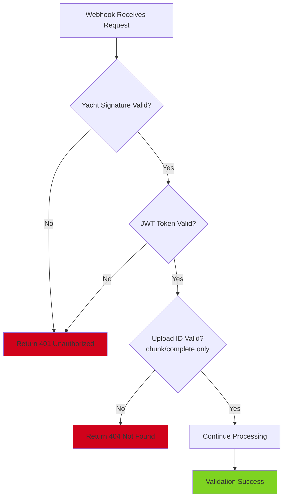

# 🌩️ **n8n-cloud-receiver.md — CelesteOS Cloud Upload Receiver Workflow**

**Version:** 1.0
**Owner:** Backend Engineering
**Status:** Implementation Ready
**Task:** Cloud Receiver for Local Agent Uploads

---

# # 🎯 **1. Overview**

The **n8n Cloud Receiver** is a workflow orchestration system that receives file uploads from the local agent, validates them, assembles chunks, verifies integrity, stores files in Supabase, and triggers the indexing pipeline.

**Architecture:**
```
Local Agent → API Endpoints (n8n webhooks) → Validation → Assembly → Storage → Indexing
```

**Key Responsibilities:**
- Accept upload initialization requests
- Receive and store file chunks
- Assemble chunks into complete files
- Verify SHA256 integrity
- Move files to final storage (Supabase)
- Trigger indexing pipeline
- Handle errors and retries

---

# # 📡 **2. n8n Trigger Nodes (Webhook Endpoints)**

## **2.1 Upload Initialization Webhook**

**Endpoint:** `POST /v1/ingest/init`

**n8n Webhook Node Configuration:**
```json
{
  "name": "Upload Init Webhook",
  "type": "n8n-nodes-base.webhook",
  "typeVersion": 1.1,
  "position": [200, 300],
  "webhookId": "upload-init",
  "parameters": {
    "path": "v1/ingest/init",
    "httpMethod": "POST",
    "responseMode": "responseNode",
    "options": {
      "rawBody": false
    }
  }
}
```

**Expected Request Body:**
```json
{
  "filename": "MTU_Manual_2023.pdf",
  "sha256": "a1b2c3d4e5f6...",
  "size_bytes": 52428800,
  "source": "nas",
  "total_chunks": 12,
  "original_path": "/Volumes/NAS/Engineering/Manuals/MTU_Manual_2023.pdf",
  "file_type": "pdf",
  "last_modified": 1700000000
}
```

**Expected Headers:**
```
X-Yacht-Signature: ABC123XYZ789
Authorization: Bearer <jwt_token>
Content-Type: application/json
```

## **2.2 Chunk Upload Webhook**

**Endpoint:** `PATCH /v1/ingest/upload_chunk`

**n8n Webhook Node Configuration:**
```json
{
  "name": "Chunk Upload Webhook",
  "type": "n8n-nodes-base.webhook",
  "typeVersion": 1.1,
  "position": [200, 500],
  "webhookId": "upload-chunk",
  "parameters": {
    "path": "v1/ingest/upload_chunk",
    "httpMethod": "PATCH",
    "responseMode": "responseNode",
    "options": {
      "rawBody": true,
      "binaryData": true
    }
  }
}
```

**Expected Headers:**
```
X-Yacht-Signature: ABC123XYZ789
Authorization: Bearer <jwt_token>
Content-Type: application/octet-stream
Upload-ID: 550e8400-e29b-41d4-a716-446655440000
Chunk-Index: 3
Chunk-SHA256: def456...
```

**Body:** Binary chunk data

## **2.3 Upload Complete Webhook**

**Endpoint:** `POST /v1/ingest/complete`

**n8n Webhook Node Configuration:**
```json
{
  "name": "Upload Complete Webhook",
  "type": "n8n-nodes-base.webhook",
  "typeVersion": 1.1,
  "position": [200, 700],
  "webhookId": "upload-complete",
  "parameters": {
    "path": "v1/ingest/complete",
    "httpMethod": "POST",
    "responseMode": "responseNode",
    "options": {
      "rawBody": false
    }
  }
}
```

**Expected Request Body:**
```json
{
  "upload_id": "550e8400-e29b-41d4-a716-446655440000",
  "total_chunks": 12,
  "sha256": "a1b2c3d4e5f6...",
  "filename": "MTU_Manual_2023.pdf"
}
```

---

# # 🔐 **3. Auth & Validation**

## **3.1 Yacht Signature Validation**

**n8n Function Node:**
```javascript
// Node Name: "Validate Yacht Signature"
const headers = $input.item.headers;
const yachtSignature = headers['x-yacht-signature'];

if (!yachtSignature) {
  throw new Error('Missing yacht signature');
}

// Query Supabase to verify yacht signature exists
const supabaseClient = $('Supabase').getConnection();

const { data, error } = await supabaseClient
  .from('yachts')
  .select('id, name, status')
  .eq('signature', yachtSignature)
  .single();

if (error || !data) {
  throw new Error('Invalid yacht signature');
}

if (data.status !== 'active') {
  throw new Error('Yacht account is not active');
}

// Pass yacht info to next node
return {
  json: {
    yacht_id: data.id,
    yacht_name: data.name,
    yacht_signature: yachtSignature,
    ...($input.item.json)
  }
};
```

**n8n Supabase Node (Check Yacht):**
```json
{
  "name": "Check Yacht Exists",
  "type": "n8n-nodes-base.supabase",
  "typeVersion": 1,
  "position": [400, 300],
  "parameters": {
    "resource": "row",
    "operation": "get",
    "tableId": "yachts",
    "filterType": "manual",
    "filterBy": "signature",
    "filterValue": "={{ $json.yacht_signature }}"
  }
}
```

## **3.2 JWT Token Validation**

**n8n Function Node:**
```javascript
// Node Name: "Validate JWT Token"
const jwt = require('jsonwebtoken');
const headers = $input.item.headers;
const authHeader = headers['authorization'];

if (!authHeader || !authHeader.startsWith('Bearer ')) {
  throw new Error('Missing or invalid authorization header');
}

const token = authHeader.substring(7);

try {
  // Verify JWT (use your secret key)
  const JWT_SECRET = process.env.JWT_SECRET;
  const decoded = jwt.verify(token, JWT_SECRET);

  // Check expiration
  const now = Math.floor(Date.now() / 1000);
  if (decoded.exp < now) {
    throw new Error('Token expired');
  }

  // Verify yacht_id matches
  if (decoded.yacht_id !== $json.yacht_id) {
    throw new Error('Token yacht_id mismatch');
  }

  return {
    json: {
      user_id: decoded.user_id,
      user_role: decoded.role,
      ...$json
    }
  };
} catch (error) {
  throw new Error(`JWT validation failed: ${error.message}`);
}
```

## **3.3 Upload ID Validation**

**For chunk upload and complete endpoints:**

**n8n Function Node:**
```javascript
// Node Name: "Validate Upload ID"
const headers = $input.item.headers;
const uploadId = headers['upload-id'] || $json.upload_id;

if (!uploadId) {
  throw new Error('Missing upload_id');
}

// Check if upload session exists in database
const supabaseClient = $('Supabase').getConnection();

const { data, error } = await supabaseClient
  .from('upload_sessions')
  .select('*')
  .eq('id', uploadId)
  .eq('yacht_id', $json.yacht_id)
  .single();

if (error || !data) {
  throw new Error('Invalid or expired upload_id');
}

if (data.status === 'completed') {
  throw new Error('Upload already completed');
}

if (data.status === 'failed') {
  throw new Error('Upload marked as failed');
}

return {
  json: {
    upload_session: data,
    upload_id: uploadId,
    ...$json
  }
};
```

## **3.4 Request Validation Summary**

**Validation Chain:**


---

# # 🧩 **4. Chunk Assembly Logic**

## **4.1 Temporary Chunk Storage**

**Storage Strategy:**
```
Supabase Storage Bucket: celesteos-temp-chunks
Path: yachts/{yacht_id}/uploads/{upload_id}/chunk_{index}.bin
```

**n8n Supabase Storage Node (Store Chunk):**
```json
{
  "name": "Store Chunk in Supabase Storage",
  "type": "n8n-nodes-base.supabase",
  "typeVersion": 1,
  "position": [800, 500],
  "parameters": {
    "resource": "storage",
    "operation": "upload",
    "bucketId": "celesteos-temp-chunks",
    "fileName": "={{ $json.yacht_id }}/uploads/{{ $json.upload_id }}/chunk_{{ $json.chunk_index }}.bin",
    "binaryData": true,
    "options": {
      "upsert": false
    }
  }
}
```

## **4.2 Track Chunk Receipt**

**n8n Supabase Node (Insert Chunk Record):**
```json
{
  "name": "Record Chunk Receipt",
  "type": "n8n-nodes-base.supabase",
  "typeVersion": 1,
  "position": [1000, 500],
  "parameters": {
    "resource": "row",
    "operation": "create",
    "tableId": "upload_chunks",
    "fieldsUi": {
      "fieldValues": [
        {
          "fieldId": "upload_id",
          "fieldValue": "={{ $json.upload_id }}"
        },
        {
          "fieldId": "chunk_index",
          "fieldValue": "={{ $json.chunk_index }}"
        },
        {
          "fieldId": "chunk_sha256",
          "fieldValue": "={{ $json.chunk_sha256 }}"
        },
        {
          "fieldId": "size_bytes",
          "fieldValue": "={{ $binary.data.fileSize }}"
        },
        {
          "fieldId": "storage_path",
          "fieldValue": "={{ $json.yacht_id }}/uploads/{{ $json.upload_id }}/chunk_{{ $json.chunk_index }}.bin"
        },
        {
          "fieldId": "status",
          "fieldValue": "received"
        }
      ]
    }
  }
}
```

## **4.3 Chunk Assembly (On Complete)**

**n8n Function Node (Assemble File):**
```javascript
// Node Name: "Assemble Chunks into File"
const uploadId = $json.upload_id;
const yachtId = $json.yacht_id;
const totalChunks = $json.total_chunks;

// 1. Verify all chunks received
const supabaseClient = $('Supabase').getConnection();

const { data: chunks, error } = await supabaseClient
  .from('upload_chunks')
  .select('*')
  .eq('upload_id', uploadId)
  .eq('status', 'received')
  .order('chunk_index', { ascending: true });

if (error || !chunks) {
  throw new Error('Failed to fetch chunks');
}

if (chunks.length !== totalChunks) {
  throw new Error(`Expected ${totalChunks} chunks, found ${chunks.length}`);
}

// 2. Download all chunks from Supabase Storage
const chunkBuffers = [];
const { data: bucket } = supabaseClient.storage.from('celesteos-temp-chunks');

for (const chunk of chunks) {
  const { data, error } = await bucket.download(chunk.storage_path);

  if (error) {
    throw new Error(`Failed to download chunk ${chunk.chunk_index}: ${error.message}`);
  }

  chunkBuffers.push(data);
}

// 3. Concatenate chunks
const assembledFile = Buffer.concat(chunkBuffers);

// 4. Return assembled file as binary data
return {
  json: {
    filename: $json.filename,
    size_bytes: assembledFile.length,
    upload_id: uploadId,
    yacht_id: yachtId
  },
  binary: {
    data: {
      data: assembledFile.toString('base64'),
      mimeType: 'application/octet-stream',
      fileName: $json.filename,
      fileExtension: $json.filename.split('.').pop()
    }
  }
};
```

## **4.4 Safety Checks**

**Pre-Assembly Validation:**
```javascript
// Node Name: "Pre-Assembly Checks"
const uploadSession = $json.upload_session;
const chunksReceived = $json.chunks_received_count;
const expectedChunks = uploadSession.total_chunks;

// Check 1: All chunks received
if (chunksReceived !== expectedChunks) {
  throw new Error(
    `Incomplete upload: ${chunksReceived}/${expectedChunks} chunks received`
  );
}

// Check 2: No duplicate chunks
const supabaseClient = $('Supabase').getConnection();

const { data: duplicates } = await supabaseClient
  .from('upload_chunks')
  .select('chunk_index, count(*)')
  .eq('upload_id', $json.upload_id)
  .group('chunk_index')
  .having('count(*) > 1');

if (duplicates && duplicates.length > 0) {
  throw new Error('Duplicate chunks detected');
}

// Check 3: Chunks are sequential
const { data: chunks } = await supabaseClient
  .from('upload_chunks')
  .select('chunk_index')
  .eq('upload_id', $json.upload_id)
  .order('chunk_index', { ascending: true });

for (let i = 0; i < chunks.length; i++) {
  if (chunks[i].chunk_index !== i) {
    throw new Error(`Missing chunk ${i}`);
  }
}

return { json: $json };
```

---

# # ✅ **5. File SHA256 Verification**

## **5.1 Compute SHA256 of Assembled File**

**n8n Function Node:**
```javascript
// Node Name: "Compute File SHA256"
const crypto = require('crypto');

// Get assembled file from binary data
const fileBuffer = Buffer.from($binary.data.data, 'base64');

// Compute SHA256
const hash = crypto.createHash('sha256');
hash.update(fileBuffer);
const actualSHA256 = hash.digest('hex');

return {
  json: {
    actual_sha256: actualSHA256,
    expected_sha256: $json.sha256,
    size_bytes: fileBuffer.length,
    ...$json
  },
  binary: $binary
};
```

## **5.2 Compare with Expected SHA256**

**n8n IF Node:**
```json
{
  "name": "SHA256 Match Check",
  "type": "n8n-nodes-base.if",
  "typeVersion": 1,
  "position": [1400, 700],
  "parameters": {
    "conditions": {
      "string": [
        {
          "value1": "={{ $json.actual_sha256 }}",
          "operation": "equals",
          "value2": "={{ $json.expected_sha256 }}"
        }
      ]
    }
  }
}
```

## **5.3 Handle Verification Success**

**n8n Function Node (on TRUE branch):**
```javascript
// Node Name: "Verification Success"
const uploadId = $json.upload_id;
const documentId = require('uuid').v4();

return {
  json: {
    document_id: documentId,
    upload_id: uploadId,
    verification_status: 'success',
    sha256_match: true,
    ...$json
  },
  binary: $binary
};
```

## **5.4 Handle Verification Failure**

**n8n Function Node (on FALSE branch):**
```javascript
// Node Name: "Verification Failed"
const uploadId = $json.upload_id;

// Log error
console.error(
  `SHA256 mismatch for upload ${uploadId}: ` +
  `expected ${$json.expected_sha256}, got ${$json.actual_sha256}`
);

// Update upload session status
const supabaseClient = $('Supabase').getConnection();

await supabaseClient
  .from('upload_sessions')
  .update({
    status: 'verification_failed',
    error_message: `SHA256 mismatch: expected ${$json.expected_sha256}, got ${$json.actual_sha256}`,
    updated_at: new Date().toISOString()
  })
  .eq('id', uploadId);

// Insert into pipeline_logs
await supabaseClient
  .from('pipeline_logs')
  .insert({
    yacht_id: $json.yacht_id,
    upload_id: uploadId,
    step: 'sha256_verification',
    status: 'FAILED',
    error: `SHA256 mismatch`,
    timestamp: new Date().toISOString()
  });

// Return error response
throw new Error(
  `File integrity check failed. SHA256 mismatch. ` +
  `Expected: ${$json.expected_sha256}, Got: ${$json.actual_sha256}`
);
```

---

# # 📦 **6. Move to Final Storage**

## **6.1 Upload to Supabase Final Storage**

**Storage Path Convention:**
```
Bucket: celesteos-documents
Path: yachts/{yacht_id}/documents/{year}/{month}/{document_id}/{filename}

Example:
yachts/ABC123/documents/2024/11/7c9e6679-7425-40de-944b-e07fc1f90ae7/MTU_Manual_2023.pdf
```

**n8n Supabase Storage Node:**
```json
{
  "name": "Move to Final Storage",
  "type": "n8n-nodes-base.supabase",
  "typeVersion": 1,
  "position": [1600, 700],
  "parameters": {
    "resource": "storage",
    "operation": "upload",
    "bucketId": "celesteos-documents",
    "fileName": "={{ $json.yacht_id }}/documents/{{ $now.format('YYYY/MM') }}/{{ $json.document_id }}/{{ $json.filename }}",
    "binaryData": true,
    "options": {
      "upsert": false,
      "contentType": "={{ $binary.data.mimeType }}"
    }
  }
}
```

## **6.2 Insert Document Metadata**

**n8n Supabase Node (Create Document Record):**
```json
{
  "name": "Create Document Record",
  "type": "n8n-nodes-base.supabase",
  "typeVersion": 1,
  "position": [1800, 700],
  "parameters": {
    "resource": "row",
    "operation": "create",
    "tableId": "documents",
    "fieldsUi": {
      "fieldValues": [
        {
          "fieldId": "id",
          "fieldValue": "={{ $json.document_id }}"
        },
        {
          "fieldId": "yacht_id",
          "fieldValue": "={{ $json.yacht_id }}"
        },
        {
          "fieldId": "source",
          "fieldValue": "nas"
        },
        {
          "fieldId": "original_path",
          "fieldValue": "={{ $json.original_path }}"
        },
        {
          "fieldId": "filename",
          "fieldValue": "={{ $json.filename }}"
        },
        {
          "fieldId": "content_type",
          "fieldValue": "={{ $binary.data.mimeType }}"
        },
        {
          "fieldId": "size_bytes",
          "fieldValue": "={{ $json.size_bytes }}"
        },
        {
          "fieldId": "sha256",
          "fieldValue": "={{ $json.actual_sha256 }}"
        },
        {
          "fieldId": "storage_path",
          "fieldValue": "={{ $json.yacht_id }}/documents/{{ $now.format('YYYY/MM') }}/{{ $json.document_id }}/{{ $json.filename }}"
        },
        {
          "fieldId": "indexed",
          "fieldValue": "false"
        }
      ]
    }
  }
}
```

## **6.3 Cleanup Temporary Chunks**

**n8n Function Node:**
```javascript
// Node Name: "Cleanup Temp Chunks"
const uploadId = $json.upload_id;
const yachtId = $json.yacht_id;

const supabaseClient = $('Supabase').getConnection();

// 1. Delete chunks from storage
const { data: chunks } = await supabaseClient
  .from('upload_chunks')
  .select('storage_path')
  .eq('upload_id', uploadId);

const bucket = supabaseClient.storage.from('celesteos-temp-chunks');

for (const chunk of chunks) {
  await bucket.remove([chunk.storage_path]);
}

// 2. Delete chunk records from database
await supabaseClient
  .from('upload_chunks')
  .delete()
  .eq('upload_id', uploadId);

// 3. Update upload session status
await supabaseClient
  .from('upload_sessions')
  .update({
    status: 'completed',
    document_id: $json.document_id,
    completed_at: new Date().toISOString()
  })
  .eq('id', uploadId);

return { json: $json };
```

---

# # 🚀 **7. Trigger Indexing Pipeline**

## **7.1 Internal Indexing Endpoint**

**Endpoint:** `POST /internal/indexer/start`

**n8n HTTP Request Node:**
```json
{
  "name": "Trigger Indexing",
  "type": "n8n-nodes-base.httpRequest",
  "typeVersion": 4,
  "position": [2000, 700],
  "parameters": {
    "method": "POST",
    "url": "{{ $env.INDEXING_SERVICE_URL }}/internal/indexer/start",
    "authentication": "predefinedCredentialType",
    "nodeCredentialType": "httpHeaderAuth",
    "sendHeaders": true,
    "headerParameters": {
      "parameters": [
        {
          "name": "X-Internal-Auth",
          "value": "={{ $env.INTERNAL_SERVICE_SECRET }}"
        }
      ]
    },
    "sendBody": true,
    "bodyParameters": {
      "parameters": [
        {
          "name": "document_id",
          "value": "={{ $json.document_id }}"
        },
        {
          "name": "yacht_id",
          "value": "={{ $json.yacht_id }}"
        },
        {
          "name": "priority",
          "value": "normal"
        }
      ]
    }
  }
}
```

## **7.2 Mark Document as Indexing**

**n8n Supabase Node:**
```json
{
  "name": "Mark as Indexing",
  "type": "n8n-nodes-base.supabase",
  "typeVersion": 1,
  "position": [2200, 700],
  "parameters": {
    "resource": "row",
    "operation": "update",
    "tableId": "documents",
    "filterType": "manual",
    "filterBy": "id",
    "filterValue": "={{ $json.document_id }}",
    "fieldsUi": {
      "fieldValues": [
        {
          "fieldId": "indexed",
          "fieldValue": "false"
        },
        {
          "fieldId": "indexing_started_at",
          "fieldValue": "={{ $now.toISO() }}"
        }
      ]
    }
  }
}
```

## **7.3 Indexing Queue Alternative**

**For High-Volume Systems, use a queue:**

**n8n Function Node (Add to Queue):**
```javascript
// Node Name: "Enqueue for Indexing"
const supabaseClient = $('Supabase').getConnection();

await supabaseClient
  .from('indexing_queue')
  .insert({
    document_id: $json.document_id,
    yacht_id: $json.yacht_id,
    priority: 'normal',
    status: 'pending',
    queued_at: new Date().toISOString()
  });

return { json: $json };
```

---

# # ⚠️ **8. Error Handling**

## **8.1 Corrupt Chunk Detection**

**n8n Function Node (Validate Chunk SHA256):**
```javascript
// Node Name: "Validate Chunk Integrity"
const crypto = require('crypto');
const chunkData = Buffer.from($binary.data.data, 'base64');
const expectedSHA = $json.chunk_sha256;

// Compute actual SHA256
const hash = crypto.createHash('sha256');
hash.update(chunkData);
const actualSHA = hash.digest('hex');

if (actualSHA !== expectedSHA) {
  // Log error
  const supabaseClient = $('Supabase').getConnection();

  await supabaseClient
    .from('pipeline_logs')
    .insert({
      yacht_id: $json.yacht_id,
      upload_id: $json.upload_id,
      step: 'chunk_upload',
      status: 'FAILED',
      error: `Chunk ${$json.chunk_index} SHA256 mismatch`,
      timestamp: new Date().toISOString(),
      metadata: {
        expected: expectedSHA,
        actual: actualSHA,
        chunk_index: $json.chunk_index
      }
    });

  throw new Error(
    `Chunk ${$json.chunk_index} is corrupt. ` +
    `Expected SHA256: ${expectedSHA}, Got: ${actualSHA}`
  );
}

return { json: $json, binary: $binary };
```

## **8.2 Retry Signals**

**Response for Retryable Errors:**
```javascript
// Node Name: "Send Retry Response"
return {
  json: {
    status: 'retry',
    error_code: 'CHUNK_CORRUPT',
    message: 'Chunk is corrupt, please retry upload',
    chunk_index: $json.chunk_index,
    retry_recommended: true
  },
  headers: {
    'Retry-After': '30'  // Seconds
  },
  statusCode: 503  // Service Unavailable (retryable)
};
```

**Response for Non-Retryable Errors:**
```javascript
// Node Name: "Send Error Response"
return {
  json: {
    status: 'error',
    error_code: 'INVALID_REQUEST',
    message: $error.message,
    retry_recommended: false
  },
  statusCode: 400  // Bad Request (not retryable)
};
```

## **8.3 Logging into pipeline_logs**

**n8n Supabase Node (Log Error):**
```json
{
  "name": "Log Pipeline Error",
  "type": "n8n-nodes-base.supabase",
  "typeVersion": 1,
  "position": [1600, 900],
  "parameters": {
    "resource": "row",
    "operation": "create",
    "tableId": "pipeline_logs",
    "fieldsUi": {
      "fieldValues": [
        {
          "fieldId": "yacht_id",
          "fieldValue": "={{ $json.yacht_id }}"
        },
        {
          "fieldId": "document_id",
          "fieldValue": "={{ $json.document_id || null }}"
        },
        {
          "fieldId": "upload_id",
          "fieldValue": "={{ $json.upload_id }}"
        },
        {
          "fieldId": "step",
          "fieldValue": "={{ $json.step }}"
        },
        {
          "fieldId": "status",
          "fieldValue": "FAILED"
        },
        {
          "fieldId": "error",
          "fieldValue": "={{ $json.error_message }}"
        },
        {
          "fieldId": "timestamp",
          "fieldValue": "={{ $now.toISO() }}"
        }
      ]
    }
  }
}
```

## **8.4 Error Response Templates**

### **Missing Yacht Signature (401)**
```json
{
  "status": "error",
  "error_code": "MISSING_YACHT_SIGNATURE",
  "message": "X-Yacht-Signature header is required",
  "retry_recommended": false
}
```

### **Invalid JWT Token (401)**
```json
{
  "status": "error",
  "error_code": "INVALID_TOKEN",
  "message": "JWT token is invalid or expired",
  "retry_recommended": false
}
```

### **Upload Not Found (404)**
```json
{
  "status": "error",
  "error_code": "UPLOAD_NOT_FOUND",
  "message": "Upload session not found or expired",
  "retry_recommended": false
}
```

### **SHA256 Mismatch (409)**
```json
{
  "status": "error",
  "error_code": "SHA256_MISMATCH",
  "message": "File integrity check failed",
  "details": {
    "expected": "a1b2c3...",
    "actual": "d4e5f6..."
  },
  "retry_recommended": true
}
```

### **Missing Chunks (400)**
```json
{
  "status": "error",
  "error_code": "INCOMPLETE_UPLOAD",
  "message": "Not all chunks received",
  "details": {
    "expected": 12,
    "received": 10,
    "missing": [3, 7]
  },
  "retry_recommended": true
}
```

---

# # 📋 **9. Complete n8n Workflow JSON Template**

**Runnable n8n Workflow (v1.98.2):**

```json
{
  "name": "CelesteOS Upload Receiver",
  "nodes": [
    {
      "parameters": {
        "path": "v1/ingest/init",
        "httpMethod": "POST",
        "responseMode": "responseNode",
        "options": {}
      },
      "id": "webhook-init",
      "name": "Upload Init Webhook",
      "type": "n8n-nodes-base.webhook",
      "typeVersion": 1.1,
      "position": [240, 300]
    },
    {
      "parameters": {
        "functionCode": "// Validate Yacht Signature\nconst headers = $input.item.headers;\nconst yachtSignature = headers['x-yacht-signature'];\n\nif (!yachtSignature) {\n  throw new Error('Missing yacht signature');\n}\n\nreturn {\n  json: {\n    yacht_signature: yachtSignature,\n    ...$input.item.json\n  }\n};"
      },
      "id": "validate-yacht",
      "name": "Validate Yacht Signature",
      "type": "n8n-nodes-base.function",
      "typeVersion": 1,
      "position": [460, 300]
    },
    {
      "parameters": {
        "resource": "row",
        "operation": "get",
        "tableId": "yachts",
        "filterType": "manual",
        "filters": {
          "conditions": [
            {
              "keyName": "signature",
              "condition": "equals",
              "value": "={{ $json.yacht_signature }}"
            }
          ]
        }
      },
      "id": "check-yacht",
      "name": "Check Yacht Exists",
      "type": "n8n-nodes-base.supabase",
      "typeVersion": 1,
      "position": [680, 300],
      "credentials": {
        "supabaseApi": {
          "id": "supabase_main",
          "name": "Supabase CelesteOS"
        }
      }
    },
    {
      "parameters": {
        "functionCode": "// Validate JWT Token\nconst jwt = require('jsonwebtoken');\nconst headers = $input.item.headers;\nconst authHeader = headers['authorization'];\n\nif (!authHeader || !authHeader.startsWith('Bearer ')) {\n  throw new Error('Missing authorization header');\n}\n\nconst token = authHeader.substring(7);\nconst JWT_SECRET = process.env.JWT_SECRET;\n\ntry {\n  const decoded = jwt.verify(token, JWT_SECRET);\n  \n  return {\n    json: {\n      user_id: decoded.user_id,\n      yacht_id: decoded.yacht_id,\n      ...$json\n    }\n  };\n} catch (error) {\n  throw new Error(`JWT validation failed: ${error.message}`);\n}"
      },
      "id": "validate-jwt",
      "name": "Validate JWT",
      "type": "n8n-nodes-base.function",
      "typeVersion": 1,
      "position": [900, 300]
    },
    {
      "parameters": {
        "functionCode": "// Create Upload Session\nconst uploadId = require('uuid').v4();\nconst storageKey = `yachts/${$json.yacht_id}/temp/${uploadId}/`;\n\nreturn {\n  json: {\n    upload_id: uploadId,\n    storage_key: storageKey,\n    expected_chunks: $json.total_chunks,\n    ...$json\n  }\n};"
      },
      "id": "create-session",
      "name": "Create Upload Session",
      "type": "n8n-nodes-base.function",
      "typeVersion": 1,
      "position": [1120, 300]
    },
    {
      "parameters": {
        "resource": "row",
        "operation": "create",
        "tableId": "upload_sessions",
        "fieldsUi": {
          "fieldValues": [
            {
              "fieldId": "id",
              "fieldValue": "={{ $json.upload_id }}"
            },
            {
              "fieldId": "yacht_id",
              "fieldValue": "={{ $json.yacht_id }}"
            },
            {
              "fieldId": "filename",
              "fieldValue": "={{ $json.filename }}"
            },
            {
              "fieldId": "sha256",
              "fieldValue": "={{ $json.sha256 }}"
            },
            {
              "fieldId": "size_bytes",
              "fieldValue": "={{ $json.size_bytes }}"
            },
            {
              "fieldId": "total_chunks",
              "fieldValue": "={{ $json.total_chunks }}"
            },
            {
              "fieldId": "status",
              "fieldValue": "pending"
            }
          ]
        }
      },
      "id": "save-session",
      "name": "Save Upload Session",
      "type": "n8n-nodes-base.supabase",
      "typeVersion": 1,
      "position": [1340, 300],
      "credentials": {
        "supabaseApi": {
          "id": "supabase_main",
          "name": "Supabase CelesteOS"
        }
      }
    },
    {
      "parameters": {
        "respondWith": "json",
        "responseBody": "={{ $json }}",
        "options": {}
      },
      "id": "response-init",
      "name": "Response - Init Success",
      "type": "n8n-nodes-base.respondToWebhook",
      "typeVersion": 1,
      "position": [1560, 300]
    },
    {
      "parameters": {
        "path": "v1/ingest/upload_chunk",
        "httpMethod": "PATCH",
        "responseMode": "responseNode",
        "options": {
          "rawBody": true,
          "binaryData": true
        }
      },
      "id": "webhook-chunk",
      "name": "Chunk Upload Webhook",
      "type": "n8n-nodes-base.webhook",
      "typeVersion": 1.1,
      "position": [240, 600]
    },
    {
      "parameters": {
        "resource": "storage",
        "operation": "upload",
        "bucketId": "celesteos-temp-chunks",
        "fileName": "={{ $json.yacht_id }}/uploads/{{ $json.upload_id }}/chunk_{{ $json.chunk_index }}.bin",
        "binaryData": true,
        "options": {}
      },
      "id": "store-chunk",
      "name": "Store Chunk",
      "type": "n8n-nodes-base.supabase",
      "typeVersion": 1,
      "position": [900, 600],
      "credentials": {
        "supabaseApi": {
          "id": "supabase_main",
          "name": "Supabase CelesteOS"
        }
      }
    },
    {
      "parameters": {
        "respondWith": "json",
        "responseBody": "={{ { status: 'ok', chunk_index: $json.chunk_index } }}",
        "options": {}
      },
      "id": "response-chunk",
      "name": "Response - Chunk Success",
      "type": "n8n-nodes-base.respondToWebhook",
      "typeVersion": 1,
      "position": [1120, 600]
    },
    {
      "parameters": {
        "path": "v1/ingest/complete",
        "httpMethod": "POST",
        "responseMode": "responseNode",
        "options": {}
      },
      "id": "webhook-complete",
      "name": "Upload Complete Webhook",
      "type": "n8n-nodes-base.webhook",
      "typeVersion": 1.1,
      "position": [240, 900]
    },
    {
      "parameters": {
        "functionCode": "// Assemble File (simplified for template)\nconst documentId = require('uuid').v4();\n\nreturn {\n  json: {\n    document_id: documentId,\n    verification_status: 'pending',\n    ...$json\n  }\n};"
      },
      "id": "assemble-file",
      "name": "Assemble File",
      "type": "n8n-nodes-base.function",
      "typeVersion": 1,
      "position": [900, 900]
    },
    {
      "parameters": {
        "resource": "row",
        "operation": "create",
        "tableId": "documents",
        "fieldsUi": {
          "fieldValues": [
            {
              "fieldId": "id",
              "fieldValue": "={{ $json.document_id }}"
            },
            {
              "fieldId": "yacht_id",
              "fieldValue": "={{ $json.yacht_id }}"
            },
            {
              "fieldId": "filename",
              "fieldValue": "={{ $json.filename }}"
            },
            {
              "fieldId": "sha256",
              "fieldValue": "={{ $json.sha256 }}"
            },
            {
              "fieldId": "indexed",
              "fieldValue": "false"
            }
          ]
        }
      },
      "id": "save-document",
      "name": "Save Document",
      "type": "n8n-nodes-base.supabase",
      "typeVersion": 1,
      "position": [1120, 900],
      "credentials": {
        "supabaseApi": {
          "id": "supabase_main",
          "name": "Supabase CelesteOS"
        }
      }
    },
    {
      "parameters": {
        "respondWith": "json",
        "responseBody": "={{ { document_id: $json.document_id, status: 'received', queued_for_indexing: true } }}",
        "options": {}
      },
      "id": "response-complete",
      "name": "Response - Complete Success",
      "type": "n8n-nodes-base.respondToWebhook",
      "typeVersion": 1,
      "position": [1340, 900]
    }
  ],
  "connections": {
    "Upload Init Webhook": {
      "main": [[{ "node": "Validate Yacht Signature", "type": "main", "index": 0 }]]
    },
    "Validate Yacht Signature": {
      "main": [[{ "node": "Check Yacht Exists", "type": "main", "index": 0 }]]
    },
    "Check Yacht Exists": {
      "main": [[{ "node": "Validate JWT", "type": "main", "index": 0 }]]
    },
    "Validate JWT": {
      "main": [[{ "node": "Create Upload Session", "type": "main", "index": 0 }]]
    },
    "Create Upload Session": {
      "main": [[{ "node": "Save Upload Session", "type": "main", "index": 0 }]]
    },
    "Save Upload Session": {
      "main": [[{ "node": "Response - Init Success", "type": "main", "index": 0 }]]
    },
    "Chunk Upload Webhook": {
      "main": [[{ "node": "Store Chunk", "type": "main", "index": 0 }]]
    },
    "Store Chunk": {
      "main": [[{ "node": "Response - Chunk Success", "type": "main", "index": 0 }]]
    },
    "Upload Complete Webhook": {
      "main": [[{ "node": "Assemble File", "type": "main", "index": 0 }]]
    },
    "Assemble File": {
      "main": [[{ "node": "Save Document", "type": "main", "index": 0 }]]
    },
    "Save Document": {
      "main": [[{ "node": "Response - Complete Success", "type": "main", "index": 0 }]]
    }
  },
  "pinData": {},
  "settings": {
    "executionOrder": "v1"
  },
  "staticData": null,
  "tags": [],
  "triggerCount": 0,
  "updatedAt": "2024-11-20T00:00:00.000Z",
  "versionId": "1.98.2"
}
```

**Note:** This is a simplified template. Production version should include:
- Full error handling branches
- SHA256 verification nodes
- Chunk assembly logic
- Cleanup operations
- Logging nodes
- Retry logic

---

# # 📝 **Summary**

This document provides a complete specification for the **n8n Cloud Receiver** workflow that handles file uploads from the local agent.

**Key Components:**
✅ **Three Webhook Endpoints** - Init, Upload Chunk, Complete
✅ **Multi-Layer Validation** - Yacht signature, JWT, upload ID
✅ **Chunk Management** - Temporary storage, tracking, assembly
✅ **SHA256 Verification** - File integrity checks
✅ **Final Storage** - Supabase buckets with organized paths
✅ **Indexing Trigger** - Automatic pipeline activation
✅ **Error Handling** - Comprehensive logging and retry signals
✅ **Production Template** - Runnable n8n JSON workflow

**Next Steps:**
1. Import workflow into n8n instance
2. Configure Supabase credentials
3. Set environment variables (JWT_SECRET, etc.)
4. Create required database tables and storage buckets
5. Test with local agent
6. Deploy to production

---
