# Predictive Maintenance Engine - Architecture Diagrams

This document contains Mermaid diagrams illustrating the architecture of the CelesteOS Predictive Maintenance Engine.

---

## System Overview

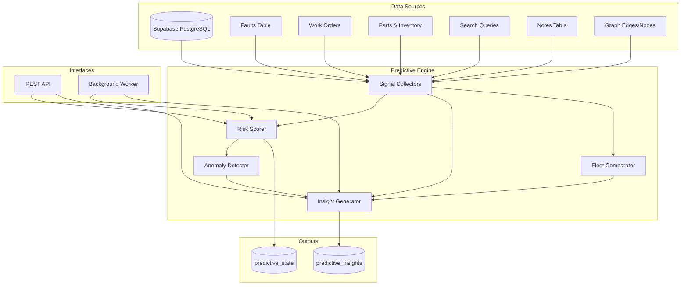

---

## Signal Collection Flow

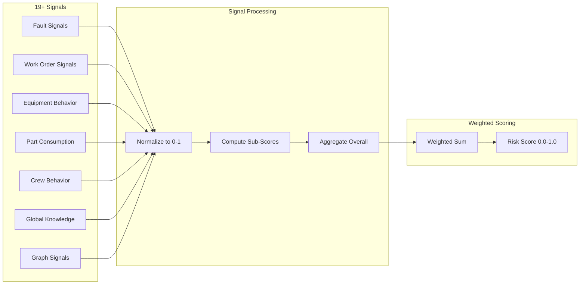

---

## Risk Score Calculation

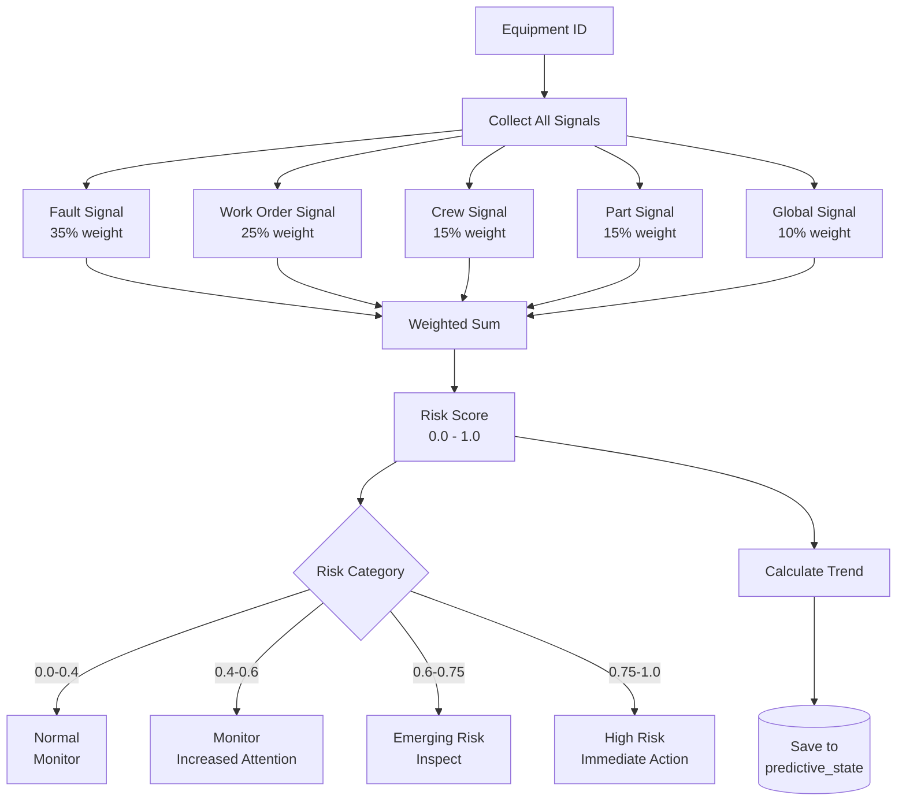

---

## Anomaly Detection Process

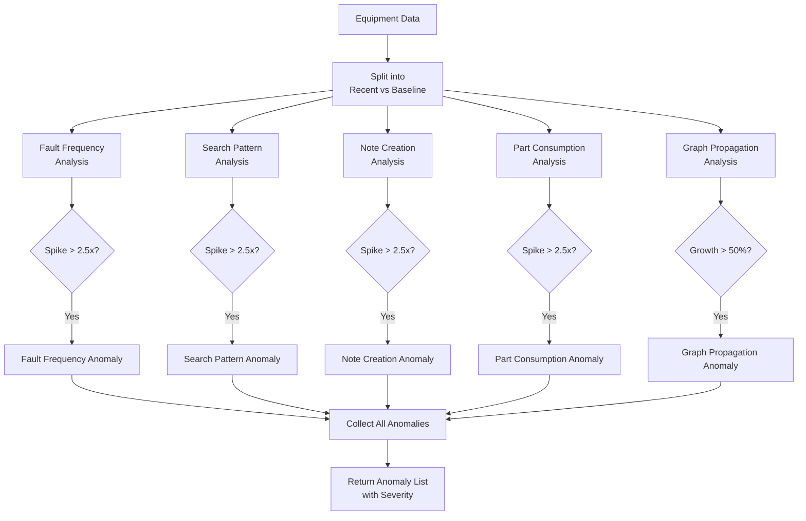

---

## Insight Generation Flow

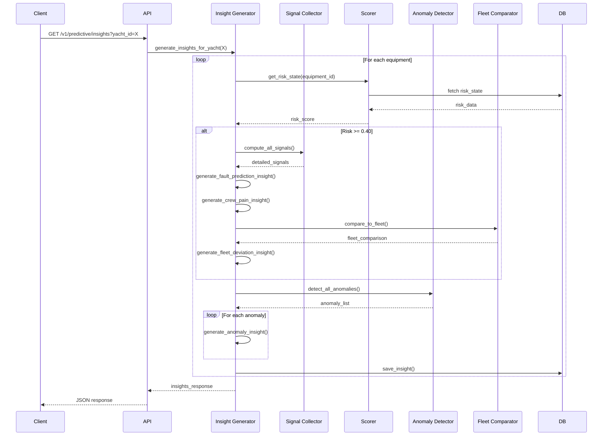

---

## Worker / Cron Architecture

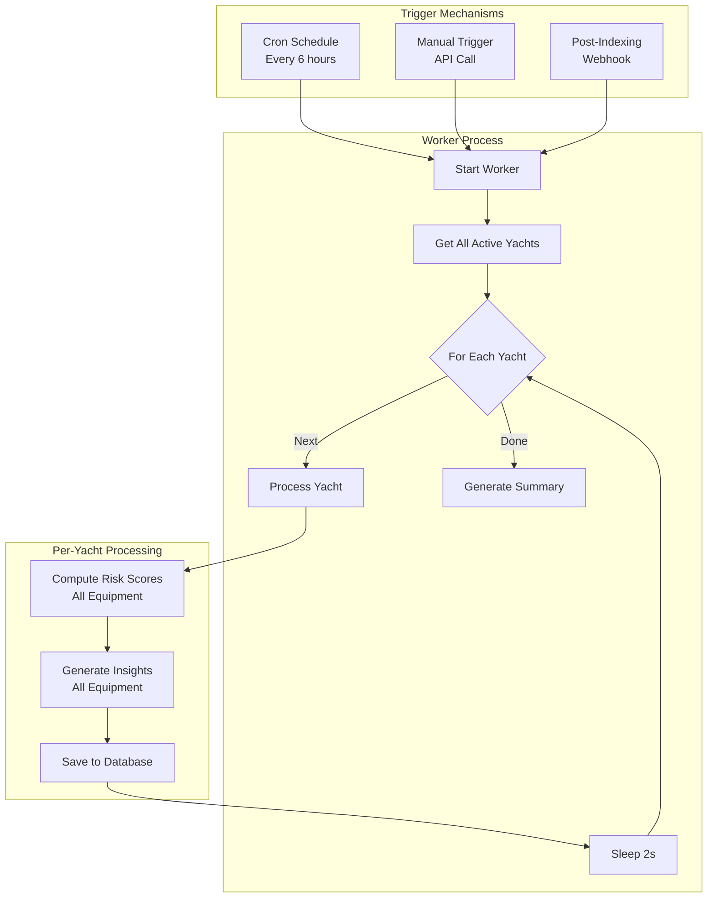

---

## API Request Flow

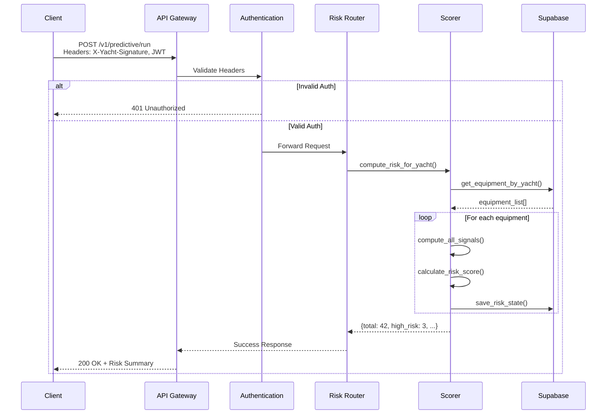

---

## Database Schema Relationships

```mermaid
erDiagram
    yachts ||--o{ equipment : has
    yachts ||--o{ predictive_state : has
    yachts ||--o{ predictive_insights : has

    equipment ||--o{ predictive_state : "risk tracked for"
    equipment ||--o{ predictive_insights : "insights for"
    equipment ||--o{ faults : has
    equipment ||--o{ work_orders : has
    equipment ||--o{ graph_nodes : represented_as

    predictive_state {
        uuid id PK
        uuid yacht_id FK
        uuid equipment_id FK
        numeric risk_score
        varchar trend
        numeric fault_signal
        numeric work_order_signal
        numeric crew_signal
        numeric part_signal
        numeric global_signal
        timestamptz updated_at
    }

    predictive_insights {
        uuid id PK
        uuid yacht_id FK
        uuid equipment_id FK
        varchar insight_type
        varchar severity
        text summary
        text explanation
        text recommended_action
        jsonb contributing_signals
        timestamptz created_at
    }

    graph_nodes ||--o{ graph_edges : from
    graph_nodes ||--o{ graph_edges : to
```

---

## Data Flow: NAS to Predictions

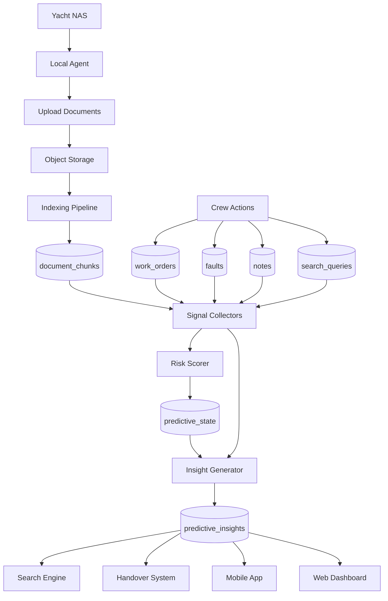

---

## Deployment Architecture

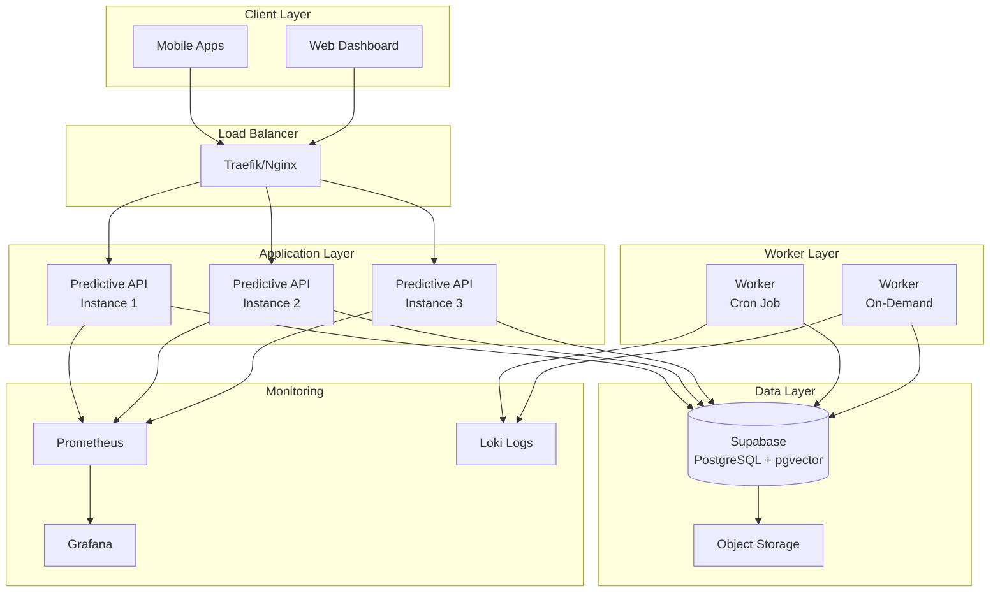

---

## Signal Weight Distribution

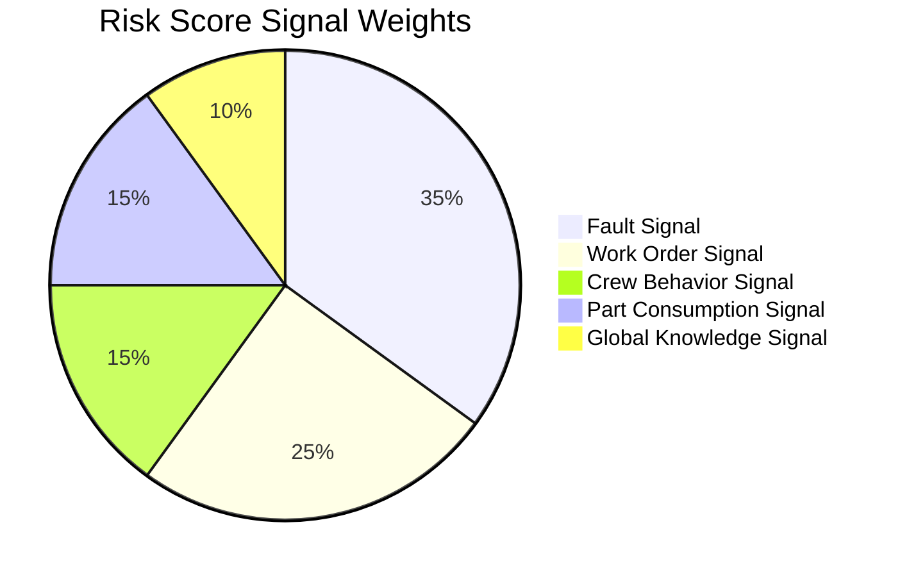

---

## Insight Type Distribution

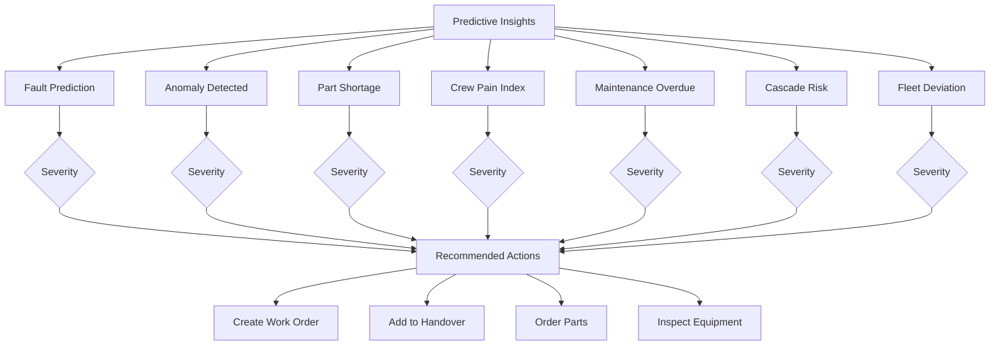

---

## State Machine: Risk Progression

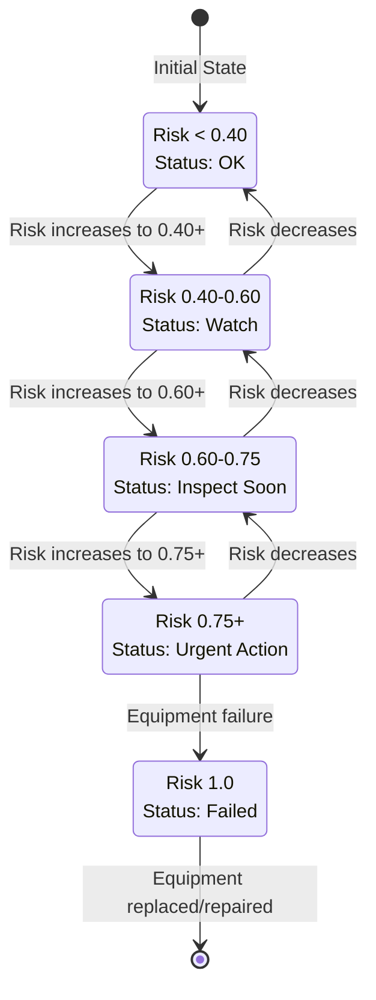

---

## End-to-End: From Data to Action

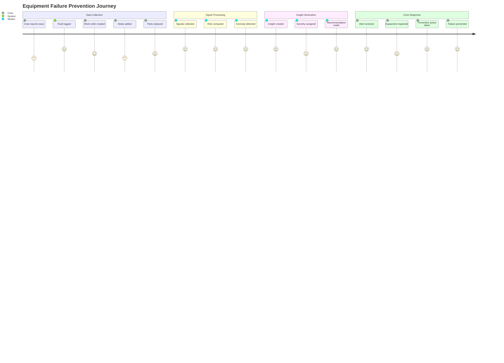

---

These diagrams provide a comprehensive visual representation of the Predictive Maintenance Engine's architecture, data flows, and operational processes.
