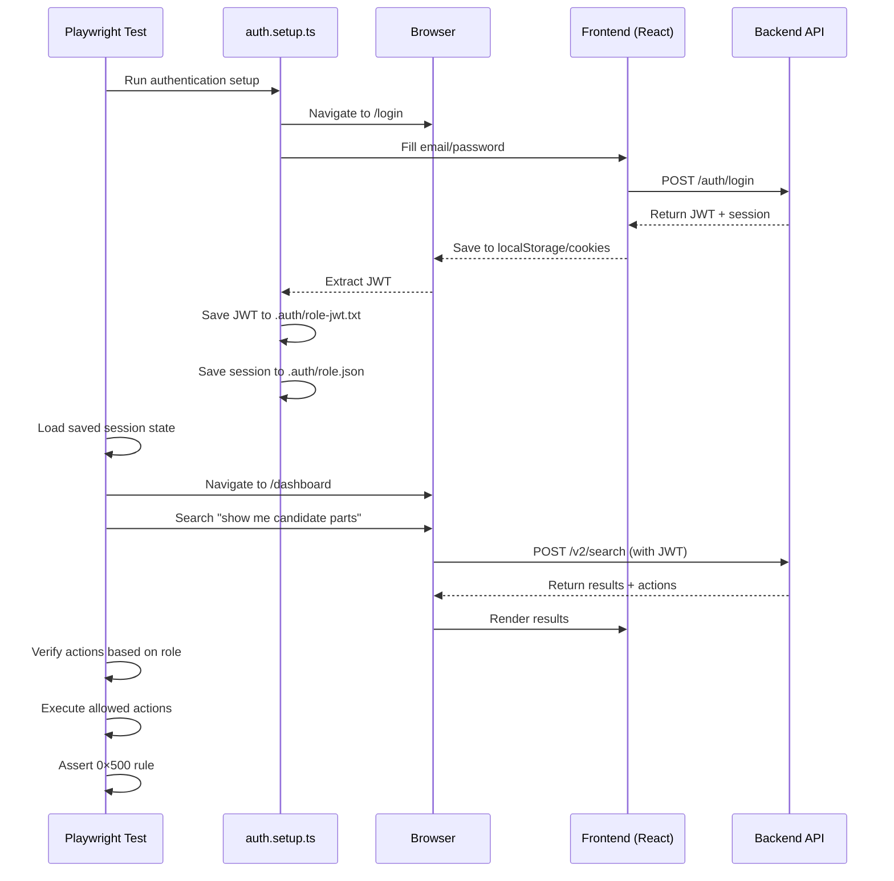

# Shopping List Lens: E2E Tests

Playwright E2E tests for Shopping List lens with role-based access control validation.

## Test Coverage

### 1. Authentication Setup (`auth.setup.ts`)
- Signs in as CREW, HOD (Chief Engineer), and CAPTAIN
- Obtains fresh JWTs for each role
- Saves authenticated session states

### 2. Role-Based Actions (`role_based_actions.e2e.spec.ts`)

**CREW Role:**
- ✅ Can view shopping list items
- ✅ Can create new shopping list items
- ❌ CANNOT see approve/reject/promote actions
- ✅ 0×500 rule validation (no server errors)

**HOD Role (Chief Engineer):**
- ✅ Can view shopping list items
- ✅ Can approve candidate items
- ✅ Can reject candidate items
- ✅ Can promote candidate items to parts
- ✅ All 4 actions visible for candidates
- ✅ 0×500 rule validation

**CAPTAIN Role:**
- ✅ Can view shopping list items
- ✅ Can approve/reject candidate items
- ❌ CANNOT see promote action
- ✅ 0×500 rule validation

## Test Users

```bash
# Credentials (from environment)
CREW:    crew.test@alex-short.com
HOD:     hod.test@alex-short.com
CAPTAIN: x@alex-short.com
PASSWORD: Password2!
YACHT_ID: 85fe1119-b04c-41ac-80f1-829d23322598
```

## Prerequisites

1. **Install Playwright:**
   ```bash
   npm install -D @playwright/test
   npx playwright install
   ```

2. **Frontend Running:**
   - Local: `http://localhost:3000`
   - Production: `https://app.celeste7.ai`

3. **Backend API Running:**
   - Shopping List lens enabled (`SHOPPING_LIST_LENS_V1_ENABLED=true`)
   - Test users provisioned in database

## Running Tests

### Quick Start

```bash
# Run against local environment
cd tests/e2e/shopping_list
./run-shopping-list-e2e.sh local

# Run against production
./run-shopping-list-e2e.sh production
```

### Step-by-Step

```bash
# 1. Navigate to project root
cd /path/to/Cloud_PMS

# 2. Set environment variables
export TEST_CREW_USER_EMAIL="crew.test@alex-short.com"
export TEST_HOD_USER_EMAIL="hod.test@alex-short.com"
export TEST_CAPTAIN_USER_EMAIL="x@alex-short.com"
export ALL_TEST_USER_PASSWORD="Password2!"
export TEST_YACHT_ID="85fe1119-b04c-41ac-80f1-829d23322598"
export BASE_URL="http://localhost:3000"

# 3. Run authentication setup
npx playwright test tests/e2e/shopping_list/auth.setup.ts

# 4. Run role-based tests
npx playwright test tests/e2e/shopping_list/role_based_actions.e2e.spec.ts

# 5. View HTML report
npx playwright show-report
```

### Individual Test Suites

```bash
# Run only CREW tests
npx playwright test tests/e2e/shopping_list/role_based_actions.e2e.spec.ts -g "CREW"

# Run only HOD tests
npx playwright test tests/e2e/shopping_list/role_based_actions.e2e.spec.ts -g "HOD"

# Run only CAPTAIN tests
npx playwright test tests/e2e/shopping_list/role_based_actions.e2e.spec.ts -g "CAPTAIN"

# Run with UI mode (debugging)
npx playwright test tests/e2e/shopping_list/role_based_actions.e2e.spec.ts --ui
```

## Test Flow



## Expected Results

### Role-Based Action Matrix

| Role | View | Create | Approve | Reject | Promote |
|------|------|--------|---------|--------|---------|
| CREW | ✅ | ✅ | ❌ | ❌ | ❌ |
| HOD (Chief Engineer) | ✅ | ✅ | ✅ | ✅ | ✅ |
| CAPTAIN | ✅ | ✅ | ✅ | ✅ | ❌ |

### Test Success Criteria

1. **Authentication**: All 3 users sign in successfully with fresh JWTs
2. **Role Enforcement**: Actions are correctly shown/hidden based on role
3. **0×500 Rule**: No HTTP 5xx errors during any test
4. **Action Execution**: Role-appropriate actions execute successfully
5. **Screenshots**: Evidence captured for all test flows

## Artifacts

After running tests, the following artifacts are generated:

```
tests/e2e/shopping_list/
├── .auth/
│   ├── crew.json                    # CREW session state
│   ├── crew-jwt.txt                 # CREW JWT token
│   ├── hod.json                     # HOD session state
│   ├── hod-jwt.txt                  # HOD JWT token
│   ├── captain.json                 # CAPTAIN session state
│   └── captain-jwt.txt              # CAPTAIN JWT token
├── screenshots/
│   ├── crew-view-candidates.png
│   ├── crew-create-item-success.png
│   ├── crew-action-restrictions.png
│   ├── hod-view-candidates.png
│   ├── hod-all-actions-visible.png
│   ├── hod-approve-success.png
│   ├── hod-promote-success.png
│   ├── captain-view-candidates.png
│   └── captain-restricted-actions.png
└── playwright-report/
    └── index.html                   # Full test report
```

## Troubleshooting

### Authentication Fails

```bash
# Check if frontend is running
curl http://localhost:3000

# Verify user credentials
echo $TEST_CREW_USER_EMAIL
echo $TEST_HOD_USER_EMAIL
echo $TEST_CAPTAIN_USER_EMAIL

# Check if users exist in database
psql -c "SELECT email FROM auth.users WHERE email IN ('crew.test@alex-short.com', 'hod.test@alex-short.com', 'x@alex-short.com');"
```

### Tests Fail to Find Actions

- **Cause**: Shopping List lens not enabled or results not rendering
- **Fix**:
  1. Verify `SHOPPING_LIST_LENS_V1_ENABLED=true` in API environment
  2. Check backend logs for entity extraction
  3. Verify database has shopping list items (status='candidate')

### 5xx Errors Detected

- **Cause**: Server-side error during action execution
- **Fix**:
  1. Check backend logs for stack traces
  2. Verify RLS policies allow user access
  3. Check action handler implementation

## Debugging

### Run Tests in UI Mode

```bash
npx playwright test tests/e2e/shopping_list/role_based_actions.e2e.spec.ts --ui
```

This opens Playwright's interactive UI where you can:
- Step through tests
- View screenshots at each step
- Inspect network requests
- See console logs

### Enable Debug Logging

```bash
DEBUG=pw:api npx playwright test tests/e2e/shopping_list/role_based_actions.e2e.spec.ts
```

### View Saved JWTs

```bash
cat tests/e2e/shopping_list/.auth/crew-jwt.txt
cat tests/e2e/shopping_list/.auth/hod-jwt.txt
cat tests/e2e/shopping_list/.auth/captain-jwt.txt
```

## CI/CD Integration

### GitHub Actions

```yaml
name: Shopping List E2E Tests

on:
  push:
    branches: [main, staging]
  pull_request:
    paths:
      - 'apps/web/**'
      - 'apps/api/handlers/shopping_list_handlers.py'
      - 'tests/e2e/shopping_list/**'

jobs:
  e2e:
    runs-on: ubuntu-latest
    steps:
      - uses: actions/checkout@v3
      - uses: actions/setup-node@v3
        with:
          node-version: '18'

      - name: Install dependencies
        run: npm ci

      - name: Install Playwright
        run: npx playwright install --with-deps

      - name: Run Shopping List E2E tests
        env:
          TEST_CREW_USER_EMAIL: ${{ secrets.TEST_CREW_USER_EMAIL }}
          TEST_HOD_USER_EMAIL: ${{ secrets.TEST_HOD_USER_EMAIL }}
          TEST_CAPTAIN_USER_EMAIL: ${{ secrets.TEST_CAPTAIN_USER_EMAIL }}
          ALL_TEST_USER_PASSWORD: ${{ secrets.ALL_TEST_USER_PASSWORD }}
          TEST_YACHT_ID: ${{ secrets.TEST_YACHT_ID }}
          BASE_URL: ${{ secrets.BASE_URL }}
        run: |
          cd tests/e2e/shopping_list
          ./run-shopping-list-e2e.sh production

      - name: Upload test artifacts
        if: always()
        uses: actions/upload-artifact@v3
        with:
          name: playwright-report
          path: playwright-report/
```

## Maintenance

### Adding New Test Cases

1. Add new test in `role_based_actions.e2e.spec.ts`
2. Use appropriate `test.describe()` block for role
3. Follow naming convention: `[ROLE] [action] [expected outcome]`
4. Always verify 0×500 rule

### Updating Test Credentials

Update credentials in:
- `/env vars/env vars.md` (source of truth)
- This README (for documentation)
- CI/CD secrets (for automation)

### Refreshing Test Data

```sql
-- Create fresh candidate items for testing
INSERT INTO pms_shopping_list_items (
  yacht_id, part_name, status, urgency, source_type
) VALUES
  ('85fe1119-b04c-41ac-80f1-829d23322598', 'Test Candidate Part 1', 'candidate', 'high', 'manual_add'),
  ('85fe1119-b04c-41ac-80f1-829d23322598', 'Test Candidate Part 2', 'candidate', 'normal', 'manual_add');
```

## References

- [Playwright Documentation](https://playwright.dev/)
- [Shopping List Lens Implementation Guide](/docs/pipeline/shopping_list_lens/SHOPPING_LIST_E2E_VALIDATION_REPORT.md)
- [Backend Validation Report](/docs/pipeline/shopping_list_lens/SHOPPING_LIST_DIRECT_VALIDATION_ADDENDUM.md)
